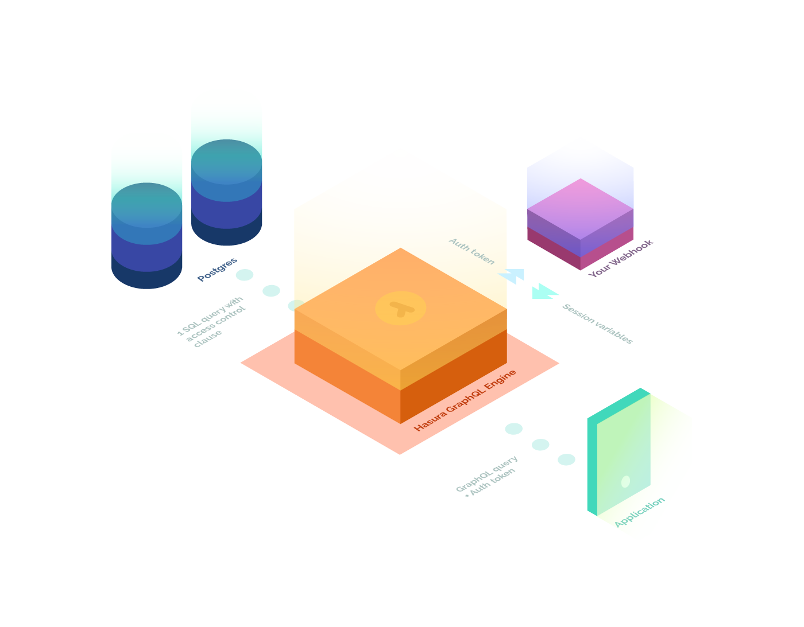
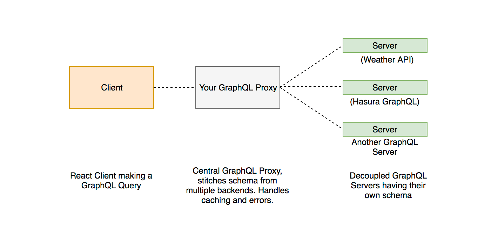

# Hasura GraphQL Engine

Hasura GraphQL Engine is a performant GraphQL server that provides **ready-to-use GraphQL API over Postgres** by auto-generating GraphQL schema and corresponding resolvers. 

* **Make powerful queries**: built-in filtering, pagination, and pattern search arguments and operators
* **Works with existing database**: point it to an existing Postgres database to instantly get a ready-to-use GraphQL API
* **Fine-grained access control**: dynamic access control that integrates with your Auth
* **Light-weight & performant**: ~15MB docker image; ~50MB RAM @ 1000 req/s; multi-core aware
* **Dev friendly**: admin UI & Rails-inspired schema migrations
* **Postgres** ❤️: supports Postgres types (PostGIS/geo-location, etc.), turns views to *graphs*, trigger stored functions or procedures with mutations

## Quickstart - Setup on Heroku

:information_source: *no credit-card required*; sign-up may be required

1. Click on the following button to deploy GraphQL Engine on Heroku and provision the free Postgres add-on:

    

2. Open the admin console

   Visit https://\<app-name\>.herokuapp.com (*replace \<app-name\> with your app name*) to open the admin console.

3. Make your first GraphQL query

   Create test tables and instantly run your first query. Follow this [simple guide](https://docs.hasura.io/1.0/graphql/manual/getting-started/first-graphql-query.html).

### Other deployment methods

For Docker-based deployment and advanced configuration options, see deployment guides [here](https://docs.hasura.io/1.0/graphql/manual/getting-started/index.html).

## Architecture

The Hasura GraphQL Engine fronts a Postgres database instance and can serve as an API Gateway for all data requests from client apps. It can be configured to work with your existing Auth middleware to handle access control to data using field-level rules with dynamic variables.

The GraphQL Engine is a standalone, multi-core aware component that can be scaled vertically and horizontally.

You can also place the engine behind a central GraphQL proxy that fronts multiple GraphQL APIs via schema stitching.

## Client-side tooling

GraphQL Engine provides an HTTP API. This means you can use any client-side tool or library to query the endpoint. To fully leverage GraphQL, it is recommended that you use GraphQL specific client-side tooling like [Apollo Client](https://github.com/apollographql/apollo-client), [Relay](https://github.com/facebook/relay), etc. See [awesome-graphql](https://github.com/chentsulin/awesome-graphql) for a list of such tools.

## Community

Please join our amazing community of developers and contributors on [Discord](https://discord.gg/vBPpJkS).

## Support & Troubleshooting

The documentation and community will help you troubleshoot most issues. However, if you have encountered a bug or need to get in touch with us, you can contact us using one of the following channels:

* [Github issues](https://github.com/hasura/graphql-engine/issues)
* Talk to us using [Intercom chat](https://hasura.io) or drop an email to build@hasura.io

We are committed to fostering an open and welcoming environment in the community. Please see the [Code of Conduct](code-of-conduct.md).

## Contributing

Check out our [contributing guide](CONTRIBUTING.md) for more details.

## License

GraphQL Engine is available under the [GNU Affero General Public License v3](https://www.gnu.org/licenses/agpl-3.0.en.html) (AGPL-3.0). [Why AGPL?](https://gist.github.com/hasura-bot/9c36a0201a7563f7762b265a12b044d5).

:information_source: Commercial licenses are available on request. Please feel free to contact us at build@hasura.io or using [Intercom chat](https://hasura.io).