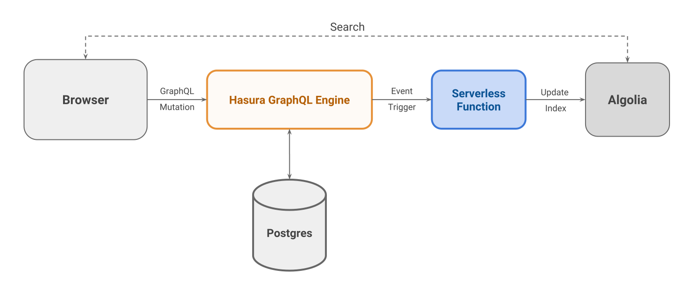

# Web notifications using Hasura GraphQL Engine Event Triggers and FCM

Visit https://shahidhk.github.io/hasura-web-notifications for a live demo.

## Pre-requisites

- Google Cloud account with billing enabled
- Firebase Cloud Messaging (FCM) account
- Hasura GraphQL Engine (HGE) installation

## Instructions

### Step 1: Create table

Goto HGE console and create the following table:

```
Name: message

Columns:

id            UUID        default: gen_random_uuid()
timestamp     Timestamp   default: now()
title         Text
body          Text        nullable
device_token  Text
```

### Step 2: Setup FCM

- Create a new project or use an exisiting project on [Firebase
  Console](https://console.firebase.google.com).
- Open the [Cloud
  Messaging](https://console.firebase.google.com/project/_/settings/cloudmessaging/)
  tab of the Firebase console Settings pane and scroll to the Web configuration
  section.
- In the Web Push certificates tab, click Generate Key Pair. The console
  displays a notice that the key pair was generated, and displays the public key
  string and date added. 
- Copy the Key Pair (we'll call it `FCM_PUBLIC_KEY`).

## Architecture

