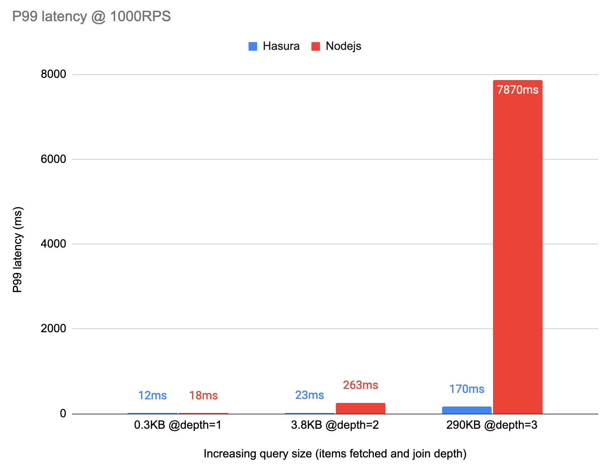

# Hasura GraphQL Engine & SQL Server
  - [Introduction](#introduction)
  - [Get started](#get-started)
  - [Features](#features)
  - [Use cases](#use-cases)
  - [How Hasura works](#how-hasura-works)
    -  [Performance](#performance)
    -  [Data model evolution](#data-model-evolution)
    -  [Authorization](#authorization)
  - [Get in touch](#get-in-touch)
  - [Roadmap](#coming-soon)

## Introduction

**[Hasura GraphQL Engine](https://hasura.io)** is a fast, open-source GraphQL service that:
1. Gives you instant, realtime GraphQL APIs over data sources
2. Built-in row and column level authorization

In this post we summarize how Hasura works with [SQL Server](https://hasura.io/docs/latest/graphql/core/databases/ms-sql-server/index.html) as a data source.

## Get started
Here are a few ways you can easily try Hasura with SQL Server in just a few minutes:

- [Hasura Cloud](https://hasura.io/docs/latest/graphql/core/databases/ms-sql-server/getting-started/cloud.html)
- [Docker](https://hasura.io/docs/latest/graphql/core/databases/ms-sql-server/getting-started/docker.html)

Once you have Hasura running:
1. Connect your new or existing SQL Server database
2. Create new tables or track existing tables to expose them in the GraphQL schema
3. Try out the GraphQL API


## Features

#### Powerful querying

- Track (expose) tables and views, and set up relationships between them
- Run powerful queries with support for nested filtering, sorting and SQL Server types like GIS.


#### Granular model-level authorization for rows and columns
- Create granular model-level RLS style authorization rules to secure the GraphQL API for internal or external consumers. 


#### Instant GraphQL subscriptions for realtime APIs
- Instant and scalable GraphQL subscriptions to securely subscribe to changing data
- Subscriptions respect the same authorization policies as queries


#### Blazing-fast
- Hasura compiles the GraphQL query to a single SQL query, including a predicate push-down of authorization rules, preventing typical N+1 problems while fetching data. 
- Hasura also uses JSON aggregations to avoid fetching a cartesian product from the database and avoids unnecessary Ser/De overhead.



<sub>[Benchmark suite](https://github.com/hasura/sql-server-hasura-apollo-bench)</sub>

#### EXPLAIN GraphQL queries
- Debug and analyze performance of GraphQL queries easily by viewing the generated SQL plan


#### Allow-lists
- Use allow-lists to restrict queries allowed in production


#### Extend GraphQL schema easily
- Extend the GraphQL schema with your own [GraphQL service](https://hasura.io/docs/latest/graphql/core/remote-schemas/index.html) or [REST endpoints](https://hasura.io/docs/latest/graphql/core/actions/index.html)


#### Create REST endpoints from GraphQL queries
- Create idiomatic REST endpoints from parametrized GraphQL queries
- Great for clients that prefer REST API endpoints or to leverage existing REST tooling


## Use-cases

### Build applications rapidly with new or existing SQL Server databases
- Cut short 50-80% of required API development work with Hasura
- Extend the GraphQL API and add custom business logic in any language or framework by adding your own resolvers as REST or GraphQL APIs

### Replace direct database access with flexible JSON APIs over HTTP
- Modern workloads in the cloud or end-user web/mobile apps need a flexible and secure API over HTTP to access data
- Use Hasura to to get a data API instantly, instead of having to build and maintain an API server


## How Hasura Works

### GraphQL Schema & API

Hasura is powered via dynamic configuration, referred to as “Metadata”. 

Once the Hasura service starts running, you can dynamically configure its metadata. This configuration is achieved through using a UI, or using an API call, or using code in a git repo to integrate with your CI/CD pipeline.

The metadata captures connection configuration to upstream data sources, relationships between models, and their authorization policies.Using this, Hasura generates a GraphQL schema and presents a GraphQL API that can be consumed.

Hasura takes incoming GraphQL API calls over HTTP and then compiles that into a T-SQL query, including authorization policies with a predicate push-down.

### Performance

Because of its compiler-like architecture Hasura can avoid N+1 issues entirely. It can memoize aggressively, and issue the minimal number of hits to upstream data sources.

There are 3 key aspects to this:

**Compiling into a SQL query:** 
- Instead of resolving a GraphQL query piece by piece, Hasura tries to compile parts of the query to a single data source, into a single query that an upstread source can understand - in this case, a SQL query for SQL Server.
- This is especially impactful when dealing with authorization rules since they can be compiled into the same query as the data fetch instead of having to make multiple requests to the data source.
- Read more about Hasura’s [compiler architecture](https://hasura.io/blog/architecture-of-a-high-performance-graphql-to-sql-server-58d9944b8a87/) and its [subscription mechanism](https://github.com/hasura/graphql-engine/blob/master/architecture/live-queries.md).

**JSON aggregation:** 
- Hasura runs the JSON aggregation in the database. This prevents serialisation/deserialisation overhead and transfers much lesser data over the wire from the database as compared to a join which returns a cartesian product.

**Connection pooling**: 
- Hasura also performs connection pooling, since it runs as a service, and also leverages prepared statements automatically.
- This allows the entire GraphQL + data fetch querying and planning process to be as efficient as possible since only variables (parameters or session variables) are processed and the queries at different layers have already been processed and planned.

### Data model evolution

Hasura generates a GraphQL API on tables and views - with support for stored procedures and functions coming soon. This allows evolution of the underlying data model without affecting the generated GraphQL API.

### Authorization

Users can add authorization rules that restrict access to particular entities (or rows) and their fields (columns). These authorization rules combine properties of the data that is being accessed with properties of the session of an API request. 

Hasura can extract session information from JWT claims or from a webhook. This allows Hasura to accept end-user API calls directly and process them securely. [Read the docs](https://hasura.io/docs/latest/graphql/core/auth/authentication/index.html) for more information on how it works.

Here are a few examples of types of authorization rules that can be implemented with Hasura:

#### Ex 1: Compare data values to session variables to allow access to specific rows
- Compare data in a table, or across a relationship, to a session variable
  
  ```yaml
  # Allow access to a music track if the track's album's artist_id is the current user
  role: user
  table: tracks
  permission: tracks.album.artist_id = session.user_id
  ```

#### Ex 2: Restrict visibility of certain models and their fields to specific roles
- Hasura allows the creation of "role based schemas"
- This allows Hasura users to create specific subgraphs for particular application roles or scopes
  ```yaml
  # For 'public' scope, allow access only to the id and username fields
  role: public
  table: profile
  permission:
    fields: [id, username]

  # For the 'private' scope, allow access to all fields, but only if the session user is the owner of that data
  role: private
  table: profile
  permission: 
    fields: [id, username, email]
    rule: profile.id = session.user_id
  ```

#### Ex 3: Compare column values
- Comparing column values allows access to be controlled by a dynamically changing value in another part of the database
- This makes modelling things like "access tiers" in a subscription plan, or a lookup from a dynamic ACL table very simple
  ```yaml
  role: user
  table: article
  permission:
    current_user.profile.plan IN article.allowed_plans
  ```

#### Ex 4: Allow roles to inherit from other roles
- Compose roles to intelligently merge into a single permission policy
- Hasura composes roles preserving row and field level access using a "cell based nullification" merge algorithm
- This allows Hasura users to specifcy different levels of ownership and visibility on the same data models easily
- Example: Allow a user to fetch all the fields of their own profile, but only some data for profiles that aren't theirs
  ```yaml
  # Role 1
  private: user can access their own data, and all fields of that data: [id, email, username]

  # Role 2
  public: user can access anyone's data, but only id and username

  # Role3 = Role1 + Role 2
  user: [public, private]
  
  # the user role can now safely be assigned to all logged-in users
  ```

## Get in touch

Feedback and issues are very welcome!

Reach out to the Hasura team via: 
- [GitHub](https://github.com/hasura/graphql-engine), 
- [Hasura Discord](https://discord.com/invite/hasura), 
- [Twitter](https://twitter.com/hasurahq)

If you'd like to see how Hasura + SQL server can work for your team [contact us](https://hasura.io/contact-us/) via our website.

We'll also be diving deeper and talking about updates at [the upcoming HasuraCon](https://hasura.io/events/hasura-con-2021/) 🎉


#### Can I use this in production?

- SQL Server support with Hasura is ready for production use for read-only use-cases.

## Coming soon

Next up on our roadmap for Hasura + SQL Server:

- [#7073](https://github.com/hasura/graphql-engine/issues/7073) Support for stored procedures & functions
- [#7074](https://github.com/hasura/graphql-engine/issues/7074) Mutations: Run inserts, updates, deletes, stored procedures and transactions securely on SQL Server over a GraphQL API
- [#7075]() Event triggers: Trigger HTTP webhooks with atomic capture and atleast once guarantee whenever data changes inside the database [(read more)](https://hasura.io/docs/latest/graphql/core/event-triggers/index.html)
- [#7076](https://github.com/hasura/graphql-engine/issues/7076) Remote Joins: Join models in SQL Server to models from other API services (GraphQL or REST)

Please do upvote / subscribe to the issues above to stay updated! We estimate these to be available over incremental releases in July/Aug 2021.
