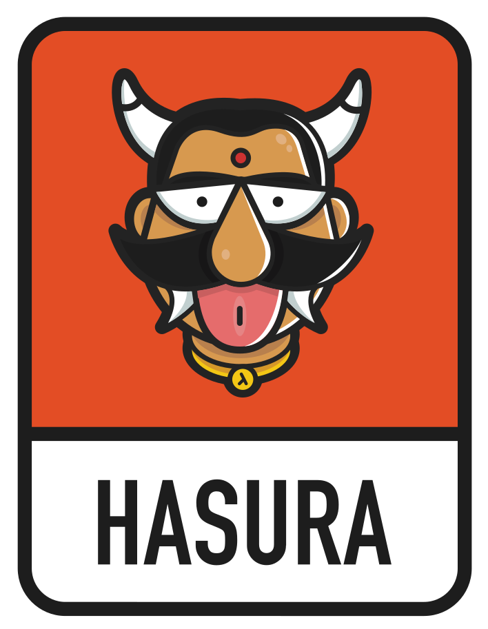

# Hasura Brand Assets

All assets are available on a Google Cloud Storage Bucket CDN at `https://graphql-engine-cdn.hasura.io/img/<name>`.

*Note: some logos maybe invisible depending on the page background color.*

| name | asset |
| ---- | ----- |
| `hasura_icon_black.svg` |  |
| `hasura_icon_blue.svg` |  |
| `hasura_icon_white.svg` |  |
| `hasura_logo_horizontal_black.svg` |  |
| `hasura_logo_horizontal_blue.svg` |  |
| `hasura_logo_horizontal_white.svg` |  |
| `hasura_logo_vertical_black.svg` |  |
| `hasura_logo_vertical_blue.svg` |  |
| `hasura_logo_vertical_white.svg` |  |
| `powered_by_hasura_black.svg` |  |
| `powered_by_hasura_blue.svg` |  |
| `powered_by_hasura_white.svg` |  |
| `hasura_mascot_logo_horizontal.svg` |  |
| `hasura_mascot_logo_vertical.svg` |  |
| `hasura_mascot.svg` |  |
