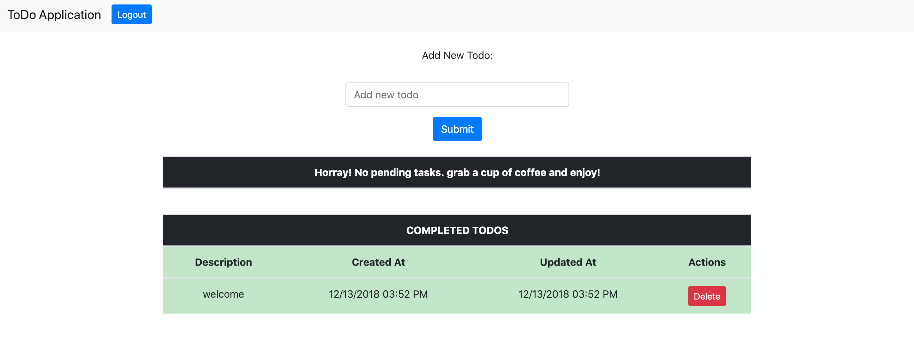
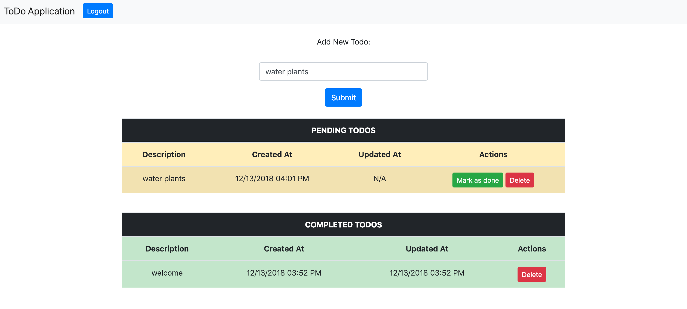

# Vue-Hasura-Graphql Advanced

This repository contains the boilerplate for the advanced application. This shows how to setup Vue application that uses [Hasura Graphql Engine](https://github.com/hasura/graphql-engine). This application is a to-do application which supports following features:

* Basic Login/Signup with auth0
* Todo creation/deletion and marking a task as done.

## Requirements

* Vue version 2.5.2
* Node version >= 6.0.0
* Hasura Engine v1.0.0-alpha20

## Setting up

- **Hasura**: You can setup hasura locally using docker and specify the version given above in requirements to run queries as given in this repo. As some of the query & mutation methods have changed in new releases. We will update this repo with the new verison of engine as soon as possible. To run Hasura Engine locally using docker see [this](https://docs.hasura.io/1.0/graphql/manual/deployment/docker/index.html).

- **Node**: To setup node on your machine you can visit their official [docs](https://nodejs.org/en/download/).

- **auth0**: Setup the auth0 following this tutorial [here](https://auth0.com/docs/quickstart/spa/vuejs). Once you setup the auth0 then execute the following commands in root directory of this advanced folder.

  `cp Auth/auth0-variables.example.js Auth0/auth0-variables.js`
  
  This should make a new file named auth0-variables.js in Auth folder. Paste your auth0 variables in this file.

## Setting Environment variables

To setup GRAPHQL_ENDPOINT and GRAPHQL_WS_ENDPOINT env variable used in main.js. Go to **config/dev.env.js** (if you are working in development environment) and **config/prod.env.js** (if you are working in production environment) and place your environment variables there.

## Build Setup

``` bash
# install dependencies
npm install

# serve with hot reload at localhost:8080
npm run dev

# build for production with minification
npm run build

# build for production and view the bundle analyzer report
npm run build --report
```
## Database Structure

Make sure to add the following tables to your postgres database that you plan to use with hasura and also track those tables with Hasura once you have Hasura engine setup. To see more about setting up tables and tracking them with hasura engine visit this [doc](https://docs.hasura.io/1.0/graphql/manual/getting-started/first-graphql-query.html).

#### Tables:

```
todos:
id - (integer auto-increment) primary key  
text  - (text)
is_completed  - (bool)
created_at  - (timestamp) default - now()
updated_at  - (timestamp) nullable
is_public  - (bool) default - true
user_id - text
```

## Setting up apollo-client.

This application uses [vue-apollo](https://github.com/Akryum/vue-apollo) to connect to Hasura graphql API. Basic setup can be done as given below.

Open config/dev.env.js and config/prod.env.js and provide the necessary environment variabels. Use absolute urls for graphql endpoints.

* Import all the necessary libraries.
```
import { ApolloClient } from 'apollo-client'
import { HttpLink } from 'apollo-link-http'
import { InMemoryCache } from 'apollo-cache-inmemory'
import VueApollo from 'vue-apollo'
```

* Setup the headers and pass them to the necessary endpoints.
```
const authLink = setContext((_, { headers }) => {
  const token = localStorage.getItem('access_token')
  return {
    headers: {
      ...headers,
      authorization: token ? `Bearer ${token}` : ''
    }
  }
})
```

* Sets up the connection to graphql endpoint by fetching the absolute URL of the graphql endpoint from the environment varibales.
```
const httpLink = new HttpLink({
  uri: process.env.GRAPHQL_ENDPOINT,
  fetch,
  headers: getHeaders(token)
})
```

* Sets up the websocket connection. This is required to setup the graphql subscriptions.
```
const wsLink = new WebSocketLink(
  new SubscriptionClient(process.env.GRAPHQL_WS_ENDPOINT, {
    reconnect: true,
    timeout: 30000,
    connectionParams: {
      headers: getHeaders(token)
    }
  })
)
```

* Using the ability to split links, you can send data to each link depending on what kind of operation is being sent.
```
const link = split(
  // split based on operation type
  ({ query }) => {
    const { kind, operation } = getMainDefinition(query)
    return kind === 'OperationDefinition' && operation === 'subscription'
  },
  wsLink,
  httpLink
)
```
* Initiate the vue apollo client and use vue-apollo plugin.
```
const client = new ApolloClient({
  link: authLink.concat(link),
  cache: new InMemoryCache({
    addTypename: true
  })
})

Vue.use(VueApollo)
```

You are ready to use the application with Hasura using this basic setup.

## Project Structure

- **src/graphql.js**

  This file contains all the graphql queries subscriptions and mutations.

- **src/main.js**

  This file contains all the necessary imports and apollo client initializations.

- **App.vue**

  This file is the entry point of the vue application. You can import other comonents and use them here.

- **components/..**

  This folder contains various components of vue application.

- **Auth/..**

  This folder contains all the necessary files for the auth0 service.

## Additional notes:

* For a detailed explanation on how things work, check out the [guide](http://vuejs-templates.github.io/webpack/) and [docs for vue-loader](http://vuejs.github.io/vue-loader).
* If you are behind proxy setup consider reading [this](https://www.jhipster.tech/configuring-a-corporate-proxy/) to setup your proxy support.
* To read more about Hasura Graphql Engine refer to their [docs](https://docs.hasura.io/) and the graphlql-engine [repo](https://github.com/hasura/graphql-engine).

## Application Screenshots:





##### Powered By:


