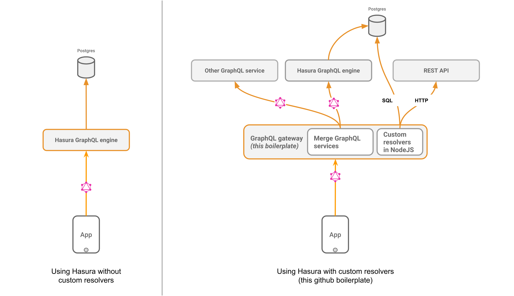

# GraphQL Custom Resolver Example

> **NOTE**: now merge [Remote Schemas](../../../remote-schemas.md) from [GraphQL servers](../graphql-servers) using Hasura
> - Boilerplates for custom GraphQL servers have been moved [here](../graphql-servers). Also, a recently released feature removes the need for an external GraphQL gateway by letting you merge remote schemas in GraphQL Engine itself - [read more](../../../remote-schemas.md) (*Please check caveats for current limitations in the feature*).
> - Once schemas have been merged in GraphQL Engine, Hasura proxies requests to remote GraphQL servers.
> - Adding another layer in front of GraphQL Engine impacts performance by as much as **4X**, due the serialization-deserialization overhead. Using an external GraphQL gateway is recommended only if your use case is blocked on any of the current limitations.

## Motivation

Hasura GraphQL Engine provides instant GraphQL APIs over the tables and views of
any Postgres database. It also comes with a fine grained access control layer
that helps you restrict the data that can be consumed. 

However, sometimes you might have to write custom resolvers to capture business
logic that is unrelated to the database or needs to execute a custom transaction
or write to the database. 

In this example, we illustrate how to write custom resolvers and merge them with
the Hasura GraphQL Engine. We combine Hasura GraphQL Engine's GraphQL API
running at `https://bazookaand.herokuapp.com/v1alpha1/graphql` with the
following custom resolvers: 

1. A `hello` query
2. A `count` query (that returns a counter from another data source )
3. A `increment_counter` mutation that increments the value of `count`.
4. A `user_average_age` query that makes directly makes an SQL query to Postgres
   using knex. 

You can use this as a boilerplate to write custom resolvers with Hasura GraphQL
Engine. 



## Usage

1. Install the required dependencies.

```bash
npm install
```

2. Set appropriate environment variables for the GraphQL Engine URL, the access
   key to GraphQL Engine and the Postgres connection string. 


```bash
# without the /v1apha1/graphql part
export HASURA_GRAPHQL_ENGINE_URL='https://hge.herokuapp.com'
export X_HASURA_ACCESS_KEY='<access_key>'

# Only required for the direct SQL resolver
export PG_CONNECTION_STRING='<postgres-connection-string>' 
```

3. Run the server

```bash
npm start
```

## Deployment

You can deploy this sample boilerplate with:

* Now
* Docker

### Deploy using [Now](https://zeit.co/now)

Run these commands to instantly deploy this boilerplate using Now.

```bash
git clone https://github.com/hasura/graphql-engine
cd community/boilerplates/custom-resolvers
now -e \
  HASURA_GRAPHQL_ENGINE_URL='https://hge.herokuapp.com' -e \
  X_HASURA_ACCESS_KEY='<access_key>' --npm
```

### Deploy the docker image

This project comes with a [`Dockerfile`](Dockerfile).

## Implementation Details

We will use Apollo's `graphql-tools` library to make a working GraphQL Schema
out of our custom resolvers. Finally, we will merge these resolvers with the
existing Hasura schema so that it can be queried under the same endpoint. 

### Writing type definitions

The type definitions are written in standard GraphQL format. We need the
following queries in our custom logic: 


```graphql
type Query {
  # field hello will return "Hello World" which is a string
  hello: String,

  # field count will return an Int
  count: Int,

  # field user_average_age will return a Float
  user_average_age: Float
}

type Mutation {
  # field "increment_counter" will increment the counter and return type IncrementCounter
  increment_counter: IncrementCounter,

  # IncrementCounter simply returns the new value of the counter
  new_count: Int
}
```

### Writing resolvers

Every resolver is a function that is executed with the following arguments in
the order below: 

1. `root`: The root of the current field
2. `args`: The arguments provided in the query
3. `context`: The server context, which also consists of headers
4. `info`: The AST document related to the query made

The resolvers in our case are: 

```js
const resolvers = {
  // resolvers for queries
  Query: {
    hello: (root, args, context, info) => {
      // return response
      return 'Hello world!';
    },
    count: (root, args, context, info) => {
      // return response
      return count;
    },
    user_average_age: async (root, args, context, info) => {
      // make SQL query using knex client
      const response = await knexClient('user')
        .avg('age');
      // return response
      return response[0].avg;
    }
  },

  // resolvers for mutations
  Mutation: {
    increment_counter: (root, args, context, info) => {
      // return response
      return { new_count: ++count };
    }
  }
};
```

### Making a new schema out of these custom resolvers

Use `makeExecutableSchema()` function from the `graphql-tools` library to make a
schema out of the type definitions and resolvers above. 

```js
import { makeExecutableSchema } from 'graphql-tools';

const executableCustomSchema = makeExecutableSchema({
  typeDefs,
  resolvers,
});
```

### Merging with existing Hasura schema and serving it

Merge these custom resolvers with the Hasura GraphQL Engine by using the
`mergeSchemas()` function from the `graphql-tools` library. 

```js
import { mergeSchemas } from 'graphql-tools';

const newSchema = mergeSchemas({
  schemas: [
    executableCustomSchema,
    executableHasuraSchema
  ]
});

const server = new ApolloServer({
  schema: newSchema
});

server.listen().then(({ url }) => {
  console.log(`Server running at ${url}`);
});
```

Check [this file](src/index.js) to see how it is done.
