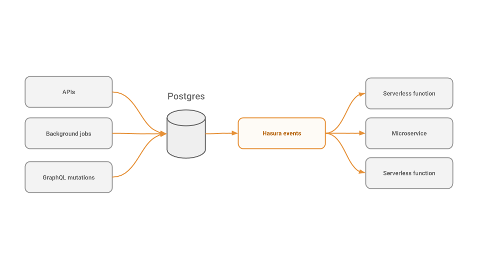

# Event trigger boilerplates for serverless cloud functions

This repository contains boilerplate functions for various use-cases, for different serverless or cloud function platforms. These functions implement sample use-cases of the different types of asynchronous business logic operations that can be triggered by the Hasura GraphQL Engine on database insert, update or delete.

Examples in this repository support the following cloud function platforms:

* AWS Lambda

* Google Cloud Functions

* Microsoft Azure Functions

* Zeit Now

* Netlify Functions

Note: *If you want to add support for other platforms, please submit a PR or create an issue and tag it with `help-wanted`*

## Events Trigger and Serverless functions architecture

## Setup Postgres + Hasura GraphQL engine
This boilerplate code assumes that you already have a HGE instance running.

If not you can visit the [docs](https://docs.hasura.io/1.0/graphql/manual/getting-started/index.html) and setup Postgres + HGE.

## Deploying the boilerplate examples

Follow the cloud function provider docs for setting these up. Provider specific README also contains CLI instructions.

## Documented examples

* A simple example to echo the trigger payload.

* Make a GraphQL mutation on some data update/insert, from the serverless function (*write related data back into the database*).

* Asynchronously send a FCM/APNS push notification.

* ETL or data transformation: transform the trigger payload and update an algolia index.

Note: Some of the examples have a corresponding `great-first-issue` issue in the repository. Please checkout the checklist in the README in the cloud provider folders for such issues.

## Directory Structure

Boilerplates have been organised into top-level folders for each cloud function platform. Inside each such folder, there's a folder for each language, followed by each use-case. The README for each cloud function provider has a list of available boilerplates.

The following is a representative tree of the folder structure:

    .
    ├── aws-lambda
    |   |── README.md
    |   |── nodejs
    |   |   |── echo
    |   |   |── mutation
    |   |── python
    |   |   ...
    |
    ├── azure-functions
    |   |── README.md 
    |   |── nodejs
    |   |   |── echo
    |   |   |── mutation
    |   |── python
    |   |   ...

    
## Contributing and boilerplate requests

Want to contribute to this repo? Issues marked `good-first-issue` or `help-wanted` are a good place to begin. Please submit a PR for new boilerplates (other use-cases or cloud function providers/platforms like Apache OpenWhisk, etc.). You can also create issues to request new boilerplates.
