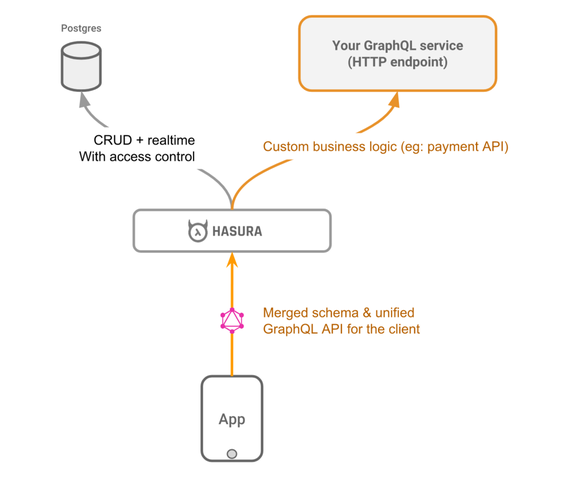

# (MOVED) GraphQL Server Boilerplates

**The contents of this directory have been moved to [remote-schemas](../remote-schemas).**

Hasura GraphQL Engine can combine schemas from multiple remote GraphQL servers
and expose them at a single endpoint. You can write these GraphQL servers in any
language and Hasura takes care of stitching together the schema from these
servers ([read more](../../../remote-schemas.md)).

This directory contains boilerplates for writing GraphQL servers using various
languages and frameworks.

- [Docs on Remote Schemas](https://docs.hasura.io/1.0/graphql/manual/remote-schemas/index.html)

## Architecture

