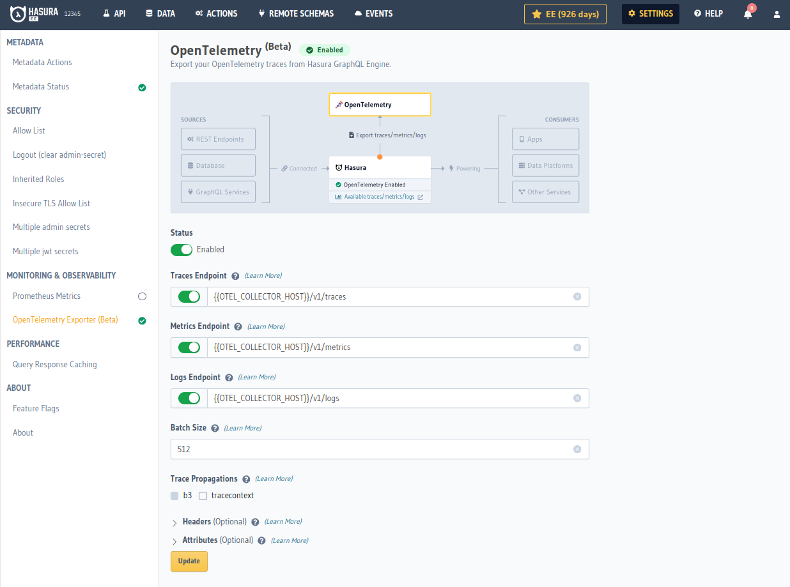
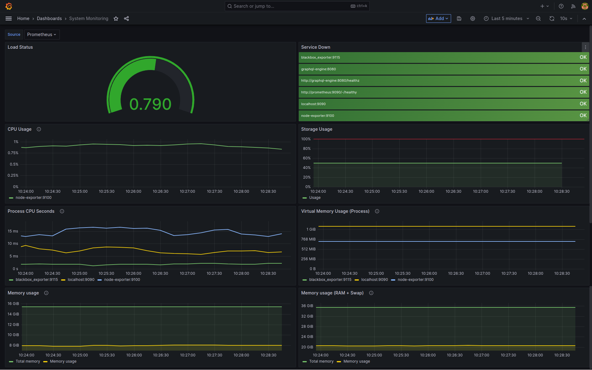
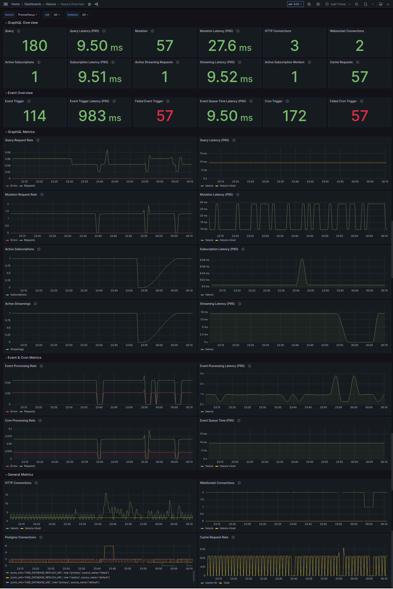
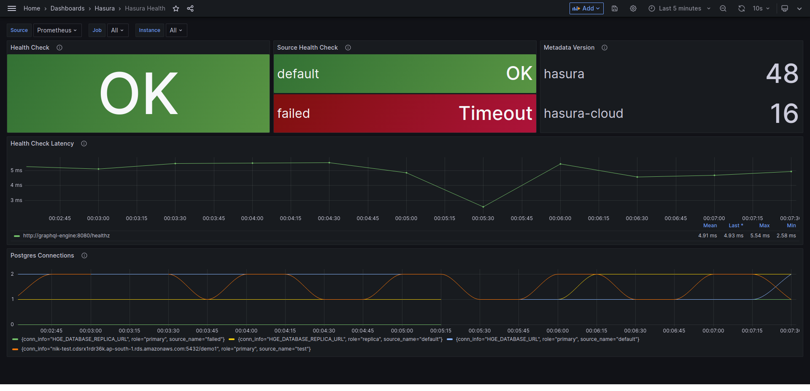
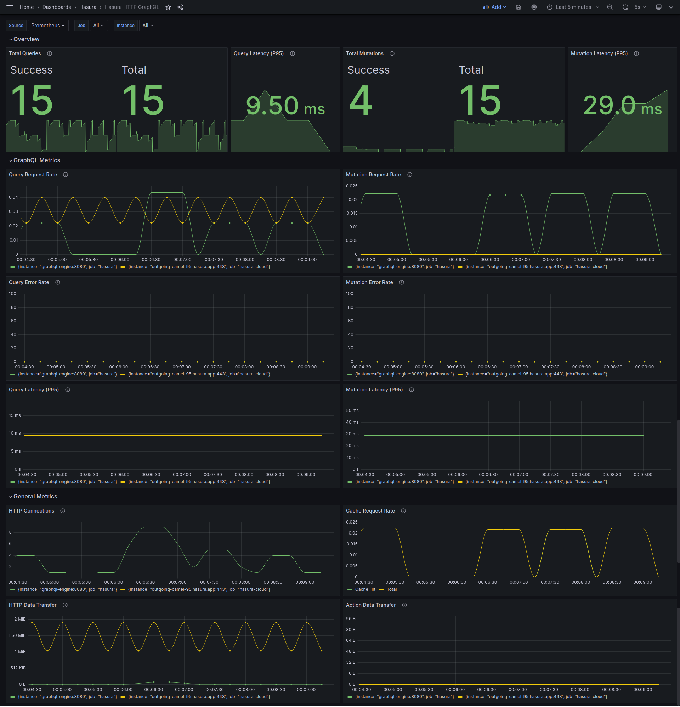
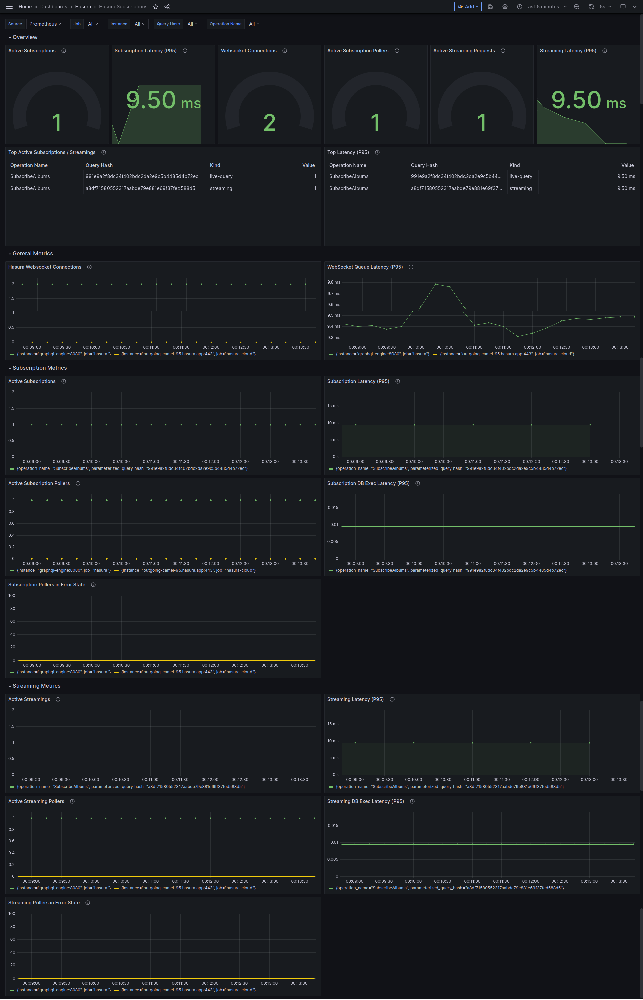
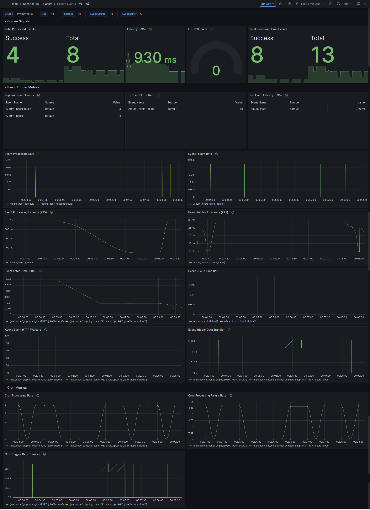
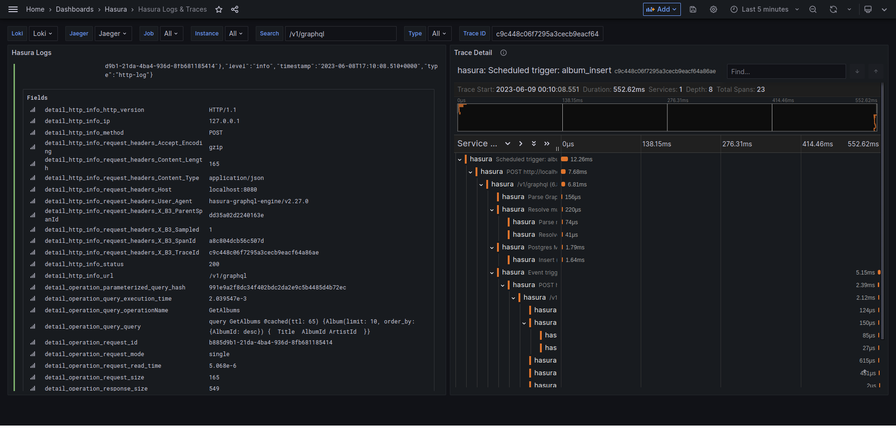
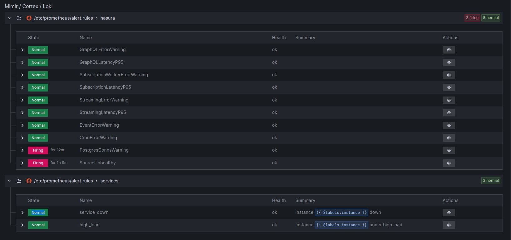

# Hasura Enterprise Observability Demo

An all-in-one observability demo for Hasura GraphQL Engine Enterprise Edition with Prometheus, Jaeger, Alert-manager, Node Exporter, Loki Logs, OpenTelemetry and Grafana dashboards.

## Get Started

- Copy `dotenv` to `.env` and configure secrets and EE License Key.
- Try `docker-compose` locally with `docker-compose up -d`, or run the Docker Swarm stack with scripts that are in the `util` folder.

The default configuration enables the Native Prometheus exporter. If you want to push metrics to 3rd-party services that support OpenTelemetry, first disable the `metrics` API and configure the OpenTelemetry metrics endpoint to the `otel-collector` service. `Browse the console -> Settings -> OpenTelemetry Exporter` and configure the metrics endpoint.

```ini
HGE_ENABLED_APIS=metadata,graphql,config
```



## Components

Here's a list of all the services that are created:

| Service           | Port  | Description                         | Notes                                         |
| ----------------- | :---: | ----------------------------------- | --------------------------------------------- |
| HGE               | :8080 | Hasura GraphQL Engine               |                                               |
| Postgres          | :5432 | Postgres Database Container         |                                               |
| Prometheus        | :9090 | Data Aggregator                     |                                               |
| Alert Manager     | :9093 | Adds Alerting for Prometheus Checks |                                               |
| Grafana           | :3000 | UI To Show Prometheus Data          | Username: `admin`, Password: `HGEMonitoring!` |
| Node Exporter     | :9100 | Data Collector for Host Stats       |                                               |
| Blackbox Exporter | :9115 | Data Collector for Ping & Uptime    |                                               |
| Redis             | :6379 | Latest Redis Cache Container        |                                               |
| Jaeger            | :4318 | Jaeger OTLP HTTP                    |                                               |
| Jaeger            | :4317 | Jaeger OTLP gRPC                    |                                               |
| Jaeger            | :4002 | Jaeger Web UI                       |                                               |
| Loki              | :3100 | Loki Logging Collector              |                                               |
| Promtail          |       | Pushes logs to Loki                 |                                               |

### Grafana Dashboards

Dashboard templates are collected in the [dashboards/hasura](grafana/dashboards/hasura) folder. You can import those files to your config folders where the Grafana service is configured, or [import them directly](https://grafana.com/docs/grafana/latest/dashboards/manage-dashboards/#import-a-dashboard) on the Grafana web UI.

### Example

The default GraphQL Engine service uses migration and metadata configuration in the [examples/hasura](./examples/hasura/) folder to invoke mock requests for metrics demonstration.

## FAQs

**How can I enable metrics in the the Source Health panel**

> Currently, only Postgres supports source health check metrics.

To enable Source Health check metrics you need to configure the [health check metadata](https://hasura.io/docs/latest/deployment/health-checks/source-health-check/#configuring-source-health-check) for each data source.


**How can I find the Trace ID of GraphQL Requests**

You can find the Trace ID in the `X-B3-TraceId` request header.

## Screenshots

### Grafana Dashboards















### Alerts


