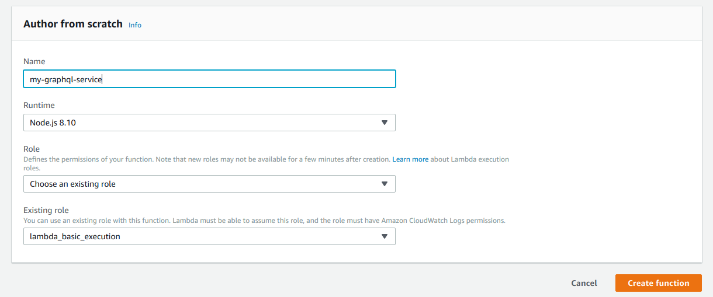

# AWS Lambda + NodeJS + Apollo

This is a GraphQL backend boilerplate in nodejs that can be deployed on AWS Lambda.

## Stack

node 8.10

AWS Lambda

#### Frameworks/Libraries

Apollo Server (GraphQL framework)

## Schema


```
type Query {
  hello:  String
}
```

## Local Development

The sample source code is present in `index.js`.

```bash
$ git clone git@github.com:hasura/graphql-engine
$ cd graphql-engine/community/boilerplates/remote-schemas/aws-lambda/nodejs
```

Start a local development server (you may need to install dependencies from npm):

```bash
$ npm i --no-save apollo-server express
$ node localDev.js

Output:

Server ready at http://localhost:4000/
```

This will start a local server on `localhost:4000`. You can hit the graphql service at `localhost:4000`. This opens a graphql playground where you can query your schema.

## Deployment

Now that you have run the graphql service locally and made any required changes, it's time to deploy your service to AWS Lambda and get an endpoint. The easiest way to do this is through the AWS console.

1) Create a Lambda function by clicking on Create Function on your Lambda console. Choose the `NodeJS 8.10` runtime and `lambda_basic_execution` role.



2) In the next page (or Lambda instance page), select API Gateway as the trigger.


3) Configure the API Gateway as you wish. The simplest configuration is shown below.


Save your changes. You will receive a HTTPS endpoint for your lambda.


If you go to the endpoint, you will receive a "Hello from Lambda!" message. This is because we haven't uploaded any code yet!

4) Zip and upload code. Make sure the handler is set as `lambdaCtx.handler`:

```bash
$ zip -r graphql.zip *
```

And that's it. Hit save and visit the endpoint again. You will see the graphql playground again.

**IMPORTANT NOTE:** You may have to edit the GraphQL URL in the Playground to reflect the right endpoint ( same as the URL created by the API Gateway ). 
