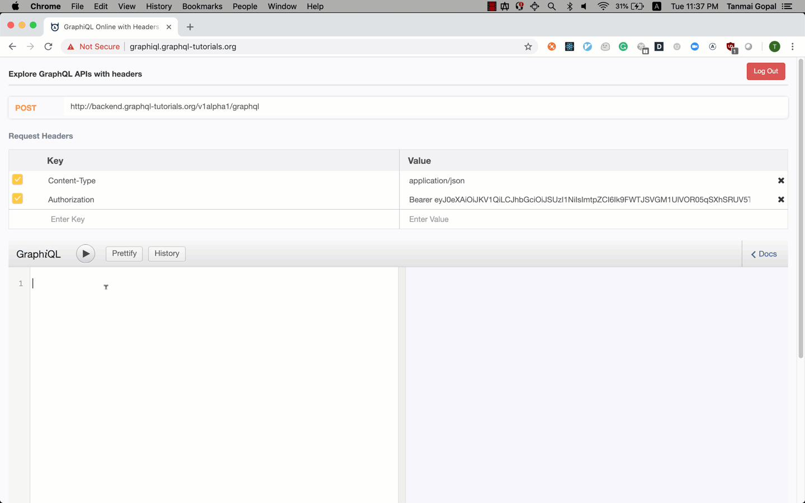

## Try out GraphQL queries
For this tutorial we've set up a GraphQL API for you. The most common
way to browse a GraphQL API is to use GraphiQL. GraphiQL is a tool
built by Facebook, (pronounced "graphical") that makes it easy to explore
any GraphQL API. When you connect GraphiQL to a GraphQL endpoint, it
queries the server for its schema and gives you a UI to browse
and test queries, including with autocomplete!



Tools like GraphiQL make GraphQL APIs really easy
to use and integrate APIs in your app without requiring
external documentation tools.

You can access the GraphiQL for this realtime todo app tutorial here:
[graphiql.graphql-tutorials.org](http://graphiql.graphql-tutorials.org)

When you work with a GraphQL API in a project you will almost always
use a tool like GraphiQL to explore and test your GraphQL queries.

## Basic GraphQL query

1. Open GraphiQL at: [graphiql.graphql-tutorials.org](http://graphiql.graphql-tutorials.org)
2. Paste this GraphQL query in the GraphiQL window

 ```graphql
 query {
   users {
     id
     name
   }
 }
 ```

3. Hit `ctrl + enter` or `cmd + enter` (mac) or click on the ▶️ icon to run the GraphQL query

Recall that there is no magic here! The hosted GraphiQL app is sending a GraphQL query string
to the server at the given endpoint with the HTTP headers. The server then sends the response
that you see on the right hand side.

## Fetching "graphs"

Our todo app has users, todos and information about users that are currently online.
This is what our API model looks like:

*insert schema diagram here*

Let's try making queries that fetch different pieces of data.

### Fetch users and their todos

### Fetch online users and their profile information

## Parameters/arguments

In most API calls, you usually use paramters. For example, to specify what data you're fetching.
If you're familiar with making `GET` calls, you would have used a query parameter. To fetch the
user information of a particular user, your API call might look like this: `GET /api/user?id=1`.

The GraphQL query analog of this is *arguments*. You can attach arguments to a "field" in your
GraphQL query. Let's try out the following examples:

### Fetch the user information and todos belonging to a specific user

### Fetch user and the latest 5 todos for user 1

- Change the number of items
- Sort
- Filter

## GraphQL variables
- Can't manipulate in code: Change parameter on which you're selecting data
- Easy to convert this to a variable

## GraphiQL tips
- Auto-complete
- Look at the types
- Run introspection query and then look at graphql voyager
