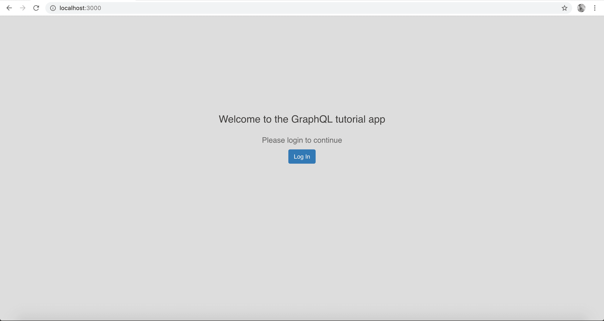
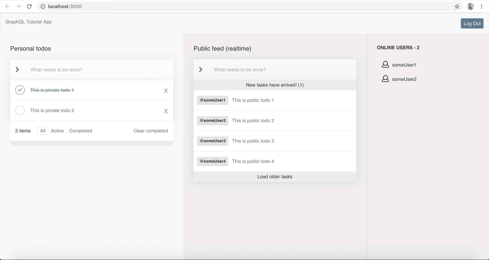

Great! Now you are done learning about major concepts of GraphQL and how it can be useful for development. So let's get started on the application that we are going to build. 

Without wasting any more time, we can directly jump into the GraphQL code as we already have the boilerplate UI ready [here](https://github.com/hasura/graphql-engine/tree/master/community/learn/graphql-tutorials/tutorials/react-apollo/app-boilerplate). You can clone it and start your GraphQL journey immediatedly.

This tutorial uses `create-react-app` with a few other essential modules for styles (`react-bootstrap`) , routing (`react-router`) and workflow tooling (`eslint`, `prettier`, `prop-types`). 
Further this app uses `Auth0` for authentication.

The backend is already built and available [here](https://backend.graphql-tutorials.org/v1alpha1/graphql). You will make use of this for testing and building your frontend app with graphql integration.

#### Directory Structure

    This is the directory structure of the boilerplate that you cloned.

    src
      - components
      - images
      - styles
      - utils
      - index.js
    public
      - index.html
    package.json

Run the react app by executing:

```
$ npm install
$ npm start
```

The boilerplate UI should look something like this:



After logging in, it should look like this:



#### Finished Application

Though you are going to follow the tutorial and write actual code to complete the app, you can always refer the already finished app code [here](https://github.com/hasura/graphql-engine/tree/master/community/learn/graphql-tutorials/react-apollo/final-app), in case you are stuck anywhere or you want to quickly refer to a code snippet.
