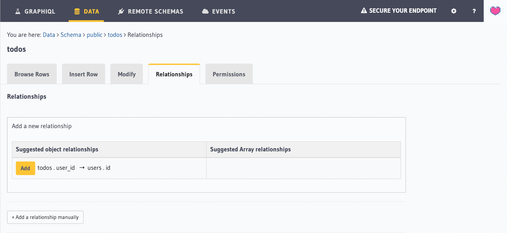
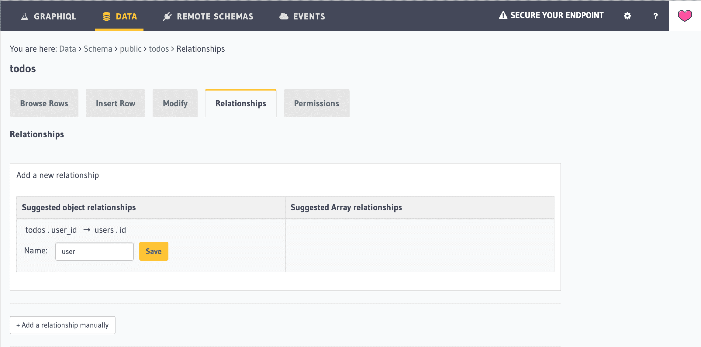

Now that the foreign key constraint is created, Hasura Console automatically suggests relationships based on that.

Head over to `Relationships` tab under `todos` table and you should see a suggested relationship like below:

Click on `Add` in the suggested object relationship.

Enter the relationship name as `user` (already pre-filled) and click on `Save`.

A relationship has now been established between todos and users table.