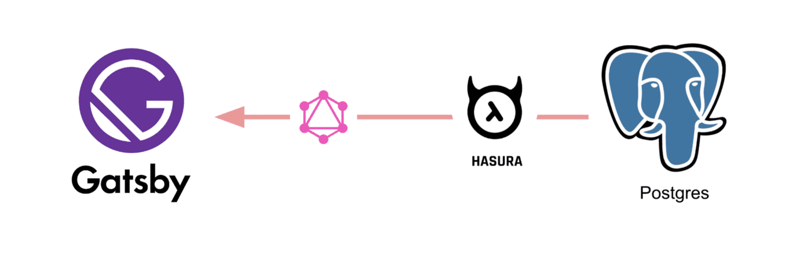
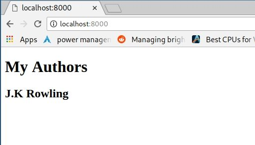

# gatsby-postgres-graphql

Boilerplate to get started with Gatsby, Hasura GraphQL engine as CMS and postgres as database using the awesome plugin [gatsby-source-graphql](https://github.com/gatsbyjs/gatsby/tree/master/packages/gatsby-source-graphql).

[](https://codesandbox.io/s/github/hasura/graphql-engine/tree/master/community/sample-apps/gatsby-postgres-graphql?fontsize=14)



# Tutorial

- Deploy Postgres and GraphQL Engine on Heroku:
  
  [](https://heroku.com/deploy?template=https://github.com/hasura/graphql-engine-heroku)
- Get the Heroku app URL (say `my-app.herokuapp.com`)
- Clone this repo:
  ```bash
  git clone https://github.com/hasura/graphql-engine
  cd graphql-engine/community/sample-apps/gatsby-postgres-graphql
  ```

- Create `author` table:
  
  Open Hasura console: visit https://my-app.herokuapp.com on a browser  
  Navigate to `Data` section in the top nav bar and create a table as follows:

  

- Insert sample data into `author` table:

  

  Verify if the row is inserted successfully

  

- Install npm modules:
  ```bash
  npm install
  ```

- Configure gatsby to use `gatsby-source-graphql` plugin and a connection GraphQL url to stitch the schema.

```js
{
  plugins: [
    {
      resolve: 'gatsby-source-graphql', // <- Configure plugin
      options: {
        typeName: 'HASURA',
        fieldName: 'hasura', // <- fieldName under which schema will be stitched
        createLink: () =>
          createHttpLink({
            uri: `${ process.env.HASURA_GRAPHQL_URL }`, // <- Configure connection GraphQL url
            headers: {},
            fetch,
          }),
        refetchInterval: 10, // Refresh every 10 seconds for new data
      },
    },
  ]
}
```

- Make a GraphQL query from your component

```js
const Index = ({ data }) => (
  <div>
    <h1>My Authors </h1>
    <AuthorList authors={data.hasura.author} />
  </div>
)
export const query = graphql`
  query AuthorQuery {
    hasura {        # <- fieldName as configured in the gatsby-config
      author {      # Normal GraphQL query
        id
        name
      }
    }
  }
`
```

- Run the app:
  ```bash
  HASURA_GRAPHQL_URL=https://my-app.herokuapp.com/v1/graphql npm run develop
  ```
- Test the app
  Visit [http://localhost:8000](http://localhost:8000) to view the app

  

# Contributing

Checkout the [contributing guide](../../../CONTRIBUTING.md#community-content) for more details.
