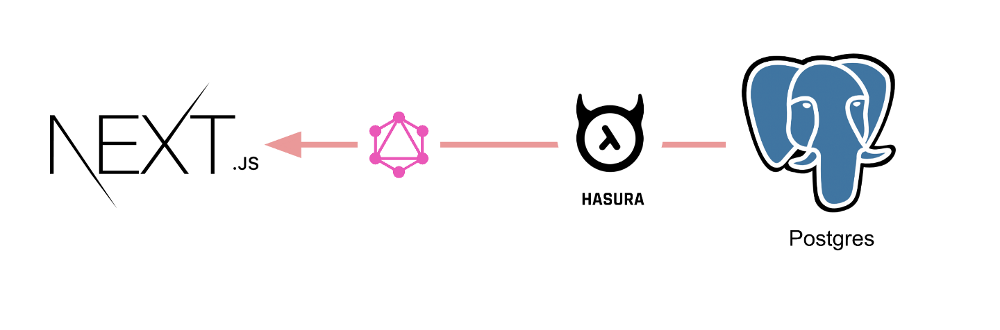

# nextjs-postgres-graphql

Boilerplate to get started with Nextjs, Hasura GraphQL engine as CMS and postgres as database using this awesome library: [withData](https://github.com/adamsoffer/next-apollo).

[](https://codesandbox.io/s/github/hasura/graphql-engine/tree/master/community/sample-apps/nextjs-postgres-graphql?fontsize=14)



# Tutorial

- Deploy GraphQL Engine on Hasura Cloud and setup PostgreSQL via Heroku:
  
  [](https://cloud.hasura.io/)

- Get the Hasura app URL (say `nextjs-graphql.hasura.app`)

- Create `author` table:
  
  Open Hasura console: visit https://nextjs-graphql.hasura.app on a browser  
  Navigate to `Data` section in the top nav bar and create a table as follows:

  

- Insert sample data into `author` table:

  

  Verify if the row is inserted successfully

  

- Clone this repo:
  ```bash
  git clone https://github.com/hasura/graphql-engine
  cd graphql-engine/community/sample-apps/nextjs-postgres-graphql
  ```

- Install npm modules:
  ```bash
  npm install
  ```

- Create config.js as follows, in this step we are configuring `withData` with an `httpLink` to connect to a valid GraphQL server URL.
  ```js
  import { withData } from 'next-apollo'
  import { HttpLink } from 'apollo-link-http'
  
  // can also be a function that accepts a `context` object (SSR only) and returns a config
  const config = {
    link: new HttpLink({
      uri: 'https://my-app.hasura.app/v1/graphql', // <- Configure GraphQL Server URL (must be absolute)
    })
  }

  export default withData(config)
  ```

- Wrap your page component with `Query` component from `react-apollo` so that appropriate data can be fetched while the page is SSRed
    - GraphQL query

      ```js

      const query = gql`
      	query {
      	  author {
      	    id
      	    name
      	  }
      	}
      `

      ```
    - Wrap your component with `Query`
      ```js

        <Query    // <- Wrap the component which requires data with Query component from react-apollo
          query={ query }
          fetchPolicy={ 'cache-and-network' }
        >
          {({ loading, data, error }) => {
            if(error) {
              return (<div>Error..</div>);
            }
            return (
              <div>
                <h1>My Authors </h1>
                <AuthorList authors={data ? data.author: []} />
              </div>
            );
        }}
        </Query>

      ```


- Run the app:
  ```bash
  npm run dev -- -p 8000
  ```
- Test the app
  Visit [http://localhost:8000](http://localhost:8000) to view the app

  

# How it works

  It uses [next-apollo](https://github.com/adamsoffer/next-apollo#how-does-it-work) underneath which ensures that data requirement is satisfied before it is rendered on the server and next.js takes care of the rest.

# Contributing

Checkout the [contributing guide](../../../CONTRIBUTING.md#community-content) for more details.
