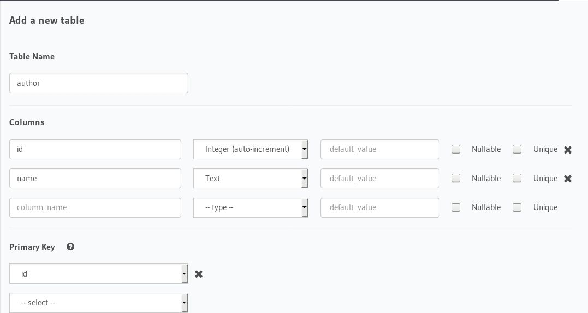
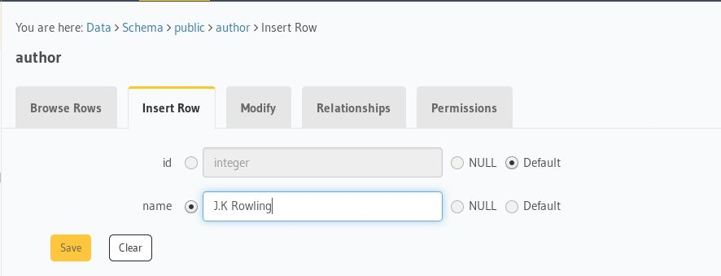
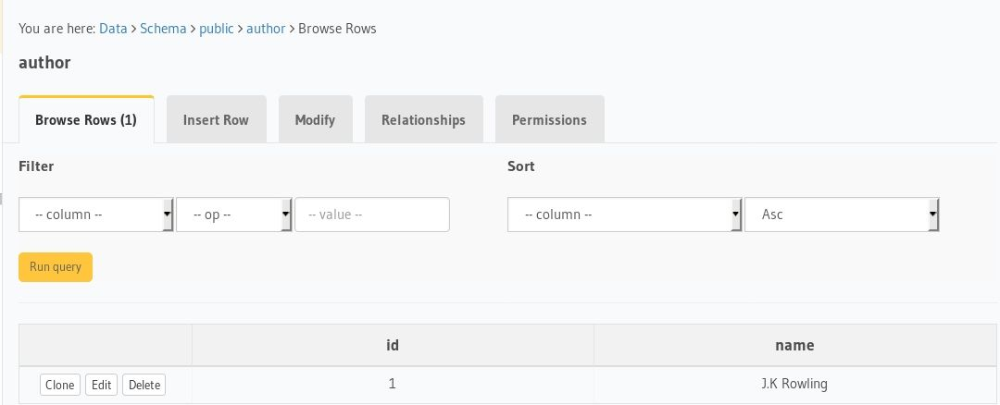

# quasar-framework-vue-graphql

Boilerplate to get started with Quasar Framework, Hasura GraphQL engine as CMS and postgres as database using the [quasar-cli](https://quasar-framework.org/guide/app-installation.html) and [vue-apollo](https://github.com/Akryum/vue-apollo) module.

[](https://codesandbox.io/s/github/hasura/graphql-engine/tree/master/community/sample-apps/quasar-framework-vue-graphql?fontsize=14)

# Tutorial

- Deploy Postgres and GraphQL Engine on Heroku:
  
  [](https://heroku.com/deploy?template=https://github.com/hasura/graphql-engine-heroku)

  Please checkout our [docs](https://docs.hasura.io/1.0/graphql/manual/deployment/index.html) for other deployment methods

- Get the Heroku app URL (say `my-app.herokuapp.com`)
- Create `author` table:
  
  Open Hasura console: visit https://my-app.herokuapp.com on a browser  
  Navigate to `Data` section in the top nav bar and create a table as follows:

  

- Insert sample data into `author` table:

  

  Verify if the row is inserted successfully

  

- Similarly, create an article table with the following data model:
table: `article`
columns: `id`, `title`, `content`, `author_id` (foreign key to `author` table's `id`)

- Clone this repo:
  ```bash
  git clone https://github.com/hasura/graphql-engine
  cd graphql-engine/community/sample-apps/nuxtjs-postgres-graphql
  ```

- Install node modules:
  ```bash
  yarn install
  ```

- Open `src/plugins/apollo.js` and configure Hasura's GraphQL Endpoint as follows: 
```js

import { ApolloClient } from 'apollo-client'
import { InMemoryCache } from 'apollo-cache-inmemory'
import VueApollo from 'vue-apollo'
import fetch from 'node-fetch'
import { createHttpLink } from 'apollo-link-http'

const httpLink = createHttpLink({ uri: 'https://myapp.herokuapp.com/v1/graphql', fetch: fetch })

// Create the apollo client
const apolloClient = new ApolloClient({
  link: httpLink,
  cache: new InMemoryCache(),
  connectToDevTools: true
})

```

In the `httpLink`, replace `myapp.herokuapp.com` with your own Heroku URL of Hasura GraphQL Engine.

- We have defined the graphql query for fetching author list in `src/layouts/MyLayout.vue`. 
    - GraphQL query

    ```graphql
    const authorQuery = gql`
      query {
        author {
          id
          name
        }
    }`
    ```

    - In `pages/Articles.vue`, we have defined a graphql query for articles
    ```js

    <script>
    const articleQuery = gql`
      query articleQuery($authorId: Int!) {
        article(where:{author_id: {_eq: $authorId}}) {
          id
          title
          content
        }
      }`
    export default {
      data () {
        return {
          authorId: this.$route.params.authorId
        }
      },
      name: 'Articles',
      apollo: {
        // Simple query that will update the 'article' vue property
        article: {
          query: articleQuery,
          prefetch: false,
          variables () {
            return { authorId: this.authorId }
          }
        }
      },
      watch: {
        '$route.params.authorId': {
          handler: function (authorId) {
            if (this.$apollo.queries.article) { this.$apollo.queries.article.refetch({ authorId: authorId }) }
          },
          deep: true,
          immediate: true
        }
      }
    }
    </script>

    ```

- Run the app:
  ```bash
  quasar dev
  ```
- Test the app
  Visit [http://localhost:8080](http://localhost:8080) to view the app

For detailed explanation on how things work, checkout [Quasar Framework docs](https://quasar-framework.org/guide/).
