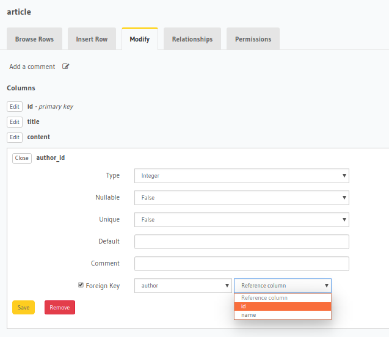

# react-static-graphql

A sample app to get started with [react-static](https://github.com/nozzle/react-static) site generator, Hasura GraphQL engine and Postgres as database.

[](https://codesandbox.io/s/github/hasura/graphql-engine/tree/master/community/sample-apps/react-static-graphql?fontsize=14)

# Tutorial

- Deploy Postgres and GraphQL Engine on Heroku:
  
  [](https://heroku.com/deploy?template=https://github.com/hasura/graphql-engine-heroku)

  Please checkout our [docs](https://docs.hasura.io/1.0/graphql/manual/deployment/index.html) for other deployment methods

- Get the Heroku app URL (say `my-app.herokuapp.com`)
- Create `author` table:
  
  Open Hasura console: visit https://my-app.herokuapp.com on a browser  
  Navigate to `Data` section in the top nav bar and create a table as follows:

  

- Insert sample data into `author` table:

  

  Verify if the row is inserted successfully

  

- Similarly, create an article table with the following data model:
table: `article`
columns: `id`, `title`, `content`, `author_id` (foreign key to `author` table's `id`) and `created_at`

  

- Now create a relationship from article table to author table by going to the Relationships tab.

- Clone this repo:
  ```bash
  git clone https://github.com/hasura/graphql-engine
  cd graphql-engine/community/sample-apps/react-static-graphql
  ```

- Install npm modules:
  ```bash
  yarn install
  ```

- Open `src/apollo.js` and configure Hasura's GraphQL Endpoint as follows: 
  ```js

    import { ApolloClient } from 'apollo-client'
    import { HttpLink } from 'apollo-link-http'
    import { InMemoryCache } from 'apollo-cache-inmemory'
    import fetch from 'node-fetch'

    const client = new ApolloClient({
      link: new HttpLink({
        uri: 'https://myapp.herokuapp.com/v1/graphql',
        fetch
      }),
      cache: new InMemoryCache(),
    })

    export default client

  ```
Replace the `uri` argument with your Hasura GraphQL Endpoint.

- We have defined the graphql query in `src/graphql/queries/queries.js`. 
    - GraphQL query to fetch author information

    ```graphql

    query {
      author {
        id
        name
      }
    }

    ```

    - GraphQL query to fetch articles written by author

    ```graphql

    query($author: Int!) {
        article(where: {author_id: {_eq: $author}}) {
            id
            title
            content
            created_at
        }
    }

    ```

- In `pages/blog.js`, we do the templating for listing all the authors and in `containers/Post.js`, we do the templating for listing all the articles written by a selected author.

- Run the app:
  ```bash
  yarn start
  ```
- Test the app
  Visit [http://localhost:3000](http://localhost:3000) to view the app

- Bundle app
  ```bash
  yarn stage
  ```
- Serve Production app
  ```bash
  yarn serve
  ```

For detailed explanation on how things work, checkout [react-static docs](https://github.com/nozzle/react-static).
