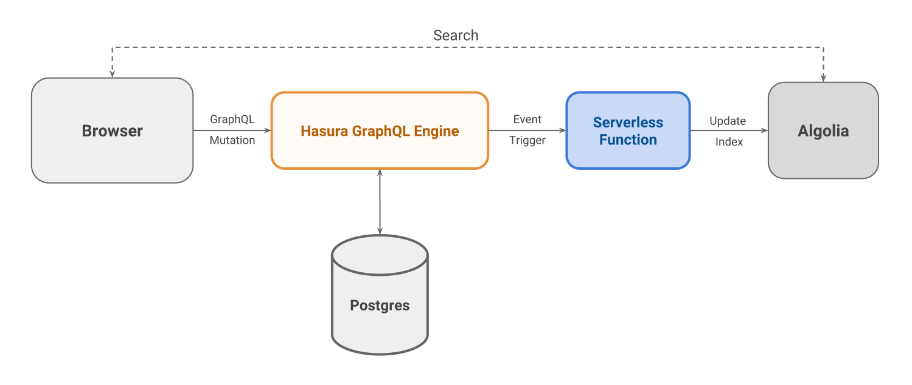

# Serverless ETL demo using Hasura GraphQL Engine Event Triggers and Algolia Search

Live demo at https://serverless-etl.demo.hasura.app/

[](https://codesandbox.io/s/github/hasura/graphql-engine/tree/master/community/sample-apps/serverless-etl?fontsize=14)

This application demonstrates an ETL process using event triggers on [Hasura
GraphQL Engine](https://github.com/hasura/graphql-engine).

A searchable book library is shown where user can add title and author for new
books. When a new book in inserted into the database using [GraphQL
Mutation](https://github.com/hasura/graphql-engine/blob/master/community/examples/serverless-etl/index.js#L36),
a [Google Cloud
Function](https://github.com/hasura/graphql-engine/blob/master/community/examples/serverless-etl/cloudfunction/index.js)
is triggered which updates an Algolia search index. On the search screen, user
can search through this index and results are shown using Algolia APIs. As many
users add more books, the search index gets bigger.

## Instructions

### Pre-requisites

- A Google Cloud account with billing enabled
- `gcloud` CLI
- Algolia account
- Hasura GraphQL Engine (HGE) installation

### Step 1: Create table

Go to HGE console and create the following table:
```
Table name: book

id           UUID default: gen_random_uuid()
created_at   Timestamp
title        Text
author       Text

Primary key: id
```

### Step 2: Setup an Algolia index

- Sign-up for [Algolia account](https://www.algolia.com)
- Go to the Dashboard, 
- Click on `Indices` tab on the left sidebar
- Click on `New Index` button
- Name it as `demo_serverless_etl_app`
- Goto `API Keys` tab on the sidebar
- Copy the `Application ID` (we'll call this `APP_ID`)
- Click on `All API Keys` tab and then click `New API Key` button
- Give description as `server key`
- Choose the `demo_serverless_etl_app` index
- Select `Add records` under the ACL section
- Click `Generate` and copy this API key from the list (we'll call it `ADMIN_KEY`)
- Similarly create one more API key called `search key` for the same index, but
  ACL as only `Search` (we'll call this one `SEARCH_KEY`)

### Step 3: Deploy the cloud function

- Go to `cloudfunction` directory and deploy the function:
  ```bash
  gcloud beta functions deploy serverless-etl \
         --runtime nodejs8 --trigger-http \
         --set-env-vars="ALGOLIA_APP_ID=<APP_ID>,ALGOLIA_ADMIN_API_KEY=<ADMIN_KEY>"
  ```
  Replace `APP_ID` and `ADMIN_KEY` with the keys generated in the previous step.
- Note down the url for triggering the function from the output (call it
  `TRIGGER_URL`):
  ```yaml
  httpsTrigger:
    url: https://us-central1-hasura-test.cloudfunctions.net/serverless-etl
  ```

### Step 4: Create an Event Trigger

Go to `Events` tab in HGE Console and add a new trigger:
```
Trigger name: book_event
Schema/Table: public/book
Operations:   Insert
Webhook URL:  <TRIGGER_URL>
```

Use the `TRIGGER_URL` from previous step.

### Step 5: Add configuration variables

Edit `index.js` and add the following values:
- `HGE_URL`, your GraphQL Engine URL (ending with `v1/graphql`)
- `APP_ID`, the algolia application id
- `SEARCH_KEY`, algolia search api key created in Step 2

### Step 6: Run the application

Run any HTTP server locally and visit the URL on a browser:
```bash
npx http-server
```

## Architecture


