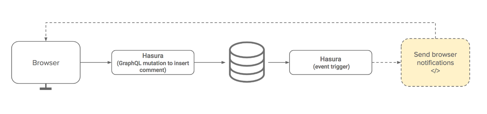

# Web notifications using Hasura GraphQL Engine Event Triggers and FCM

Visit https://serverless-push.demo.hasura.app/ for a live demo.

[](https://codesandbox.io/s/github/hasura/graphql-engine/tree/master/community/sample-apps/serverless-push?fontsize=14)

## Pre-requisites

- Google Cloud account with billing enabled
- Firebase Cloud Messaging (FCM) account
- Hasura GraphQL Engine (HGE) installation

## Instructions

### Step 1: Create table

Goto HGE console and create the following table:

```
Table name: message

Columns:

id            UUID        default: gen_random_uuid()
timestamp     Timestamp   default: now()
title         Text
body          Text        nullable
device_token  Text

Primary key: id
```

### Step 2: Setup FCM

- Create a new project or use an existing project on [Firebase
  Console](https://console.firebase.google.com).
- Note down the Google Cloud project name - also called `PROJECT_ID`.
- Open the [Cloud
  Messaging](https://console.firebase.google.com/project/_/settings/cloudmessaging/)
  tab of the Firebase console Settings pane and scroll to the Web configuration
  section.
- In the Web Push certificates tab, click Generate Key Pair. The console
  displays a notice that the key pair was generated, and displays the public key
  string and date added. 
- Copy the Key Pair (we'll call it `FCM_PUBLIC_KEY`).
- Note down the Sender ID from top of this page (`SENDER_ID`);
- Also note down the Server Key (`SERVER_KEY`).

### Step 3: Deploy Google Cloud Function

We'll configure HGE to send an event to a webhook trigger whenever an insert
happens on the `message` table. The data inserted to this table contains the
notification text and a unique device token. The webhook receives this data and
makes an API call to Firebase to send a push notification to that unique device.

We'll deploy this webhook as a Google Cloud Function.

- Execute the command to deploy the function:
  ```
  cd cloudfunction
  gcloud beta functions deploy push-notification \
         --runtime nodejs8 --trigger-http \
         --set-env-vars="FCM_SERVER_KEY=<SERVER_KEY>"
  ```
- Copy URL from the output (`TRIGGER_URL`)
  ```yaml
  httpsTrigger:
    url: https://us-central1-hasura-test.cloudfunctions.net/push-notification
  ```

### Step 4: Setup event trigger

Goto HGE console and then to the "Events" tab. Here we can add triggers which
will be executed on insert/update/delete actions on tables configured.

Add a new trigger with details as follows:

```
Trigger name:  message_event
Schema/Table:  public/message
Operations:    Insert
Webhook URL:   <TRIGGER_URL>

```

Use the `TRIGGER_URL` from the cloudfunction deployment.

### Step 5: Add configuration variables

- Edit `index.html`, add `PROJECT_ID` and `SENDER_ID`.  
- Edit `index.js`, add `FCM_PUBLIC_KEY` and Hasura GraphQL Engine url (`HGE_URL`)

### Step 6: Run the server

Run any HTTP server locally and visit the URL on browser.

```bash
http-server
```

> **Note**: If you're deploying to any server other than localhost, service
workers will only work if the scheme is HTTPS.

## Architecture


