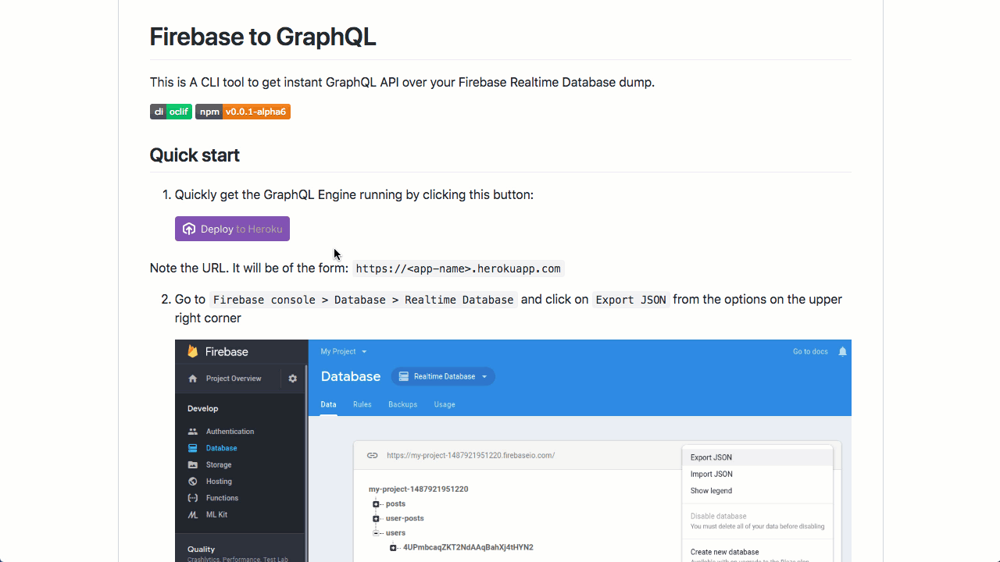

# Firebase to GraphQL

This is A CLI tool to get instant GraphQL API over your Firebase Realtime Database dump.

[](https://oclif.io)
[](https://npmjs.org/package/firebase2graphql)



## Quick start

1. Quickly get the GraphQL Engine running by clicking this button:

   [](https://heroku.com/deploy?template=https://github.com/hasura/graphql-engine-heroku)

   Note the URL. It will be of the form: `https://<app-name>.herokuapp.com`

2. Go to `Firebase console > Database > Realtime Database` and click on `Export JSON` from the options on the upper right corner

   

   The exported JSON will be something like this:

    ```json
    {
      "posts" : {
        "-LMbLFOAW2q6GO1bD-5g" : {
          "author" : "Rishichandra Wawhal",
          "authorPic" : "https://lh4.googleusercontent.com/-vPOIBOxCUpo/AAAAAAAAAAI/AAAAAAAAAFo/SKk9hpOB7v4/photo.jpg",
          "body" : "My first post content\nAnd body\nANd structure",
          "starCount" : 0,
          "title" : "My first post",
          "uid" : "4UPmbcaqZKT2NdAAqBahXj4tHYN2"
        },
        "-LMbLIv6VKHYul7p_PZ-" : {
          "author" : "Rishichandra Wawhal",
          "authorPic" : "https://lh4.googleusercontent.com/-vPOIBOxCUpo/AAAAAAAAAAI/AAAAAAAAAFo/SKk9hpOB7v4/photo.jpg",
          "body" : "AKsdjak\naklsdjaskldjklas\nasdklfjaklsdfjklsda\nasdklfjasklf",
          "starCount" : 0,
          "title" : "Whatta proaaa",
          "uid" : "4UPmbcaqZKT2NdAAqBahXj4tHYN2"
        }
      },
      "user-posts" : {
        "4UPmbcaqZKT2NdAAqBahXj4tHYN2" : {
          "-LMbLFOAW2q6GO1bD-5g" : {
            "author" : "Rishichandra Wawhal",
            "authorPic" : "https://lh4.googleusercontent.com/-vPOIBOxCUpo/AAAAAAAAAAI/AAAAAAAAAFo/SKk9hpOB7v4/photo.jpg",
            "body" : "My first post content\nAnd body\nANd structure",
            "starCount" : 0,
            "title" : "My first post",
            "uid" : "4UPmbcaqZKT2NdAAqBahXj4tHYN2"
          },
          "-LMbLIv6VKHYul7p_PZ-" : {
            "author" : "Rishichandra Wawhal",
            "authorPic" : "https://lh4.googleusercontent.com/-vPOIBOxCUpo/AAAAAAAAAAI/AAAAAAAAAFo/SKk9hpOB7v4/photo.jpg",
            "body" : "AKsdjak\naklsdjaskldjklas\nasdklfjaklsdfjklsda\nasdklfjasklf",
            "starCount" : 0,
            "title" : "Whatta proaaa",
            "uid" : "4UPmbcaqZKT2NdAAqBahXj4tHYN2"
          }
        }
      },
      "users" : {
        "4UPmbcaqZKT2NdAAqBahXj4tHYN2" : {
          "email" : "rishichandrawawhal@gmail.com",
          "profile_picture" : "https://lh4.googleusercontent.com/-vPOIBOxCUpo/AAAAAAAAAAI/AAAAAAAAAFo/SKk9hpOB7v4/photo.jpg",
          "username" : "Rishichandra Wawhal"
        }
      }
    }
    ```

4. Use the CLI to import the data:

    ```
    $ npx firebase2graphql https://<app-name>.herokuapp.com --db=./path/to/db.json
    ```

5. That's it. You can now go to your GraphQL Engine URL `https://<app-name>.herokuapp.com` and make awesome GraphQL Queries like:

    ```graphql
    query {
      posts {
        title
        body
        author
      }
      users {
        email
        username
      }
    }
    ```

Check out [next steps](#next-steps).

## Installation

### CLI

```bash
npm install -g firebase2graphql
```

## Usage

**Without access key**

```
$ firebase2graphql https://hge.herokuapp.com -d ./path/to/db.json
```

**### With access key**

```
$ firebase2graphql https://hge.herokuapp.com -k <access-key> -d ./path/to/db.json
```

## Command

```bash
$ firebase2graphql URL [flags]
```

### Args

* `URL`: The URL where Hasura GraphQL Engine is running

### Options

- `-d --db`: path to the JS file that exports your sample JSON database
- `-n --normalize`: normalize the schema while importing
- `-o --overwrite`: (experimental) overwrite tables if they already exist in database
- `-v --version`: show CLI version
- `-h, --help`: show CLI help

## Next steps

Once you have imported your data, it is recommended that you make it production ready.

1. Denormalize the data by [removing duplicates](#duplicates).
2. Explore the GraphQL Engine Console to play with things such as
   
   a. [Relationships](https://docs.hasura.io/1.0/graphql/manual/schema/relationships/index.html)
   b. [Permissions](https://docs.hasura.io/1.0/graphql/manual/auth/index.html)
   c. Using SQL
   d. [Set up async business logic using event triggers](https://docs.hasura.io/1.0/graphql/manual/event-triggers/index.html)
   e. [Create new tables](https://docs.hasura.io/1.0/graphql/manual/schema/basics.html)

3. Set appropriate permissions. GraphQL Engine comes with [fine grained control layer](https://docs.hasura.io/1.0/graphql/manual/auth/index.html) that can be integrated with any standard Auth provider.

## Usage Comparison - Firebase SDK vs GraphQL

A typical query to do a single read from the database using [Firebase SDK](https://firebase.google.com/docs/reference/), (javascript) would look something like:

```javascript
firebase.database().ref('/users/' + userId).once('value').then(function(snapshot) {
  var username = (snapshot.val() && snapshot.val().username) || 'Anonymous';
  // ...
});
```

Equivalent GraphQL Query would look like:

```graphql
query {
  users(where: {uid: {_eq: userId}}) {
    uid,
    username
  }
}
```

Similarly a write into database using Firebase SDK, would look something like:

```javascript
firebase.database().ref('users/' + userId).set({
    username: name,
    email: email,
    profile_picture : imageUrl
  });
```

And the equivalent GraphQL Mutation would look like:

```graphql
mutation {
  insert_users(objects:[{
      uid: userId
      username: name,
      email: email,
      profile_picture: imageUrl
    }])
}
```

## Things to know about implementation

### Duplicates

By default, the CLI gives you the exact API that you originally had in Firebase (of course, over GraphQL). But in that case, some duplicate tables might be created and you might not be able to leverage the complete power of GraphQL and Postgres.

In such cases, you have three choices:

1. Use the API as such if you prefer the exact API.
2. Go to the UI Console and delete the duplicates and normalize the database as you feel fit.
3. (Experimental) Use the `--normalize` flag. In this case, the CLI will detect duplicates and make appropriate relationships between root nodes. (This feature is experimental and needs more test cases to get stable. Contributions are welcome) 
 

### Overwrite

If your database already contains tables with the same name as the root fields of your JSON database, the command will face. If you want to overwrite the database anyway, you should provide an additional flag "--overwrite".

## Feedback

This project is still in alpha and we are actively looking for feedback about how the tool can be improved. If you facing an issue, feel free to [open one here](https://github.com/hasura/graphql-engine/issues/new). Any positive or negative feedback would be appreciated.

---
Maintained with ♡ by <a href="https://hasura.io">Hasura</a>
