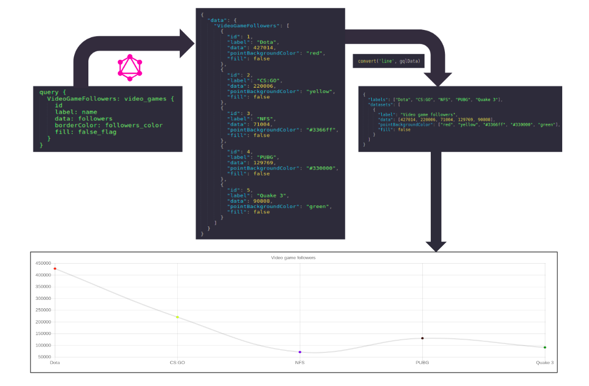
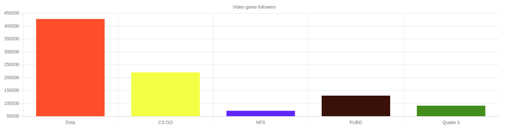
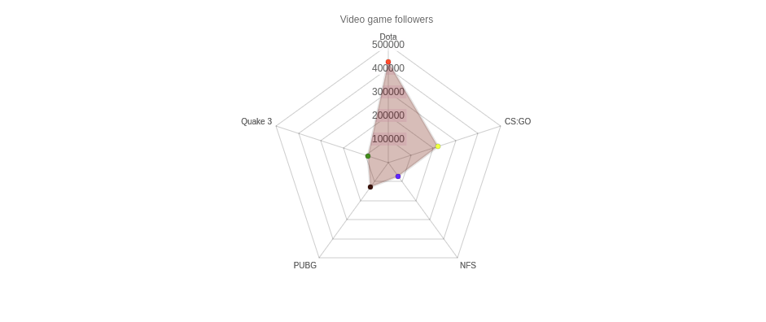
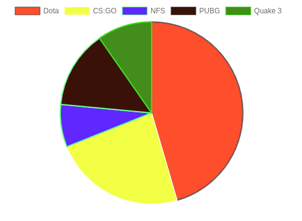
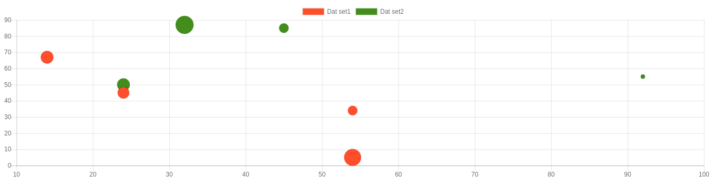
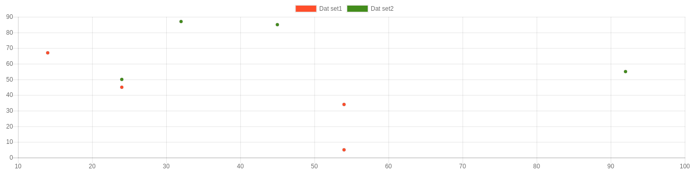

# graphql2chartjs - Instant realtime charts using GraphQL

`graphql2chartjs` reshapes your GraphQL data as per the [ChartJS](https://chartjs.org) API. This makes it easy to query a GraphQL API and render the output as a ChartJS chart.

If you're using Postgres and [Hasura](https://hasura.io), this is what using `graphql2chartjs` looks like:


## Demos & sandbox
- Live demo: [https://graphql2chartjs-examples.herokuapp.com](https://graphql2chartjs-examples.herokuapp.com)
- Vanilla JS: [codesandbox.io/vanilla]
- React: [codesandbox.io/react]
- Angular: [codesandbox.io/angular]
- Vue: [codesandbox.io/vue]

## Tutorials

1. Basic bar chart
   
2. Multiple datasets
   
3. Multiple chart types in the same chart
   
4. Realtime chart with animations
   
5. Realtime time-series chart
   

## Mapping GraphQL queries to ChartJS charts

Different types of charts need different structures in their datasets. 

For example a bar chart dataset needs labels and data associated for each label; the ChartJS API refers to this as `label` and `data`. Once you alias fields in your graphql query to `label` and `data`, and pass the response through `graphql2chartjs`, your dataset is ready to be used by bar chart in chartjs.

### Bar / Doughnut / Pie

**Show a query with the alias names / field names being mapped to things in a bar chart**


## Sample usage with react, apollo, react-chartjs-2

```javascript
import React from 'react';
import gql from 'graphql-tag';

import {Bar} from 'react-chartjs-2';
import {Query} from 'react-apollo';

import graphql2chartjs from 'graphql2chartjs';

const Chart = () => (
  <Query
    query={gql`
        query {
          VideoGameFollowers: video_games {
            id
            label: name
            data: followers
          }
        }
      `}>
    {
      ({data, error, loading}) => {

        // Render the chart by calling graphql2chartjs() on the graphql data
        if (data) {
          return (<Bar data={graphql2chartjs('bar', data)} />);
        }

        if (error) {
          return "Error";
        }
        if (loading) {
          return "Loading..";
        }
      }
    }
  </Query>
);
```

## Sample usage with vanillaJS

```javascript
async function createChart() {
  // Run a GraphQL query and get the response data
  const response = await fetch('http://myapp.com/graphql', {
    method: 'POST',
    body: JSON.stringify({
      query: `query {
          VideoGameFollowers: video_games {
            id
            label: name
            data: followers
          }
        }`
    })
  });
  const data = (await response.json()).data;

  // Convert the response data to a ChartJS version
  const chartData = graphql2chartjs('bar', data);

  // Build the chart!
  const ctx = document.getElementById('my-chart').getContext('2d');
  const chart = new Chart(ctx, {
    type: 'bar',
    data: chartData
  });
};

createChart();

```

Check out the live demo [here](https://graphql2chartjs-examples.herokuapp.com).



## Contents

- [Demo](#demo)
- [Realtime](#realtime)
- [Installation](#installation)
- [Getting started](#quickstart-with-react)
- [How it works](#how-it-works)
    + [Motivation](#motivation)
    + [GraphQL Aliasing](#graphql-aliasing)
    + [ChartJS API](#chartjs-api)
    + [The graphql2chartjs function](#the-graphql2chartjs-function)
    + [How the restructuring works](#how-the-restructuring-works)
- [Reference examples with CodeSandbox links](#reference-examples)
    + [Bar](#bar)
    + [Line](#line)
    + [Radar](#radar)
    + [Pie](#pie)
    + [Doughnut](#doughnut)
    + [Bubble](#bubble-multiple-datasets)
    + [Scatter](#scatter-multiple-datasets)
- [Limitations](#limitations)

## Demo

### Time series


### Doughnut chart


### Bar chart


### Line chart


## Realtime

Realtime charts can be very useful in visualising live data trends. Two of the major use cases of realtime charts are:

1. Live time series
2. Realtime poll

You can see the time series chart in action [here](#demo). We have used [Hasura GraphQL engine](https://hasura.io) as a realtime GraphQL backend. Hasura provides realtime GraphQL APIs over any Postgres database. Postgres is a good choice of a database for storing chart data because you can create custom views that aggregate the data in your tables. Hasura allows you to query (or subscribe to) these views over GraphQL. Hasura also allows you to have granular access control rules so that you can restrict the CRUD on your database based on user's session information.

## Installation

### Via npm

```
npm install --save graphql2chartjs
```

### Use in a script tag

```html
<script src="https://cdn.jsdelivr.net/gh/hasura/graphql-engine/master/community/tools/graphql2chartjs/bundle/js/index.min.js" type="text/javascript"></script>
```

## Quickstart with React

1. Clone a boilerplate from the CDN and install the dependencies.
    
    ```sh
    wget https://graphql-engine-cdn.hasura.io/assets/graphql2chartjs/graphql2chartjs-example.zip
    unzip graphql2chartjs-example.zip && cd example
    yarn
    ```

2. **Run GraphQL Engine**: Run the Hasura GraphQL Engine and Postgres on Heroku's free tier (no credit card required) by clicking this button:

   [](https://heroku.com/deploy?template=https://github.com/hasura/graphql-engine-heroku)

   Note the URL. It will be of the form: `https://<app-name>.herokuapp.com`. Let's say it's `graphql2chartjs.herokuapp.com`.
   For instructions on how to deploy Hasura in other environments, head to the [docs](https://docs.hasura.io/1.0/graphql/manual/getting-started/index.html).

3. **Populate sample data**: Run the following commands. (Replace `graphql-engine-url` with the URL you obtained above)
   
    ```sh
    export SAMPLE_JSON='{"video_games": [{ "id": 1, "name": "Dota", "followers": 427014, "color": "red"},{ "id": 2, "name": "CS:GO", "followers": 220006, "color": "yellow"},{ "id": 3, "name": "NFS", "followers": 71004, "color": "#3366ff"},{ "id": 4, "name": "PUBG", "followers": 129769, "color": "#330000"},{ "id": 5, "name": "Quake 3", "followers": 90808, "color": "green"}]}'
    echo $SAMPLE_JSON > db.json
    npx json2graphql <graphql-engine-url> -d db.json
    ```

4. **Set constants in the app**: Go to `src/constants.js` and set HGE_URL to your GraphQL Engine URL.

5. **Run the app**:
    ```
    yarn start
    ```
    
The app opens at `localhost:3000` rendering the realtime bar chart.

## How it works

### Motivation

We started using ChartJS with GraphQL so that we could leverage GraphQL's realtime subscriptions to build realtime charts. Soon enough we realised that we can automate this tedious procedure of restructuring the GraphQL data to a form that ChartJS expects.

The idea behind this tool is to generate ChartJS compliant `data` object from your GraphQL response by simply adding a few aliases in your GraphQL query.

### GraphQL Aliasing

GraphQL gives you the power of aliasing the response fields with custom names. Lets look at a simple GraphQL query.

```gql
query {
    rootField {
        field1
        field2
    }
}

```

The response to this query would be of the form:

```json
{
    "data": {
        "rootField": [
            {
                "field1": "value 1",
                "field2": "value 2"
            }
        ]
    }
}
```

Now, when we alias the above GraphQL query like so:

```gql
query {
    aliasedRootField: rootField {
        aliasedField1: field1
        aliasedField2: field2
    }
}
```

The response would be:

```
{
    "data": {
        "aliasedRootField": {
            "aliasedField1": 'value 1',
            "aliasedField2": 'value 2'
        }
    }
}
```

### ChartJS API

Most of the ChartJS charts expect a data object of the form:

```js
{
    "labels": ["label1", "label2", ..., "label10"], // list of strings
    "datasets": [ // list of custom datasets with their properties
        {
            "data": [1334, 4314, ..., 2356],
            "backgroundColor": ['red', "blue", ..., "brown"],
            "borderColor": ['red', "blue", ..., "brown"],
            "fill": false
        } 
    ]
}
```

### The graphql2chartjs function

The `graphql2chartjs` function i.e. the default export of this library accepts two arguments:
1. **type**: (String) Type of the chart; Eg. `bar`, `line`, `pie`
2. **graphqlData**: [Object] This should be an object with each field having its value as a list of data points.

You can directly feed the output of the `graphql2chartjs` function to your ChartJS instance.

```js

const graphQLResponse = makeGraphQLQuery();
var chartType = 'bar';

var myChart = new Chart(ctx, {
    type: chartType,
    data: graphql2chartjs(chartType, graphQLResponse),
    options: {...} //custom options
});

```

### How the restructuring works

The `graphql2chartjs` function understands the API for each kind of chart that it supports. It constructs appropriate arrays mapping the indices of labels with other dataset properties.

Lets consider this GraphQL response:

```json
{
  "data": {
    "VideoGameFollowers": [
      {
        "id": 1,
        "label": "Dota",
        "data": 427014,
        "pointBackgroundColor": "red",
        "fill": false
      },
      {
        "id": 2,
        "label": "CS:GO",
        "data": 220006,
        "pointBackgroundColor": "yellow",
        "fill": false
      },
      {
        "id": 3,
        "label": "NFS",
        "data": 71004,
        "pointBackgroundColor": "#3366ff",
        "fill": false
      },
      {
        "id": 4,
        "label": "PUBG",
        "data": 129769,
        "pointBackgroundColor": "#330000",
        "fill": false
      },
      {
        "id": 5,
        "label": "Quake 3",
        "data": 90808,
        "pointBackgroundColor": "green",
        "fill": false
      }
    ]
  }
}
```

The above GraphQL response is restructured to the ChartJS `data` as follows:

1. It starts with initializing the `data` object as:

    ```json
    {
        "labels": [],
        "datasets": []
    }
    ```

2. It pushes a dataset with label as `humanized(rootFieldName)`. In this case, the root field is `VideoGameFollowers`. After inserting this step, the `data` object looks like 

    ```json
    {
        "labels": [],
        "dataset": [
            {
                "label": "Video game followers"
            }
        ]
    } 
    ```

3. It then iterates over the contents of this dataset. For each datapoint in the dataset, it pushes the label to the top level `labels` array and every other property to the dataset. So, after inserting the first data point, that is:
    ```json
    {
      "id": 1,
      "name": "Dota",
      "data": 427014,
      "pointBackgroundColor": "red",
      "fill": false
    }
    ```

    the `data` object looks like:

    ```json
    {
        "labels": ["Dota"],
        "datasets": [
            {
                "data": [427014],
                "pointBackgroundColor": ["red"],
                "fill": false
            }
        ]
    }
    ```

    As you see, `pointBackgroundColor` and `data` get pushed in an array while `fill` gets set as a top level field. This is because `graphql2chartjs` function understands that the ChartJS API expects `pointBackgroundColor` to be an array and `fill` to be a simple flag.

4. It repeats the step above for every data point. The final `data` object would be:

    ```json
    {
      "labels": [ "Dota", "Cs:go", "Nfs", "Pubg", "Quake 3"],
      "datasets": [
        {
          "label": "Video game followers",
          "id": 5,
          "data": [ 427014, 220006, 71004, 129769, 90808 ],
          "pointBackgroundColor": ["red", "yellow", "#3366ff", "#330000", "green"],
          "fill": false
        }
      ]
    }
    ```

Now you can pass this data object to your ChartJS instance and you will have a chart like this:


## Reference examples:

### Bar

[Try in Codesandbox](https://codesandbox.io/s/7y5wmpz6k6)

```js
fetch("https://graphql2chartjs.herokuapp.com/v1alpha1/graphql", {
  method: "POST",
  body: JSON.stringify({
  query: `
    query {
      video_games (
        order_by: {
          name: asc
        }
      ) {
        id
        label:name
        data: followers
        backgroundColor:color
      }
    }
  `
  })
}).then(function(resp) {
  resp.json().then(function(respObj) {
    const chartJsData = graphql2chartjs("bar", respObj.data);
    var ctx = document.getElementById("myChart").getContext("2d");
    var myChart = new Chart(ctx, {
      type: "bar",
      data: chartJsData,
      options: {
        legend: {
          labels: { boxWidth: 0 }
        }
      }
    });
  });
});
```



### Line

[Try out in codesandbox](https://codesandbox.io/s/1qp1w7m58l)

```js
fetch("https://graphql2chartjs.herokuapp.com/v1alpha1/graphql", {
  method: "POST",
  body: JSON.stringify({
    query: `
      query {
        video_games (
          order_by: {
            name: asc
          }
        ) {
          id
          label:name
          data: followers
          pointBackgroundColor: color
          fill: false_flag
        }
      }
    `
  })
}).then(function(resp) {
  resp.json().then(function(respObj) {
    const chartJsData = graphql2chartjs("line", respObj.data);
    var ctx = document.getElementById("myChart").getContext("2d");
    var myChart = new Chart(ctx, {
      type: "line",
      data: chartJsData,
      options: {
        legend: {
          labels: { boxWidth: 0 }
        }
      }
    });
  });
})
```


### Radar

[Try out in codesandbox](https://codesandbox.io/s/0qnm9jr550)


```js
fetch("https://graphql2chartjs.herokuapp.com/v1alpha1/graphql", {
  method: "POST",
  body: JSON.stringify({
    query: `
    query {
      video_games (
        order_by: {
          name: asc
        }
      ) {
        id
        label:name
        data: followers
        pointBackgroundColor: color
        fill: false_flag
      }
    }
        `
  })
}).then(function(resp) {
  resp.json().then(function(respObj) {
    const chartJsData = graphql2chartjs("radar", respObj.data);
    var ctx = document.getElementById("myChart").getContext("2d");
    var myChart = new Chart(ctx, {
      type: "radar",
      data: chartJsData,
      options: {
        legend: {
          labels: { boxWidth: 0 }
        }
      }
    });
  });
})
```



### Pie

[Try out in codesandbox](https://codesandbox.io/s/pwo9w71q47)

```js
fetch("https://graphql2chartjs.herokuapp.com/v1alpha1/graphql", {
  method: "POST",
  body: JSON.stringify({
    query: `
        query {
          video_games (
            order_by: {
              name: asc
            }
          ) {
            id
            label:name
            data: followers
            backgroundColor:color
          }
        }
    `
  })
}).then(function(resp) {
  resp.json().then(function(respObj) {
    const chartJsData = graphql2chartjs("pie", respObj.data);
    var ctx = document.getElementById("myChart").getContext("2d");
    var myChart = new Chart(ctx, {
      type: "pie",
      data: chartJsData
    });
  });
});
```



### Doughnut

[Try out in codesandbox](https://codesandbox.io/s/1yo9m5z173)

```js
fetch("https://graphql2chartjs.herokuapp.com/v1alpha1/graphql", {
  method: "POST",
  body: JSON.stringify({
    query: `
        query {
          video_games (
            order_by: {
              name: asc
            }
          ) {
            id
            label:name
            data: followers
            backgroundColor:color
          }
        }
      `
  })
}).then(function(resp) {
  resp.json().then(function(respObj) {
    const chartJsData = graphql2chartjs("doughnut", respObj.data);
    var ctx = document.getElementById("myChart").getContext("2d");
    var myChart = new Chart(ctx, {
      type: "doughnut",
      data: chartJsData
    });
  });
})
```


### Bubble (multiple datasets)

[Try out in codesandbox](https://codesandbox.io/s/23ozw02200)

```js
fetch("https://graphql2chartjs.herokuapp.com/v1alpha1/graphql", {
  method: "POST",
  body: JSON.stringify({
    query: `
    query {
      DataSet1: scatter {
        id
        data_r: r1
        data_x: x1
        data_y: x2
        backgroundColor: backgroundColor1
      }
      DataSet2: scatter {
        id
        data_r: r2
        data_x: x2
        data_y: y2
        backgroundColor: backgroundColor2
      }
    }
                    `
  })
}).then(function(resp) {
  resp.json().then(function(respObj) {
    const chartJsData = graphql2chartjs("bubble", respObj.data);
    var ctx = document.getElementById("myChart").getContext("2d");
    var myChart = new Chart(ctx, {
      type: "bubble",
      data: chartJsData
    });
  });
})
```



### Scatter (multiple datasets)

[Try out in codesandbox](https://codesandbox.io/s/64pqlm3v0n)

```js
fetch("https://graphql2chartjs.herokuapp.com/v1alpha1/graphql", {
  method: "POST",
  body: JSON.stringify({
    query: `
        query {
          DataSet1: scatter {
            id
            data_x: x1
            data_y: x2
            backgroundColor: backgroundColor1
          }
          DataSet2: scatter {
            id
            data_x: x2
            data_y: y2
            backgroundColor: backgroundColor2
          }
        }
                        `
  })
}).then(function(resp) {
  resp.json().then(function(respObj) {
    const chartJsData = graphql2chartjs("scatter", respObj.data);
    var ctx = document.getElementById("myChart").getContext("2d");
    var myChart = new Chart(ctx, {
      type: "scatter",
      data: chartJsData
    });
  });
});
```



## Limitations

1. The response structure of your GraphQL query is opinionated. This is however not a limitation as you use GraphQL aliasing to rename the fields to achieve the required structure.

2. GraphQL spec for subscriptions allows subscribing to just one root field. This doesn't allow for having multiple datasets in the chart. The workaround for this is to open multiple subscriptions, form a custom GraphQL response from the subscription responses and then pass the response to the `graphql2chartjs` function.

---
*Only sample data has been used in this readme and any resemblance to reality is purely coincidental*
