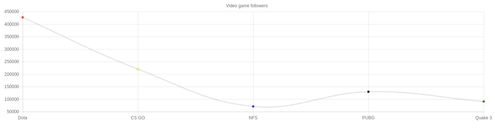

## How it works

### Motivation

We started using ChartJS with GraphQL so that we could leverage GraphQL's realtime subscriptions to build realtime charts. Soon enough we realised that we can automate this tedious procedure of restructuring the GraphQL data to a form that ChartJS expects.

The idea behind this tool is to generate ChartJS compliant `data` object from your GraphQL response by simply adding a few aliases in your GraphQL query.

### GraphQL Aliasing

GraphQL gives you the power of aliasing the response fields with custom names. Lets look at a simple GraphQL query.

```gql
query {
    rootField {
        field1
        field2
    }
}

```

The response to this query would be of the form:

```json
{
    "data": {
        "rootField": [
            {
                "field1": "value 1",
                "field2": "value 2"
            }
        ]
    }
}
```

Now, when we alias the above GraphQL query like so:

```gql
query {
    aliasedRootField: rootField {
        aliasedField1: field1
        aliasedField2: field2
    }
}
```

The response would be:

```
{
    "data": {
        "aliasedRootField": {
            "aliasedField1": 'value 1',
            "aliasedField2": 'value 2'
        }
    }
}
```

### ChartJS API

Most of the ChartJS charts expect a data object of the form:

```js
{
    "labels": ["label1", "label2", ..., "label10"], // list of strings
    "datasets": [ // list of custom datasets with their properties
        {
            "data": [1334, 4314, ..., 2356],
            "backgroundColor": ['red', "blue", ..., "brown"],
            "borderColor": ['red', "blue", ..., "brown"],
            "fill": false
        } 
    ]
}
```

### The graphql2chartjs function

The `graphql2chartjs` function i.e. the default export of this library accepts two arguments:
1. **type**: (String) Type of the chart; Eg. `bar`, `line`, `pie`
2. **graphqlData**: [Object] This should be an object with each field having its value as a list of data points.

You can directly feed the output of the `graphql2chartjs` function to your ChartJS instance.

```js

const graphQLResponse = makeGraphQLQuery();
var chartType = 'bar';

var myChart = new Chart(ctx, {
    type: chartType,
    data: graphql2chartjs(chartType, graphQLResponse),
    options: {...} //custom options
});

```

### How the restructuring works

The `graphql2chartjs` function understands the API for each kind of chart that it supports. It constructs appropriate arrays mapping the indices of labels with other dataset properties.

Lets consider this GraphQL response:

```json
{
  "data": {
    "VideoGameFollowers": [
      {
        "id": 1,
        "label": "Dota",
        "data": 427014,
        "pointBackgroundColor": "red",
        "fill": false
      },
      {
        "id": 2,
        "label": "CS:GO",
        "data": 220006,
        "pointBackgroundColor": "yellow",
        "fill": false
      },
      {
        "id": 3,
        "label": "NFS",
        "data": 71004,
        "pointBackgroundColor": "#3366ff",
        "fill": false
      },
      {
        "id": 4,
        "label": "PUBG",
        "data": 129769,
        "pointBackgroundColor": "#330000",
        "fill": false
      },
      {
        "id": 5,
        "label": "Quake 3",
        "data": 90808,
        "pointBackgroundColor": "green",
        "fill": false
      }
    ]
  }
}
```

The above GraphQL response is restructured to the ChartJS `data` as follows:

1. It starts with initializing the `data` object as:

    ```json
    {
        "labels": [],
        "datasets": []
    }
    ```

2. It pushes a dataset with label as `humanized(rootFieldName)`. In this case, the root field is `VideoGameFollowers`. After inserting this step, the `data` object looks like 

    ```json
    {
        "labels": [],
        "dataset": [
            {
                "label": "Video game followers"
            }
        ]
    } 
    ```

3. It then iterates over the contents of this dataset. For each datapoint in the dataset, it pushes the label to the top level `labels` array and every other property to the dataset. So, after inserting the first data point, that is:
    ```json
    {
      "id": 1,
      "name": "Dota",
      "data": 427014,
      "pointBackgroundColor": "red",
      "fill": false
    }
    ```

    the `data` object looks like:

    ```json
    {
        "labels": ["Dota"],
        "datasets": [
            {
                "data": [427014],
                "pointBackgroundColor": ["red"],
                "fill": false
            }
        ]
    }
    ```

    As you see, `pointBackgroundColor` and `data` get pushed in an array while `fill` gets set as a top level field. This is because `graphql2chartjs` function understands that the ChartJS API expects `pointBackgroundColor` to be an array and `fill` to be a simple flag.

4. It repeats the step above for every data point. The final `data` object would be:

    ```json
    {
      "labels": [ "Dota", "Cs:go", "Nfs", "Pubg", "Quake 3"],
      "datasets": [
        {
          "label": "Video game followers",
          "id": 5,
          "data": [ 427014, 220006, 71004, 129769, 90808 ],
          "pointBackgroundColor": ["red", "yellow", "#3366ff", "#330000", "green"],
          "fill": false
        }
      ]
    }
    ```

Now you can pass this data object to your ChartJS instance and you will have a chart like this:



#
