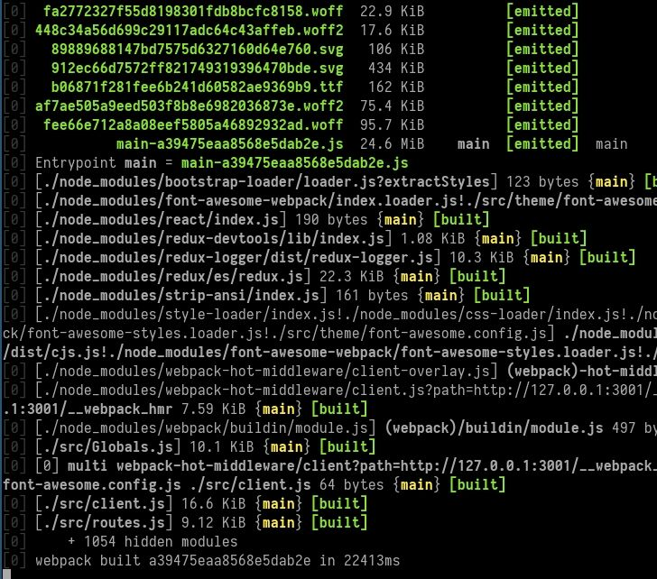

## Hasura Console

- An admin dashboard to manage database and try out GraphQL APIs. Hasura console is served in production by
  - Hasura GraphQL Engine
    - Typically runs in _No Migration Mode_ which means that actions on the console are not spitting out migration “yaml” files automatically. Most users will be using the Hasura console in this mode.
  - Hasura CLI
    - Typically runs with migration mode _enabled_. All the changes to schema/hasura metadata will be tracked and spit out on the filesystem as migration yaml files and a metadata yaml file. This allows for easy version controlling of the schema/hasura metadata.

## Contributing to Hasura console

Hasura console needs to be configured with Hasura GraphQL URL to work and hence there are two ways to start contributing

### Prerequisites

- [Hasura GraphQL Engine](https://docs.hasura.io/1.0/graphql/manual/getting-started/index.html)
- [Hasura CLI](https://docs.hasura.io/1.0/graphql/manual/hasura-cli/install-hasura-cli.html)

### Setup

```bash
> git clone https://github.com/hasura/graphql-engine
> cd graphql-engine
> cd console
> npm install
```

### Development with Hasura GraphQL Engine

We use [dotenv](https://github.com/motdotla/dotenv) for setting environment variables for development. Create a `.env' file in the root directory (wherever package.json is) and set the following values. Replace accordingly for testing.
Configure .env file with appropriate values for the required environment variables
Sample environment variables:

```bash
PORT=3000
NODE_ENV=development
DATA_API_URL=http://localhost:8080
ACCESS_KEY=xyz
CONSOLE_MODE=server
URL_PREFIX=/`
```

Note that _CONSOLE_MODE_ is set to _server_. In this mode _migration mode_ will be disabled and the corresponding functionality on the console will be hidden. If you are looking to add/tweak functionality related to migration. <Link to Development With Hasura CLI section>

Configure the following environment variables appropriately

PORT: Configure the port where Hasura console will run locally.
DATA_API_URL: Configure it with the Hasura GraphQL Engine url. If you are running it on Heroku. Your url will look like <app-name>.herokuapp.com.
ACCESS_KEY: Set access key if Hasura GraphQL engine is configured to run with ACCESS_KEY.
CONSOLE_MODE: hasuradb
URL_PREFIX: ‘/’ (forward slash)

#### Run Development Server:

```bash
> npm run dev
```



### Development with Hasura CLI

Configure .env file with appropriate values for the required environment variables

Sample environment variables (With Migration mode enabled):

```bash
PORT=3000
NODE_ENV=development
API_HOST=http://localhost
API_PORT=9693
ACCESS_KEY=xyz
CONSOLE_MODE=cli
URL_PREFIX=/`
```

Sample environment variables (With Migration mode disabled):

```bash
PORT=3000
NODE_ENV=development
DATA_API_URL=http://localhost:8080
API_HOST=http://localhost
API_PORT=9693
ACCESS_KEY=xyz
CONSOLE_MODE=cli
URL_PREFIX=/`
```

Configure the following environment variables appropriately

PORT: Configure the port where Hasura console will run locally.
DATA_API_URL: Configure it with the Hasura GraphQL Engine url. If you are running it on Heroku. Your url will look like <app-name>.herokuapp.com. This value will be used to test when Hasura migration mode is disabled.
API_HOST: Hasura CLI host.
API_PORT: Hasura CLI port.
ACCESS_KEY: Set access key if Hasura GraphQL engine is configured to run with ACCESS_KEY.
CONSOLE_MODE: cli
URL_PREFIX: ‘/’ (forward slash)

#### Run Development Server:

```bash
> npm run dev
```


### Testing

Visit [http://localhost:3000](http://localhost:3000) to confirm the setup.


## How it works

Hasura console is a react application bundled with webpack and the entire state is managed using redux.

### Release Process

All the development work need to happen in your own fork of the graphql-engine. Once the desired feature/bug is fixed. Raise a PR to the hasura/graphql-engine. Once the PR is raised, CI configured for PR’s will run the test suite and once everything goes well it will generate a preview heroku app with the desired feature/bug fixed. The source code and the preview app will be reviewed by maintainers. If it passes the test suite/code review, then it will be merged to master and released.
