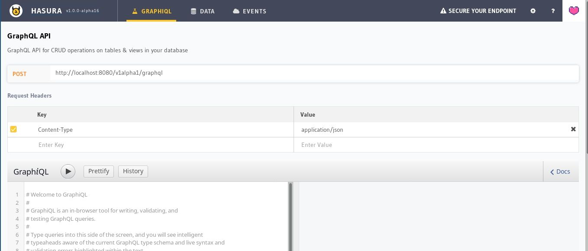

<!-- prettier-ignore-start -->

# Hasura Console

The Hasura console is an admin dashboard to manage the connected database and to try out GraphQL APIs. It is a React application bundled with webpack and the state is managed using Redux.

Served by:
1. Hasura GraphQL Engine:
   The console is served by GraphQL Engine at `/console` endpoint (when `--enable-console` flag is used). Typically runs in **No Migration Mode** which means that actions on the console are not spitting out migration “yaml” files automatically. Most users will be using the Hasura console in this mode.

2. Hasura CLI:
   Served by the Hasura CLI using `hasura console` command, typically runs with migration mode **enabled**. All the changes to schema/hasura metadata will be tracked and spit out on the filesystem as migration yaml files and a metadata yaml file. This allows for easy version controlling of the schema/hasura metadata.

## Contributing to Hasura console

This guide is for setting-up the console for development on your own machine, and how to contribute.

### Console issues in the repo
Issues in the repo for the console UI are labelled as `c/console`(see [list](https://github.com/hasura/graphql-engine/issues?utf8=%E2%9C%93&q=is%3Aissue+is%3Aopen++label%3Ac%2Fconsole)). Issues also labelled as `good first issue` are aimed at those making their first contribution to the repo (see [list](https://github.com/hasura/graphql-engine/issues?utf8=%E2%9C%93&q=is%3Aissue+is%3Aopen++label%3Ac%2Fconsole+label%3A%22good+first+issue%22)). Others marked as `help wanted` are those requiring community contributions on priority (see [list](https://github.com/hasura/graphql-engine/issues?utf8=%E2%9C%93&q=is%3Aissue+is%3Aopen++label%3Ac%2Fconsole+label%3A%22help+wanted%22)).

Please note that some of these issues, labelled with both `c/console` and `c/server`, are part of a change/task that requires modifications in both the server and the console.

Feel free to open pull requests to address these issues or to add/fix  console features, even if a corresponding issue doesn't exist. If you are unsure about whether to go ahead and work on something like the latter, please get in touch with the maintainers in the `GraphQL Engine`->`contrib` channel in the community [Discord](https://discord.gg/vBPpJkS).

### Prerequisites

- [Node.js](https://nodejs.org/en/) (v8.9+)
- [Hasura GraphQL Engine](https://hasura.io/docs/1.0/graphql/manual/getting-started/index.html)
- [Hasura CLI](https://hasura.io/docs/1.0/graphql/manual/hasura-cli/install-hasura-cli.html) (for working with migrations)

### Set up and install dependencies

- Fork the repo on GitHub.
- Clone your forked repo: `git clone https://github.com/<your-username>/graphql-engine`

```bash
git clone https://github.com/<your-user-name>/graphql-engine
cd graphql-engine
cd console
npm ci
```

### Run console development server

Hasura console can be developed in two modes, `server` or `cli` mode. If you are looking to add/tweak functionality related to migrations, check out [Develop with Hasura CLI](#develop-with-hasura-cli-cli-mode), otherwise check out [Develop with Hasura GraphQL engine](#develop-with-hasura-graphql-engine-server-mode).

Both modes require a running instance of GraphQL Engine. The easiest way to get Hasura GraphQL engine instance is by Heroku. You can get it by following the steps given in [this](https://hasura.io/docs/1.0/graphql/manual/getting-started/heroku-simple.html) link. Other methods to install Hasura GraphQL engine are documented [here](https://hasura.io/docs/1.0/graphql/manual/getting-started/index.html).

[Dotenv](https://github.com/motdotla/dotenv) is used for setting environment variables for development. In production, these environment variables are templated by the server or CLI.

#### Develop with Hasura GraphQL engine (`server` mode)

In server mode, **migrations** will be disabled and the corresponding functionality on the console will be hidden.

##### Set up `.env` file
Environment variables accepted in `server` mode:

- `NODE_ENV`: Console build environment (`development`/`production`) 
- `PORT`: The port where Hasura console will run locally
- `CDN_ASSETS`: Should assets be loaded from CDN (`true`/`false`)
- `ASSETS_PATH`: Path to console assets
- `ASSETS_VERSION`: Version of console assets being served 
- `ENABLE_TELEMETRY`: Whether to enable telemetry (`true`/`false`)
- `URL_PREFIX`: Path at which the console is running
- `DATA_API_URL`: The Hasura GraphQL engine url. (If you are running it on Heroku, it will look like https://<app-name\>.herokuapp.com, if you are running locally, it will look like http://localhost:<port\>)
- `SERVER_VERSION`: Hasura GraphQL Engine server version
- `CONSOLE_MODE`: In server mode, it should be `server`
- `IS_ADMIN_SECRET_SET`: Is GraphQl engine configured with an admin secret (`true`/`false`)

Here's an example `.env` file for `server` mode:

```bash
NODE_ENV=development
PORT=3000
CDN_ASSETS=true
ASSETS_PATH=https://graphql-engine-cdn.hasura.io/console/assets
ASSETS_VERSION=channel/stable/v1.0
ENABLE_TELEMETRY=true
URL_PREFIX=/
DATA_API_URL=http://localhost:8080
SERVER_VERSION=v1.0.0
CONSOLE_MODE=server
IS_ADMIN_SECRET_SET=true
```

> The server also templates `consolePath` in `window.__env` which is the relative path of the current page (something like `/console/data/schema/public`). Using this path, the console determines the DATA_API_URL in production. You do not need to worry about this in development since you are hardcoding the value of DATA_API_URL in `.env`.

##### Run console development server:

```bash
 npm run dev
```

#### Develop with Hasura CLI (`cli` mode)

##### Set up `.env` file

Environment variables accepted in `cli` mode:

- `NODE_ENV`: Console build environment (`development`/`production`) 
- `PORT`: The port where Hasura console will run locally
- `MIGRATE_API_URL`: CLI Migrate API URL, `http://localhost:9693` by default.
- `CDN_ASSETS`: Should assets be loaded from CDN (`true`/`false`)
- `ASSETS_PATH`: Path to console assets
- `ASSETS_VERSION`: Version of console assets being served 
- `ENABLE_TELEMETRY`: Whether to enable telemetry (`true`/`false`)
- `URL_PREFIX`: Path at which the console is running
- `DATA_API_URL`: The Hasura GraphQL engine url. (If you are running it on Heroku, it will look like <app-name\>.herokuapp.com, if you are running locally, it will look like http://localhost:<port\>)
- `SERVER_VERSION`: Hasura GraphQL Engine server version
- `CONSOLE_MODE`: In cli mode, it should be `cli`
- `IS_ADMIN_SECRET_SET`: Is GraphQl engine configured with an admin secret (`true`/`false`)

Here's an example `.env` file for `cli` mode:

```bash
NODE_ENV=development
PORT=3000
MIGRATE_API_URL=http://localhost:9693
CDN_ASSETS=true
ASSETS_PATH=https://graphql-engine-cdn.hasura.io/console/assets
ASSETS_VERSION=channel/stable/v1.0
ENABLE_TELEMETRY=true
URL_PREFIX=/
DATA_API_URL=http://localhost:8080
SERVER_VERSION=v1.0.0
CONSOLE_MODE=cli
IS_ADMIN_SECRET_SET=true
```

##### Run console development server:

This setup requires a Hasura CLI console server to be running.

###### Start Hasura CLI console server

Start Hasura CLI console with the same Hasura GraphQL engine url as configured for `DATA_API_URL`.

```bash
hasura console --endpoint <DATA_API_URL> --admin-secret <your-admin-secret> (optional)
```

###### Start development console server

```bash
npm run dev
```

### Check out the console

Visit [http://localhost:3000](http://localhost:3000) to confirm the setup.



### Make changes to the code

Make changes to the code and the console will reload automatically to reflect the new changes. Keep iterating.
When adding a new feature, it is recommended to add corresponding tests too.

Tests are written using [Cypress](https://www.cypress.io/).

You can use the [Redux DevTools Extension](http://extension.remotedev.io/) to inspect and debug the Redux store.
It should automatically connect to the Redux store when started in development mode.

By default [redux-logger](https://www.npmjs.com/package/redux-logger) is enabled to assist in development.
You can disable it if you wish by commenting out the `createLogger` line in `src/client.js`

### Run tests

- Run tests: `npm run cypress`
- Write your tests in the `cypress` directory, integration.

### Linter and formatter

Pre-commit git-hook that runs linter and formatter is by default disabled. You can enable it by adding `HUSKY_PRE_COMMIT=true` to your `.env` file.

If you want to run a linter for all files, you can do:

```bash
npm run lint
```

To format all files, you can run:

```bash
npm run format
```

### Submitting a pull request

- All the development work happens in your own fork of the graphql-engine.
- Make sure your commit messages meet the [guidelines](../CONTRIBUTING.md#commit-messages).
- Once the changes are done, create a pull request.
- CI configured for PR will run the test suite.
- Once everything goes well, it will generate a preview Heroku app.
- The source code and the preview app will be reviewed by maintainers.

<!-- prettier-ignore-end -->
