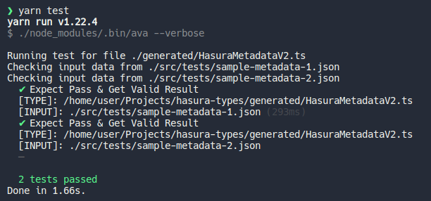

# Table of Contents

- [Table of Contents](#table-of-contents)
- [Introduction](#introduction)
- [How to use this (aka TL;DR)](#how-to-use-this-aka-tldr)
- [Demos](#demos)
    - [TypeScript SDK](#typescript-sdk)
    - [Type-Checking & Docs inside of Metadata YAML files](#type-checking--docs-inside-of-metadata-yaml-files)
- [SDK Usage Examples (TypeScript)](#sdk-usage-examples-typescript)
    - [Extending the Generated Class Functionality](#extending-the-generated-class-functionality)
    - [Programmatically Interacting with Metadata](#programmatically-interacting-with-metadata)
- [Generator Config File Options](#generator-config-file-options)
- [Test Config File Options](#test-config-file-options)
- [Programmatic Usage](#programmatic-usage)
- [Metadata IDE Type-Checking Integration](#metadata-ide-type-checking-integration)
    - [VS Code](#vs-code)
    - [Jetbrains](#jetbrains)

# Introduction

This repo contains a script used to generate SDK's in various languages from either TypeScript or JSON Schema sources. The script is configurable and built to be consumed from something such as a Github Action or a git hook.

It is being used to generate SDK's for Hasura Metadata V2

# How to use this (aka TL;DR)

_**"I want to..."**_

- Add support to my IDE for type-checking and documentation of metadata files

  - See: [Metadata IDE Type-Checking Integration](#metadata-ide-type-checking-integration)

- _Use an existing typed-language SDK in my project_

  - Download the SDK from the [`/generated`](./generated) directory
  - Follow the guide in [SDK Usage Examples (TypeScript)](#sdk-usage-examples-TypeScript)

- _Generate a new SDK for a language that isn't already present in the `/generated` directory (or customize the generator options on existing ones)_

  - Update the config, following guide here: [Generator Config File Options](#generator-config-file-options)
  - `yarn install` or `npm install`
  - `yarn generate-types` or `npm run generate-types`

# Demos

### TypeScript SDK


### Type-Checking & Docs inside of Metadata YAML files


# SDK Usage Examples (TypeScript)

### Extending the Generated Class Functionality

The SDK generated for TypeScript contains types, but also produces a top-level class called `Convert`, which contains methods to do runtime parsing and validation of types. These are named e.g. `Convert.toCronTrigger()` and `Convert.cronTriggerToJson()`:

```ts
public static toCronTrigger(json: string): CronTrigger {
    return cast(JSON.parse(json), r("CronTrigger"));
}

public static cronTriggerToJson(value: CronTrigger): string {
    return JSON.stringify(uncast(value, r("CronTrigger")), null, 2);
}
```

This class can be extended from another file to add extra functionality. Here is an example we will be using, which adds `diff` functionality and a YAML conversion function.

```ts
// customMetadataConverter.ts
import fs from 'fs'
import { load, dump } from 'js-yaml'
import { createPatch } from 'diff'
import { detailedDiff } from 'deep-object-diff'
import {
  Convert as _Convert,
  TableEntry,
  Action,
  CustomTypes,
  CronTrigger,
  HasuraMetadataV2,
} from '../generated/HasuraMetadataV2'

interface DiffOutput {
  structuralDiff: object
  textDiff: string
}

interface WriteDiffOpts {
  folder: string
  file: string
  diffs: DiffOutput
}

export class Convert extends _Convert {
  public static loadYAML = load
  public static dumpYAML = dump
  public static diffYaml = createPatch
  public static diffJson = detailedDiff

  public static clone(obj: any) {
    if (obj == null || typeof obj != 'object') return obj
    let temp = new obj.constructor()
    for (var key in obj) {
      if (obj.hasOwnProperty(key)) {
        temp[key] = Convert.clone(obj[key])
      }
    }
    return temp
  }

  public static diff(before: object, after: object): DiffOutput {
    const originalYaml = Convert.metadataToYaml(before)
    const updatedYaml = Convert.metadataToYaml(after)
    const structuralDiff = Convert.diffJson(before, after)
    const textDiff = Convert.diffYaml('', originalYaml, updatedYaml)
    return { structuralDiff, textDiff }
  }

  public static writeDiff(opts: WriteDiffOpts) {
    const { file, folder, diffs } = opts
    fs.writeFileSync(`${folder}/${file}.diff`, diffs.textDiff)
    fs.writeFileSync(
      `${folder}/${file}.json`,
      JSON.stringify(diffs.structuralDiff, null, 2)
    )
  }

  /**
   * Converts metadata objects into YAML strings
   */
  public static metadataToYaml(value: object): string {
    // JSON Stringify + Parse to remove "undefined" key/values from YAML
    return dump(JSON.parse(JSON.stringify(value)))
  }
}
```

### Programmatically Interacting with Metadata

Below is an example to demonstrate the common usecases you may encounter when wanting to script your interactions with metadata. It includes:

- Loading `tables.yaml`, and `actions.yaml` files
- Adding a new table
- Creating a JSON and text diff of `tables.yaml`, and writing it to a `diffs` folder
- Repeating the above process for `metadata.json` (could be `metadata.yaml` as well)

```ts
import { Convert } from './customMetadataConverter'
import {
  TableEntry,
  Action,
  CustomTypes,
  HasuraMetadataV2,
} from '../generated/HasuraMetadataV2'

// Read "tables.yaml" file as text from filesystem
const tablesMetadataFile = fs.readFileSync('./metadata/tables.yaml', 'utf8')
// Convert it to JSON object with type annotation using loadYAML utility
const tablesMetadata: TableEntry[] = Convert.loadYAML(tablesMetadataFile)
tablesMetadata.forEach(console.log)

// Read "actions.yaml" file as text from filesystem
const actionMetadataFile = fs.readFileSync('./metadata/actions.yaml', 'utf8')
// Convert it to JSON object with type annotation using loadYAML utility
const actionMetadata: {
  actions: Action[]
  custom_types: CustomTypes
} = Convert.loadYAML(actionMetadataFile)
actionMetadata.actions.forEach(console.log)
console.log(actionMetadata.custom_types)

// Make a new table object
const newTable: TableEntry = {
  table: { schema: 'public', name: 'user' },
  select_permissions: [
    {
      role: 'user',
      permission: {
        limit: 100,
        allow_aggregations: false,
        columns: ['id', 'name', 'etc'],
        computed_fields: ['my_computed_field'],
        filter: {
          id: { _eq: 'X-Hasura-User-ID' },
        },
      },
    },
  ],
}

// Clone the tables for comparison after changes using diff()
const originalTablesMetadata = Convert.clone(tablesMetadata)
// Add the new table to tables metadata
tablesMetadata.push(newTable)

// Generate a structural and text diff from the changes between original and now
const tableDiff = Convert.diff(originalTablesMetadata, tablesMetadata)
// Write the diffs to /diffs folder, will output "tables.json" and "tables.diff"
Convert.writeDiff({ folder: 'diffs', file: 'tables', diffs: tableDiff })
// Ouput the updated "tables.yaml" to filesystem
fs.writeFileSync(
  './tables-updated.yaml',
  Convert.metadataToYAML(tablesMetadata)
)

// Read "metadata.json"
const metadataFile = fs.readFileSync('./metadata.json', 'utf-8')
// Convert.to<typeName> does runtime validation of the type
const allMetadata: HasuraMetadataV2 = Convert.toHasuraMetadataV2(metadataFile)
console.log(allMetadata)

// Clone, add table
const beforeMetadataChanges = Convert.clone(allMetadata)
allMetadata.tables.push(newTable)

// Diff, write diff
const metadataDiff = Convert.diff(beforeMetadataChanges, allMetadata)
Convert.writeDiff({ folder: 'diffs', file: 'metadata', diffs: metadataDiff })
```

# Generator Config File Options

_Note: Run with `yarn generate-types`/`npm run generate-types`_

The file `config.yaml` can be used to pass options to the program. It takes:

- An input language target of either "TypeScript" or "JsonSchema"
- A single file/glob expression, or an array of file/glob expressions for the input files used to generates the types
- The output directory can be set, and the output filename will be the name of the input file (with the new language extension)
- Any language name that exists in `quicktype_config` will be generated, and the object keys are options passed to Quicktype's `rendererOptions` config

```yaml
# Accepts "TypeScript" or "JsonSchema"
# Override this with --TypeScript or --jsonschema from CLI
selected_input_language: TypeScript

# Glob patterns for the target input files of selected language
# Only the matching SELECTED INPUT LANGUAGE file expression will be used
input_files:
  # Paths can be either a string, or an array of strings
  JsonSchema: './src/types/**.schema.json'
  TypeScript: ['./src/types/**.ts', './src/otherfolder/**.ts']

# Output file directory
output_directory: './generated'

# Quicktype config per-language
# Config is an object of type "rendererOptions"
# See: https://github.com/quicktype/quicktype/blob/master/src/quicktype-core/language/TypeScriptFlow.ts#L20
quicktype_config:
  # c++: ~
  # crystal: ~
  # csharp: ~
  # dart: ~
  # elm: ~
  # flow: ~
  go:
    package: hasura_metadata
  haskell: ~
  # java:
  #   package: org.hasura.metadata
  # kotlin:
  #   framework: kotlinx
  #   package: org.hasura.metadata
  # objective-c: ~
  # pike: ~
  python:
    python-version: '3.7'
  # ruby: ~
  # rust: ~
  schema: ~
  # swift: ~
  TypeScript: ~
  # rendererOptions:
  #   just-types: true
```

# Test Config File Options

_Note: Run with `yarn test`/`npm run test`_

The test config file is used to take sample input JSON files, and feed them to the generated TypeScript SDK for automated testing. The idea is to have many samples of `metadata.json` (or even individual types, like a single `table.yaml` item as JSON) and have them be type-checked against the generated types for verification.

The input takes the location of a TypeScript file containing the Metadata types, and then an array of `jsonInputTests` with `files` as a one or more file paths or glob expressions pointing to input JSON data to use as type inputs.

For example:

```ts
// myTypes.ts
interface MyType {
  name: string
  age: number
}
```

```js
// test-data1.json
{
  "name": "John",
  "age": 30
}
```

This is what the definition looks like:

```yaml
---
- typeDefinitionFile: './generated/HasuraMetadataV2.ts'
  jsonInputTests:
    - files: './src/tests/**.json'
      # This gets called as "Convert.to(expectType)" -> e.g "Convert.toHasuraMetadataV2" in generated TS SDK
      expectType: HasuraMetadataV2
```



# Programmatic Usage

The type generator can in theory run both as a CLI executable, and as a library.
This allows for customizing behavior, IE for CI/CD pipelines. Here is one example:

```ts
generateTypes()
  .then((outputs) => {
    console.log('Finished generateTypes(), outputs are', outputs)
    for (let output of outputs) {
      // This is the input file path
      console.log('File:', output.file)
      // This contains the generated text
      console.log('Results:', output.results)
    }
  })
  .catch((err) => {
    console.log('Got error', err)
  })
  .finally(async () => {
    // Convert the generated JSON Schema to YAML, for example
    const generatedFolder = path.join(pathFromRoot, 'generated', '/')
    const jsonSchemas = await glob(generatedFolder + '**.json')
    jsonSchemas.forEach(jsonSchemaToYAML)
  })
```

# Metadata IDE Type-Checking Integration

Ever tried (or wanted) to write Hasura Metadata YAML definitions by hand, but found yourself frequently pulled back to documentation for definitions, or fighting YAML's whitespace sensitivity? Well, no more!

### VS Code

VS Code has native support for supplying JSON Schemas when editing JSON files. The [YAML extension authored by Redhat](https://github.com/redhat-developer/vscode-yaml) extends identical support to YAML files.

Follow the configuration below to enable type-checking, documentation, and auto-completion of Hasura metadata YAML files in your project:

_Note: In the future, this may be refactored to point to hosted schema links on Github so that manual copying of schema files is not necessary._

`.vscode/extensions.json`

```json
{
  "recommendations": ["redhat.vscode-yaml"]
}
```

`.vscode/settings.json`

```json
{
  "json.schemas": [
    {
      "fileMatch": ["**/metadata.json"],
      "url": "./MetadataExport.schema.json"
    }
  ],
  "yaml.schemas": {
    "./ActionsYAML.schema.json": "**/actions.yaml",
    "./AllowListYAML.schema.json": "**/allow_list.yaml",
    "./CronTriggerYAML.schema.json": "**/cron_triggers.yaml",
    "./FunctionsYAML.schema.json": "**/functions.yaml",
    "./QueryCollectionsYAML.schema.json": "**/query_collections.yaml",
    "./RemoteSchemasYAML.schema.json": "**/remote_schemas.yaml",
    "./TablesYAML.schema.json": "**/tables.yaml"
  }
}
```

`./MetadataExport.schema.json`

```json
{
  "type": "object",
  "$ref": "./HasuraMetadataV2.schema.json#definitions/HasuraMetadataV2"
}
```

`./ActionsYAML.schema.json`:

```json
{
  "type": "object",
  "properties": {
    "actions": {
      "type": "array",
      "items": {
        "$ref": "./HasuraMetadataV2.schema.json#definitions/Action"
      }
    },
    "custom_types": {
      "type": "object",
      "$ref": "./HasuraMetadataV2.schema.json#definitions/CustomTypes"
    }
  }
}
```

`./AllowListYAML.schema.json`:

```json
{
  "type": "array",
  "items": {
    "$ref": "./HasuraMetadataV2.schema.json#definitions/AllowList"
  }
}
```

`./CronTriggerYAML.schema.json`:

```json
{
  "type": "array",
  "items": {
    "$ref": "./HasuraMetadataV2.schema.json#definitions/CronTrigger"
  }
}
```

`./FunctionsYAML.schema.json`:

```json
{
  "type": "array",
  "items": {
    "$ref": "./HasuraMetadataV2.schema.json#definitions/Function"
  }
}
```

`./QueryCollectionsYAML.schema.json`:

```json
{
  "type": "array",
  "items": {
    "$ref": "./HasuraMetadataV2.schema.json#definitions/QueryCollectionEntry"
  }
}
```

`./RemoteSchemasYAML.schema.json`:

```json
{
  "type": "array",
  "items": {
    "$ref": "./HasuraMetadataV2.schema.json#definitions/RemoteSchema"
  }
}
```

`./TablesYAML.schema.json`

```json
{
  "type": "array",
  "items": {
    "$ref": "./HasuraMetadataV2.schema.json#definitions/TableEntry"
  }
}
```

### Jetbrains

YAML Instructions:

https://www.jetbrains.com/help/ruby/yaml.html#remote_json


JSON Instructions:

https://www.jetbrains.com/help/idea/json.html#ws_json_schema_add_custom


