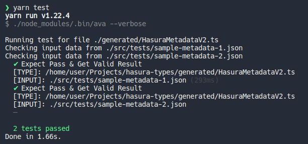

# Table of Contents

- [Table of Contents](#table-of-contents)
- [RFC](#rfc)
  - [What](#what)
  - [Why](#why)
  - [How](#how)
- [Hasura Metadata Types](#hasura-metadata-types)
- [Generator Config File Options](#generator-config-file-options)
- [Test Config File Options](#test-config-file-options)
- [Programmatic Usage](#programmatic-usage)

# RFC

## What

The proposal is to adopt a shared type definition for Metadata across HGE. We can use JSON/YAML Schema or Typescript, whichever is most comfortable.

The process for each is:

- Typescript -> JSON Schema -> (other types)
- YAML Schema -> parse as JSON -> (other types)
- JSON Schema -> (other types)

## Why

- It's useful
- Easy to automate (besides making updates to master type definition when Metadata API changes)
- Will reduce engineering time and headache related to Metadata upkeep
- Improves type-safety and productivity across teams when interacting with metadata due to strong typings and the docstrings (no context switching)

## How

[Manually transcribed, with links and documentation, every Metadata type](./src/types/HasuraMetadataV2.ts) used in `metadata.json` and the `replace_metadata` endpoint.

Initially this was done in TS (it was faster/easier than JSON Schema) and from there generated JSON + YAML schemas.

[A script has been written which is configurable and can automatically generate SDK's in all languages from either TS/JSON Schema sources.](./src/generateTypes.ts)

Additionally, [a testing script was also written](./src/test.ts) that takes filepaths/globs to input JSON data and will type-check them against the generated SDK for automated regression testing.

Source:

- [Original TS Types](./src/types/HasuraMetadataV2.ts)
- [JSON Schema](./src/types/HasuraMetadataV2.schema.json)
- [YAML Schema (easier to read)](./src/types/HasuraMetadataV2.schema.yaml)

Generated Haskell SDK:

- https://gist.github.com/GavinRay97/6c16ae963687a8268e265a171e28cf21

Generated Go SDK:

- https://gist.github.com/GavinRay97/f253a41dd23064bc700358dece84deed

Generated Typescript SDK:

- https://gist.github.com/GavinRay97/8e9c828cb688db75ed4fc2f16cfa8352

# Hasura Metadata Types

This repo contains a script used to generate SDK's in various languages from either Typescript or JSON Schema sources. The script is configurable and built to be consumed from something such as a Github Action or a git hook.

It is being used to generate SDK's for Hasura Metadata V2

Notes: Many of the types on the documentation exist only for semantic purposes. IE `QualifiedFunction` and `QualifiedTable` both have the same type signature:

```json
{
  "name": String,
  "schema": String
}
```

Other types are just aliases to primitives. IE `RoleName`, `ComputedFieldName` and `PGColumnType` are all just `String`.

# Generator Config File Options

_Note: Run with `yarn generate-types`/`npm run generate-types`_

The file `config.yaml` can be used to pass options to the program. It takes:

- An input language target of either "Typescript" or "JsonSchema"
- A single file/glob expression, or an array of file/glob expressions for the input files used to generates the types
- The output directory can be set, and the output filename will be the name of the input file (with the new language extension)
- Any language name that exists in `quicktype_config` will be generated, and the object keys are options passed to Quicktype's `rendererOptions` config

```yaml
# Accepts "Typescript" or "JsonSchema"
# Override this with --typescript or --jsonschema from CLI
selected_input_language: Typescript

# Glob patterns for the target input files of selected language
# Only the matching SELECTED INPUT LANGUAGE file expression will be used
input_files:
  # Paths can be either a string, or an array of strings
  JsonSchema: './src/types/**.schema.json'
  Typescript: ['./src/types/**.ts', './src/otherfolder/**.ts']

# Output file directory
output_directory: './generated'

# Quicktype config per-language
# Config is an object of type "rendererOptions"
# See: https://github.com/quicktype/quicktype/blob/master/src/quicktype-core/language/TypeScriptFlow.ts#L20
quicktype_config:
  # c++: ~
  # crystal: ~
  # csharp: ~
  # dart: ~
  # elm: ~
  # flow: ~
  go:
    package: hasura_metadata
  haskell: ~
  # java:
  #   package: org.hasura.metadata
  # kotlin:
  #   framework: kotlinx
  #   package: org.hasura.metadata
  # objective-c: ~
  # pike: ~
  python:
    python-version: '3.7'
  # ruby: ~
  # rust: ~
  schema: ~
  # swift: ~
  typescript: ~
  # rendererOptions:
  #   just-types: true
```

# Test Config File Options

_Note: Run with `yarn test`/`npm run test`_

The test config file is used to take sample input JSON files, and feed them to the generated Typescript SDK for automated testing. Typescript was chosen simply because it was easy to automate from Node tests. The idea is to have many samples of `metadata.json` (or even smaller samples, like a single `table.yaml` item as JSON) and have them be type-checked against the generated types for verification.

The input takes the location of a Typescript file containing the Metadata types, and then an array of `jsonInputTests` with `files` as a one or more file paths or glob expressions pointing to input JSON data to use as type inputs.

For example:

```ts
// myTypes.ts
interface MyType {
  name: string
  age: number
}
```

```js
// test-data1.json
{
  "name": "John",
  "age": 30
}
```

This is what the definition looks like:

```yaml
---
- typeDefinitionFile: './generated/HasuraMetadataV2.ts'
  jsonInputTests:
    - files: './src/tests/**.json'
      # This gets called as "Convert.to(expectType)" -> e.g "Convert.toHasuraMetadataV2" in generated TS SDK
      expectType: HasuraMetadataV2
```



# Programmatic Usage

The type generator can in theory run both as a CLI executable, and as a library.
This allows for customizing behavior, IE for CI/CD pipelines. Here is one example:

```ts
generateTypes()
  .then((outputs) => {
    console.log('Finished generateTypes(), outputs are', outputs)
    for (let output of outputs) {
      // This is the input file path
      console.log('File:', output.file)
      // This contains the generated text
      console.log('Results:', output.results)
    }
  })
  .catch((err) => {
    console.log('Got error', err)
  })
  .finally(async () => {
    // Convert the generated JSON Schema to YAML, for example
    const generatedFolder = path.join(pathFromRoot, 'generated', '/')
    const jsonSchemas = await glob(generatedFolder + '**.json')
    jsonSchemas.forEach(jsonSchemaToYAML)
  })
```
