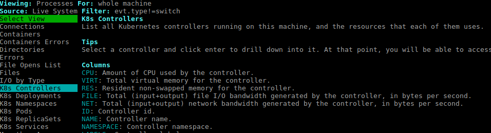

Logging and Monitoring
======================

Here, we will see ways in which you can see logs and monitor your services real-time.

Logging
-------

After setting kubectl context in your development environment (refer to Advanced Settings in your console for details), follow these steps:

::

    $> kubectl -n hasura get pods        #show pods in hasura namespace

    auth-870096057-o1ky8             1/1       Running   0          38d
    console-440138749-uvms0          1/1       Running   0          38d
    data-584267757-nz10x             1/1       Running   4          38d
    gateway-3006027358-q3cm9         1/1       Running   0          24d
    k8s-792970503-0khrs              1/1       Running   4          38d
    postgres-1067805265-q57eg        1/1       Running   0          38d
    session-redis-2836879980-yomel   1/1       Running   0          38d
    shukra-1261221488-lnvh3          2/2       Running   0          24d
    sshd-1110732758-r0672            1/1       Running   0          24d

**The important pods are: auth-xxx, data-xxx, gateway-xxx.** A brief description of these pods:

Pod: *auth-xxx*
  This is the pod for authorisation service. All session management APIs are logged in this pod.

Pod: *data-xxx*
    This is the pod for data service. All query APIs are logged in this pod.

Pod: *gateway-xxx*
    This is the pod for gateway which sits before every service and passed it to upstream service. All API requests are logged in this pod.

Similarly, if you’ve added a **custom service**, then the pod will be visible in the default namespace:

::

    $> kubectl -n default get pods

You can see logs with the following command for each pod:

::

    $> kubectl logs <pod> --tail=200        #show last 200 log lines for <pod>

Monitoring
----------

We use **sysdig** to monitor the health of our kubernetes cluster. Unfortunately, sysdig doesn’t support remote monitoring of kubernetes cluster as of now. For now, we can use sysdig by logging into a node and running the sysdig commands.

SSHing into VM
~~~~~~~~~~~~~~

Suppose the name of your app is <hasura-app>

::
    
    $> curl -XPOST -d '{"type":"select","args":{"table":"prod_project","columns":["ssh_keys"],"where":{"name":"<hasura-app>"}}}' -H "Authorization: Bearer <API token>" -H "Content-Type: application/json" https://data.beta.hasura.io/v1/query > hasura_ssh_keys.enc

The <API token> can be found on your projects settings page: https://beta.hasura.io/settings 

::

    $> cat hasura_ssh_keys.enc | jq -r '.[0].ssh_keys' | base64 --decode | jq -r '.private'  > <hasura-app>-key.pem

    $> ssh -i <hasura-app>-key.pem -p 2022 core@<hasura-app>.hasura-app.io 

Now, you should be logged into your VM. 

Run the sysdig container
~~~~~~~~~~~~~~~~~~~~~~~~
::

    $> docker pull sysdig/sysdig

    $> docker run -i -t --name sysdig --privileged  --net=host -v /var/run/docker.sock:/host/var/run/docker.sock -v /dev:/host/dev -v /proc:/host/proc:ro -v /boot:/host/boot:ro -v /lib/modules:/host/lib/modules:ro -v /usr:/host/usr:ro sysdig/sysdig

    $> docker attach sysdig             # Required only if container is already running

Launch csysdig
~~~~~~~~~~~~~~

After Step 2 above, you should be in sysdig shell

::

    sysdig> csysdig -k 127.0.0.1:8080

We can see the status of each of our namespace, pods, services, etc by pressing F2 in the csysdig console and choosing the appropriate k8s view. For e.get.

We can deep-dive into a particular resource-type to see all resources, CPU, memory consumption, etc.

There are many resources to deep-dive into k8s cluster monitoring using sysdig. Refer to the following resources for more details:

https://sysdig.com/blog/digging-into-kubernetes-with-sysdig/

