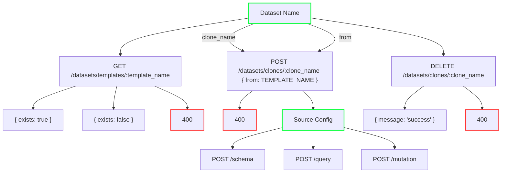

# Data Connectors

This document describes the current specification of the new _data connectors_s feature of `graphql-engine`, which is under active development.

The data connectors feature allows `graphql-engine` to delegate the execution of operations to external web services called _agents_. Such agents provide access to a data set, allowing `graphql-engine` to query that data set over a web API.

This document specifies (1) the web API that must be presented by agents, and (2) the precise behaviour of agents for specific reference data sets.

For further reference, the directory in which this document resides contains some implementations of different agents:
- [Reference Implementation](./reference/) - A reference implementation in TypeScript that serves some static in-memory data

## Stability

This specification is complete with regards to the current implementation, but should be considered _unstable_ until the Data Connectors feature is officially released and explicitly marked as a non-experimental feature.

## Setting up Data Connector agents with `graphql-engine`

In order to run one of the example agents, follow the steps in its respective README document.

Once an agent is running, import the following metadata into `graphql-engine`:

```json
POST /v1/metadata

{
  "type": "replace_metadata",
  "args": {
    "metadata": {
      "version": 3,
      "backend_configs": {
        "dataconnector": {
          "reference": {
            "uri": "http://localhost:8100/"
          }
        }
      },
      "sources": [
        {
          "name": "chinook",
          "kind": "reference",
          "tables": [
            {
              "table": ["Album"],
              "object_relationships": [
                {
                  "name": "Artist",
                  "using": {
                    "manual_configuration": {
                      "remote_table": ["Artist"],
                      "column_mapping": {
                        "ArtistId": "ArtistId"
                      }
                    }
                  }
                }
              ]
            },
            {
              "table": ["Artist"],
              "array_relationships": [
                {
                  "name": "Album",
                  "using": {
                    "manual_configuration": {
                      "remote_table": ["Album"],
                      "column_mapping": {
                        "ArtistId": "ArtistId"
                      }
                    }
                  }
                }
              ]
            }
          ],
          "configuration": {
            "value": {
              "tables": [ "Artist", "Album" ]
            }
          }
        }
      ]
    }
  }
}
```

The `backend_configs.dataconnector` section lets you set the URIs for as many agents as you'd like. In this case, we've defined one called "reference". When you create a source, the `kind` of the source should be set to the name you gave the agent in the `backend_configs.dataconnector` section (in this case, "reference").

The `configuration` property under the source can contain an 'arbitrary' JSON object, and this JSON will be sent to the agent on every request via the `X-Hasura-DataConnector-Config` header. The example here is configuration that the reference agent uses. The JSON object must conform to the schema specified by the agent from its `/capabilities` endpoint.

The `name` property under the source will be sent to the agent on every request via the `X-Hasura-DataConnector-SourceName` header. This name uniquely identifies a source within an instance of HGE.

The `albums` and `artists` tables should now be available in the GraphiQL console. You should be able to issue queries via the web service. For example:

```graphql
query {
  artists {
    name
    albums {
      title
    }
  }
}
```

## Implementing Data Connector agents

This section is a guide to implementing Data Connector agents for `graphql-engine`. You may find it useful to consult the code examples for reference.

The entry point to the reference agent application is a Fastify HTTP server. Raw data is loaded from JSON files on disk, and the server provides the following endpoints:

- `GET /capabilities`, which returns the capabilities of the agent and a schema that describes the type of the configuration expected to be sent on the `X-Hasura-DataConnector-Config` header
- `POST /schema`, which returns information about the provided _data schema_, its tables and their columns
- `POST /query`, which receives a query structure to be executed, encoded as the JSON request body, and returns JSON containing the requested fields. The query will be over the data schema described by the `/schema` endpoint.
- `GET /health`, which can be used to either check if the agent is running, or if a particular data source is healthy
- `POST /mutation`, which receives a request to mutate (ie change) data described by the `/schema` endpoint.
- **DEPRECATED** - `GET /schema`, which returns information about the provided _data schema_, its tables and their columns 

The `/schema`, `/query` and `/mutation` endpoints require the request to have the `X-Hasura-DataConnector-Config` header set. That header contains configuration information that agent can use to configure itself. For example, the header could contain a connection string to the database, if the agent requires a connection string to know how to connect to a specific database. The header must be a JSON object, but the specific properties that are required are up to the agent to define.

The `/schema`, `/query` and `/mutation` endpoints also require the request to have the `X-Hasura-DataConnector-SourceName` header set. This header contains the name of the data source configured in HGE that will be querying the agent. This can be used by the agent to maintain things like connection pools and configuration maps on a per-source basis.

We'll look at the implementation of each of the endpoints in turn.

### Capabilities and configuration schema

The `GET /capabilities` endpoint is used by `graphql-engine` to discover the capabilities supported by the agent, and so that it can know the correct shape of configuration data that needs to be collected from the user and sent to the agent in the `X-Hasura-DataConnector-Config` header. It should return a JSON object similar to the following:

```json
{
  "capabilities": {
    "queries": {
      "foreach": {},
      "redaction": {}
    },
    "data_schema": {
      "supports_primary_keys": true,
      "supports_foreign_keys": true,
      "column_nullability": "nullable_and_non_nullable"
    },
    "relationships": {},
    "interpolated_queries": {},
    "scalar_types": {
      "DateTime": {
        "comparison_operators": {
          "in_year": "Number"
        }
      }
    },
    "user_defined_functions": {}
  },
  "config_schemas": {
    "config_schema": {
      "type": "object",
      "nullable": false,
      "properties": {
        "tables": { "$ref": "#/other_schemas/Tables" }
      }
    },
    "other_schemas": {
      "Tables": {
        "description": "List of tables to make available in the schema and for querying",
        "type": "array",
        "items": { "$ref": "#/other_schemas/TableName" },
        "nullable": true
      },
      "TableName": {
        "nullable": false,
        "type": "string"
      }
    }
  }
}
```

The `capabilities` section describes the _capabilities_ of the service. This includes
- `queries`: The query capabilities that the agent supports
- `data_schema`: What sorts of features the agent supports when describing its data schema
- `relationships`: whether or not the agent supports relationships
- `interpolated_queries`: whether or not the agent supports interpolated queries
- `scalar_types`: scalar types and the operations they support. See [Scalar types capabilities](#scalar-type-capabilities).

The `config_schema` property contains an [OpenAPI 3 Schema](https://swagger.io/specification/#schema-object) object that represents the schema of the configuration object. It can use references (`$ref`) to refer to other schemas defined in the `other_schemas` object by name.

`graphql-engine` will use the `config_schema` OpenAPI 3 Schema to validate the user's configuration JSON before putting it into the `X-Hasura-DataConnector-Config` header.

#### Query capabilities

The agent can declare whether or not it supports ["foreach queries"](#foreach-queries) by including a `foreach` property with an empty object assigned to it. Foreach query support is optional, but is required if the agent is to be used as the target of remote relationships in HGE.

The agent can also declare whether or not it supports ["data redaction"](#data-redaction) by including a `redaction` property with an empty object assigned to it. Data redaction support is optional, but is required if a user configures HGE with inherited roles with different column selection permissions for the same table in the inherited role's role set.

#### Data schema capabilities

The agent can declare whether or not it supports primary keys or foreign keys by setting the `supports_primary_keys` and `supports_foreign_keys` properties under the `data_schema` object on capabilities. If it does not declare support, it is expected that it will not return any such primary/foreign keys in the schema it exposes on the `/schema` endpoint.

If the agent only supports table columns that are always nullable, then it should set `column_nullability` to `"only_nullable"`. However, if it supports both nullable and non-nullable columns, then it should set `"nullable_and_non_nullable"`.

### Interpolated Queries

Interpolated queries are lists of strings and scalars that represent applied templates of analagous form to [`select * from users where id = `, 5]. 

By declaring support for the `interpolated_queries` capability the Hasura admin understands that they will be able to define native queries that leverage this cabability through the agent.

In the case of a well understood backend with a well defined query language - for example - Postgres. The admin will assume that they can define native queries using the most common query language for that backend - In the case of Postgres, PG flavoured SQL.

In the case of a more niche or custom backend, they native query format should be well documented so that administrators know how to define them.

#### Scalar type capabilities

Agents should declare the scalar types they support, along with the comparison operators and aggregate functions on those types.
The agent may optionally specify how to parse values of scalar type by associating it with one of the built-in GraphQL types (`Int`, `Float`, `String`, `Boolean` or `ID`)

Scalar types are declared by adding a property to the `scalar_types` section of the [capabilities](#capabilities-and-configuration-schema).

Comparison operators can be defined by adding a `comparison_operators` property to the scalar type capabilities object.
The `comparison_operators` property is an object where each key specifies a comparison operator name.
The operator name must be a valid GraphQL name.
The value associated with each key should be a string specifying the argument type, which must be a valid scalar type.
All scalar types must also support the built-in comparison operators `eq`, `gt`, `gte`, `lt` and `lte`.

Aggregate functions can be defined by adding an `aggregate_functions` property to the scalar type capabilities object.
The `aggregate_functions` property must be an object mapping aggregate function names to their result types.
Aggregate function names must be must be valid GraphQL names.
Result types must be valid scalar types.

Update column operators are operators that can defined to allow custom mutation operations to be performed on columns of the particular scalar type.
These can be defined by adding an `update_column_operators` property, which maps the operator name to an object that defines the operator's `argument_type`. The name specified in capabilities will be prefixed with `_` when it is used in the GraphQL mutation schema.
The `argument_type` must be a valid scalar type.

The `graphql_type` property can be used to tell Hasura GraphQL Engine to parse values of the scalar type as though they were one of the built-in GraphQL scalar types `Int`, `Float`, `String`, `Boolean`, or `ID`.

Example:

```yaml
capabilities:
  scalar_types:
    DateTime:
      comparison_operators:
        in_year: Number
      aggregate_functions:
        max: DateTime
        min: DateTime
      update_column_operators:
        set_year:
          argument_type: Number
      graphql_type: String
```

This example declares a scalar type `DateTime` which should be parsed as though it were a GraphQL `String`.
The type supports a comparison operator `in_year`, which takes an argument of type `Number`.

An example GraphQL query using the comparison operator might look like below:
```graphql
query MyQuery {
  Employee(where: {BirthDate: {in_year: 1962}}) {
    Name
    BirthDate
  }
}
```
In this query we have an `Employee` field with a `BirthDate` property of type `DateTime`.
The `in_year` comparison operator is being used to request all employees with a birth date in the year 1962.

The example also defines two aggregate functions `min` and `max`, both of which have a result type of `DateTime`.

The example also defined a `set_year` update operator, which could be used in an update mutation:

```graphql
mutation MyMutation {
  update_Employee(_set_year: {BirthDate: 1980}) {
    returning {
      BirthDate
    }
    affected_rows
  }
}
```

### Mutations capabilities
The agent can declare whether it supports mutations (ie. changing data) against its data source. If it supports mutations, it needs to declare a `mutations` capability with agent-specific values for the following properties:

```json
{
  "capabilities": {
    "mutations": {
      "insert": {
        "supports_nested_inserts": true
      },
      "update": {},
      "delete": {},
      "atomicity_support_level": "heterogeneous_operations",
      "returning": {}
    }
  }
}
```

The agent is able to specify whether or not it supports inserts, updates and deletes separately. For inserts, it can specify whether it supports nested inserts, where the user can insert related rows nested inside the one row insert.

It also should specify its supported level of transactional atomicity when performing mutations. It can choose between the following levels:
- `row`: If multiple rows are affected in a single operation but one fails, only the failed row's changes will be reverted. For example, if one mutation operation inserts four rows, but one row fails, the other three rows will still be inserted, and the failed one will not.
- `single_operation`: If multiple rows are affected in a single operation but one fails, all affected rows in the operation will be reverted. For example, if one mutation operation inserts four rows, but one row fails, none of the rows will be inserted.
- `homogeneous_operations`: If multiple operations of only the same type exist in the one mutation request, a failure in one will result in all changes being reverted. For example, if one mutation request contains two insert operations, one to Table A and one to Table B, and Table B's insert fails, no rows will have been inserted into either Table A nor B.
- `heterogeneous_operations`: If multiple operations of any type exist in the one mutation request, a failure in one will result in all changes being reverted. For example, if one mutation request contains three operations, one to insert some rows, one to update some rows, and one to delete some rows, and the deletion fails, all changes (inserts, updates and deletes) will be reverted.

The preference would be to support the highest level of atomicity possible (ie `heteregeneous_operations` is preferred over `row`). It is also possible to omit the property, which would imply no atomicity at all (failures cannot be rolled back whatsoever).

The agent can also specify whether or not it supports `returning` data from mutations. This refers to the ability to return the data that was mutated by mutation operations (for example, the updated rows in an update, or the deleted rows in a delete).

### Dataset Capabilities

The agent can declare whether it supports datasets (ie. api for creating/cloning schemas). If it supports datasets, it needs to declare a `datasets` capability:

```json
{
  "capabilities": {
    "datasets": { }
  }
}
```

See [Datasets](#datasets) for information on how this capability is used.

### Schema

The `GET /schema` endpoint is called whenever the metadata is (re)loaded by `graphql-engine`. It returns the following JSON object:

```json
{
  "tables": [
    {
      "name": ["Artist"],
      "type": "table",
      "primary_key": ["ArtistId"],
      "description": "Collection of artists of music",
      "columns": [
        {
          "name": "ArtistId",
          "type": "number",
          "nullable": false,
          "description": "Artist primary key identifier",
          "insertable": true,
          "updatable": false,
          "value_generated": { "type": "auto_increment" }
        },
        {
          "name": "Name",
          "type": "string",
          "nullable": true,
          "description": "The name of the artist",
          "insertable": true,
          "updatable": true
        }
      ],
      "insertable": true,
      "updatable": true,
      "deletable": true
    },
    {
      "name": ["Album"],
      "type": "table",
      "primary_key": ["AlbumId"],
      "description": "Collection of music albums created by artists",
      "columns": [
        {
          "name": "AlbumId",
          "type": "number",
          "nullable": false,
          "description": "Album primary key identifier",
          "insertable": true,
          "updatable": false,,
          "value_generated": { "type": "auto_increment" }
        },
        {
          "name": "Title",
          "type": "string",
          "nullable": false,
          "description": "The title of the album",
          "insertable": true,
          "updatable": true
        },
        {
          "name": "ArtistId",
          "type": "number",
          "nullable": false,
          "description": "The ID of the artist that created this album",
          "insertable": true,
          "updatable": true
        }
      ],
      "insertable": true,
      "updatable": true,
      "deletable": true
    }
  ]
}
```

The `tables` section describes two available tables, as well as their columns, including types and nullability information.

Notice that the names of tables and columns are used in the metadata document to describe tracked tables and relationships.

Table names are described as an array of strings. This allows agents to fully qualify their table names with whatever namespacing requirements they have. For example, if the agent connects to a database that puts tables inside schemas, the agent could use table names such as `["my_schema", "my_table"]`.

The `type` of a table can be either a "table" or a "view".

Tables have mutability properties, namely, whether they are "insertable", "updatable" and "deletable", which refers to whether rows can be inserted/updated/deleted from the table. Typically, in an RDBMS, tables are insertable, updatable and deletable, but views may not be. However, an agent may declare the mutability properties in any combination that suits its data source.

Columns also have "insertable" and "updatable" mutability properties. Typically, in an RDBMS, computed columns are neither insertable not updatable, primary keys are insertable but not updatable and normal columns are insertable and updatable. Agents may declare whatever combination suits their data source.

Columns can have their value generated by the database, for example auto-incrementing primary key columns. This can be described on the column schema using the `value_generated` property. It can contain an object with a `type` field and the `type` can be one of:
- `auto_increment`: The column's value can be generated by the database using an auto-incrementing integer ID
- `unique_identifier`: The column's value can be generated by the database using a unique identifier
- `default_value`: The column's value can be generated by the database using a default value

If the agent declares a lack of mutability support in its capabilities, it should not declare tables/columns as mutable in its schema here.

#### Schema Request
The `/schema` endpoint may be sent a request body with optional filtering details designed to reduce the amount of schema data returned. Here's an example request body:

```json
{
  "filters": {
    "only_tables": [
      ["Artist"],
      ["Album"]
    ],
    "only_functions": [
      ["SearchAlbums"]
    ]
  },
  "detail_level": "basic_info"
}
```

The `filters` property may contain an object with the following properties:
* `only_tables`: This is a list of table names, and the schema response must only contain the tables specified in this list, if it is specified. An empty list means return no tables.
* `only_functions`: This is a list of function names, and the schema response must only contain the functions specified in this list, if it is specified. An empty list means return no functions.

The `detail_level` property controls what data needs to be returned about functions and tables. There are two values: `everything` and `basic_info` (the default, if omitted, is `everything`). `everything` requires the agent to return all properties described above. `basic_info` requires the agent to only return a reduced set of properties about tables and functions; specifically only table names and types, and function names and types should be returned. All other properties should be omitted.

Here's an example response to the above request:

```json
{
  "tables": [
    {
      "name": ["Artist"],
      "type": "table"
    },
    {
      "name": ["Album"],
      "type": "table"
    }
  ],
  "functions": [
    {
      "name": ["SearchAlbums"],
      "type": "read"
    }
  ]
}
```

#### Type definitions

The `SchemaResponse` TypeScript type from [the reference implementation](./reference/src/types/index.ts) describes the valid response body for the `GET /schema` endpoint.

### Responding to queries

The `POST /query` endpoint is invoked when the user requests data from `graphql-engine` which is resolved by the service.

The service logs queries from the request body in the console. Here is a simple example based on a GraphQL query which fetches all artist data:

```graphql
query {
  Artist {
    ArtistId
    Name
  }
}
```

and here is the resulting query request payload:

```json
{
  "target": {
    "type": "table",
    "name": ["Artist"]
  },
  "relationships": [],
  "query": {
    "where": {
      "expressions": [],
      "type": "and"
    },
    "order_by": null,
    "limit": null,
    "offset": null,
    "fields": {
      "ArtistId": {
        "type": "column",
        "column": "ArtistId",
        "column_type": "number"
      },
      "Name": {
        "type": "column",
        "column": "Name",
        "column_type": "string"
      }
    }
  }
}
```

The implementation of the service is responsible for intepreting this data structure and producing a JSON response body which is compatible with both the query and the schema.

Let's break down the request:

- The `table` field tells us which table to fetch the data from, namely the `Artist` table. The table name (ie. the array of strings) must be one that was returned previously by the `/schema` endpoint.
- The `relationships` field that lists any relationships used to join between entities in the query. This query does not use any relationships, so this is just an empty list here.
- The `query` field contains further information about how to query the specified table:
  - The `where` field tells us that there is currently no (interesting) predicate being applied to the rows of the data set (just an empty conjunction, which ought to return every row).
  - The `order_by` field tells us that there is no particular ordering to use, and that we can return data in its natural order.
  - The `limit` and `offset` fields tell us that there is no pagination required.
  - The `fields` field tells us that we ought to return two fields per row (`ArtistId` and `Name`), and that these fields should be fetched from the columns with the same names. The scalar types of the columns are also denoted with `column_type`.

#### Response Body Structure

The response body for a call to `POST /query` must conform to a specific query response format. Here's an example:

```json
{
  "rows": [
    {
      "ArtistId": 1,
      "Name": "AC/DC"
    },
    {
      "ArtistId": 2,
      "Name": "Accept"
    }
  ]
}
```

The rows returned by the query must be put into the `rows` property array in the query response object. Each object within this array represents a row, and the row object properties are the fields requested in the query. The value of the row object properties can be one of two types:

- `column`: The field was a column field, then value of that column for this row is used
- `relationship`: If the field was a relationship field, then a new query response object that contains the results of navigating that relationship for the current row must be used. (The query response structure is recursive via relationship-typed field values). Examples of this can be seen in the Relationships section below.

#### Pagination

There are three properties that are used to control pagination of queried data:

* `aggregates_limit`: The maximum number of rows to consider in aggregations calculated and returned in the `aggregrates` property. `aggregates_limit` does not influence the rows returned in the `rows` property. It will only be used if there are aggregates in the query.
* `limit`: The maximum number of rows to return from a query in the `rows` property. `limit` does not influence the rows considered by aggregations.
* `offset`: The index of the first row to return. This affects the rows returned, and also the rows considered by aggregations.

`limit` and `aggregates_limit` are set when the user uses a `limit` parameter in their GraphQL query. This restricts the dataset considered when returning rows as well as calculating aggregates.
HGE also has a row limit setting in a table's select permissions. This row limit will be used in the `limit` property if it is specified or if it is smaller than the limit specified in the GraphQL query itself.

To illustrate the difference between `limit` and `aggregates_limit`, consider this GraphQL query, where a row limit of `2` has been placed on the Artist table in its select permissions.

```graphql
query ArtistsQuery {
  Artist_aggregate {
    aggregate {
      count
    }
    nodes {
      Name
    }
  }
}
```

This would produce the following agent query request JSON:

```json
{
  "target": {
    "type": "table",
    "name": ["Artist"]
  },
  "relationships": [],
  "query": {
    "aggregates_limit": null,
    "limit": 2,
    "offset": null,
    "aggregates": {
      "aggregate_count": {
        "type": "star_count"
      }
    },
    "fields": {
      "nodes_Name": {
        "type": "column",
        "column": "Name",
        "column_type": "string"
      }
    }
  }
}
```

The expected response to that query request would be the following JSON. Note that the row count has counted all rows (since `aggregates_limit` was null), but query has only returned the maximum number of rows as specified by the `limit` property: `2`.
```json
{
  "aggregates": {
    "aggregate_count": 275
  },
  "rows":[
    { "nodes_Name": "AC/DC" },
    { "nodes_Name": "Accept" }
  ]
}
```

By comparison, if we added a limit to our GraphQL query:

```graphql
query ArtistsQuery {
  Artist_aggregate(limit: 5) {
    aggregate {
      count
    }
    nodes {
      Name
    }
  }
}
```

This would produce the following agent query request JSON:

```json
{
  "target": {
    "type": "table",
    "name": ["Artist"]
  },
  "relationships": [],
  "query": {
    "aggregates_limit": 5,
    "limit": 2,
    "offset": null,
    "aggregates": {
      "aggregate_count": {
        "type": "star_count"
      }
    },
    "fields": {
      "nodes_Name": {
        "type": "column",
        "column": "Name",
        "column_type": "string"
      }
    }
  }
}
```

We would expect the following result:

```json
{
  "aggregates": {
    "aggregate_count": 5
  },
  "rows":[
    { "nodes_Name": "AC/DC" },
    { "nodes_Name": "Accept" }
  ]
}
```

Note that the row count aggregation has been limited to `5` because `aggregates_limit` was `5`, and the rows returned were limited by the value of `limit`: `2`.

#### Filters

The `where` field contains a recursive expression data structure which should be interpreted as a predicate in the context of each record.

Each node of this recursive expression structure is tagged with a `type` property, which indicates the type of that node, and the node will contain one or more additional fields depending on that type. The valid expression types are enumerated below, along with these additional fields:

| type            | Additional fields                            | Description |
|-----------------|----------------------------------------------|-------------|
| `and`           | `expressions`                                | A conjunction of several subexpressions |
| `or`            | `expressions`                                | A disjunction of several subexpressions |
| `not`           | `expression`                                 | The negation of a single subexpression |
| `exists`        | `in_table`, `where`                          | Test if a row exists that matches the `where` subexpression in the specified table (`in_table`) |
| `binary_op`     | `operator`, `column`, `value`                | Test the specified `column` against a single `value` using a particular binary comparison `operator` |
| `binary_arr_op` | `operator`, `column`, `values`, `value_type` | Test the specified `column` against an array of `values` using a particular binary comparison `operator` where the type of each value is a `value_type` |
| `unary_op`      | `operator`, `column`                         | Test the specified `column` against a particular unary comparison `operator` |

The value of the `in_table` property of the `exists` expression is an object that describes which table to look for rows in. The object is tagged with a `type` property:

| type        | Additional fields | Description |
|-------------|---------------------------------|
| `related`   | `relationship`    | The table is related to the current table via the relationship name specified in `relationship` (this means it should be joined to the current table via the relationship) |
| `unrelated` | `table`           | The table specified by `table` is unrelated to the current table and therefore is not explicitly joined to the current table |

The "current table" during expression evaluation is the table specified by the closest ancestor `exists` expression, or if there is no `exists` ancestor, it is the table involved in the Query that the whole `where` Expression is from.

The available binary comparison operators that can be used against a single value in `binary_op` are:

| Binary comparison operator | Description |
|----------------------------|-------------|
| `less_than`                | The `<` operator |
| `less_than_or_equal`       | The `<=` operator |
| `greater_than`             | The `>` operator |
| `greater_than_or_equal`    | The `>=` operator |
| `equal`                    | The `=` operator |

The available binary comparison operators that can be used against an array of values in `binary_arr_op` are:

| Binary array comparison operator | Description |
|----------------------------------|-------------|
| `in`                             | The SQL `IN` operator (ie. the column must be any of the array of specified values) |

The available unary comparison operators that can be used against a column:

| Unary comparison operator | Description |
|---------------------------|-------------|
| `is_null`                 | Tests if a column is null |

Values (as used in `value` in `binary_op` and the `values` array in `binary_arr_op`) are specified as either a literal value, or a reference to another column, which could potentially be in another related table in the same query. The value object is tagged with a `type` property and has different fields based on the type.

| type     | Additional fields | Description |
|----------|-------------------|-------------|
| `scalar` | `value`           | A scalar `value` to compare against |
| `column` | `column`          | A `column` in the current table being queried to compare against |

Columns (as used in `column` fields in `binary_op`, `binary_arr_op`, `unary_op` and in `column`-typed Values) are specified as a column `name`, a `column_type` to denote the scalar type of the column, as well as optionally a `path` to the table that contains the column. If the `path` property is missing/null or an empty array, then the column is on the current table. However, if the path is `["$"]`, then the column is on the table involved in the Query that the whole `where` expression is from. At this point in time, these are the only valid values of `path`.

Here is a simple example, which correponds to the predicate "`first_name` is John and `last_name` is Smith":

```json
{
  "type": "and",
  "expressions": [
    {
      "type": "binary_op",
      "operator": "equal",
      "column": {
        "name": "first_name",
        "column_type": "string"
      },
      "value": {
        "type": "scalar",
        "value": "John",
        "value_type": "string"
      }
    },
    {
      "type": "binary_op",
      "operator": "equal",
      "column": {
        "name": "last_name",
        "column_type": "string"
      },
      "value": {
        "type": "scalar",
        "value": "John",
        "value_type": "string"
      }
    }
  ]
}
```

Here's another example, which corresponds to the predicate "`first_name` is the same as `last_name`":

```json
{
  "type": "binary_op",
  "operator": "equal",
  "column": {
    "name": "first_name",
    "column_type": "string"
  },
  "value": {
    "type": "column",
    "column": {
      "name": "last_name",
      "column_type": "string"
    }
  }
}
```

In this example, a person table is filtered by whether or not that person has any children 18 years of age or older:

```json
{
  "type": "exists",
  "in_table": {
    "type": "related",
    "relationship": "children"
  },
  "where": {
    "type": "binary_op",
    "operator": "greater_than_or_equal",
    "column": {
      "name": "age",
      "column_type": "number"
    },
    "value": {
      "type": "scalar",
      "value": 18,
      "value_type": "number"
    }
  }
}
```

In this example, a person table is filtered by whether or not that person has any children that have the same first name as them:

```jsonc
{
  "type": "exists",
  "in_table": {
    "type": "related",
    "relationship": "children"
  },
  "where": {
    "type": "binary_op",
    "operator": "equal",
    "column": {
      "name": "first_name", // This column refers to the child's name,
      "column_type": "string"
    },
    "value": {
      "type": "column",
      "column": {
        "path": ["$"],
        "name": "first_name", // This column refers to the parent's name
        "column_type": "string"
      }
    }
  }
}
```

Exists expressions can be nested, but the `["$"]` path always refers to the query table. So in this example, a person table is filtered by whether or not that person has any children that have any friends that have the same first name as the parent:

```jsonc
{
  "type": "exists",
  "in_table": {
    "type": "related",
    "relationship": "children"
  },
  "where": {
    "type": "exists",
    "in_table": {
      "type": "related",
      "relationship": "friends"
    },
    "where": {
      "type": "binary_op",
      "operator": "equal",
      "column": {
        "name": "first_name", // This column refers to the children's friend's name
        "column_type": "string"
      },
      "value": {
        "type": "column",
        "column": {
          "path": ["$"],
          "name": "first_name", // This column refers to the parent's name
          "column_type": "string"
        }
      }
    }
  }
}
```

In this example, a table is filtered by whether or not an unrelated administrators table contains an admin called "superuser". Note that this means if the administrators table contains the "superuser" admin, then all rows of the table are returned, but if not, no rows are returned.

```json
{
  "type": "exists",
  "in_table": {
    "type": "unrelated",
    "table": ["administrators"]
  },
  "where": {
    "type": "binary_op",
    "operator": "equal",
    "column": {
      "name": "username",
      "column_type": "string"
    },
    "value": {
      "type": "scalar",
      "value": "superuser",
      "value_type": "string"
    }
  }
}
```

#### Relationships

If the call to `GET /capabilities` returns a `capabilities` record with a `relationships` field then the query structure may include fields corresponding to relationships.

_Note_ : if the `relationships` capability is not present then `graphql-engine` will not send queries to this agent involving relationships.

Relationship fields are indicated by a `type` field containing the string `relationship`. Such fields will also include the name of the relationship in a field called `relationship`. This name refers to a relationship that is specified on the top-level query request object in the `relationships` field.

This `relationships` is a list of relationships from a target - table, function, or interpolated query. For each target, a map of relationship name to relationship information. The information is an object that has a `target` field that specifies the name of the related target. It has a field called `relationship_type` that specified either an `object` (many to one) or an `array` (one to many) relationship. There is also a `column_mapping` field that indicates the mapping from columns in the source table to columns in the related target.

It is intended that the backend should execute the `query` contained in the relationship field and return the resulting query response as the value of this field, with the additional record-level predicate that any mapped columns should be equal in the context of the current record of the current target.

An example will illustrate this. Consider the following GraphQL query:

```graphql
query {
  Artist {
    Name
    Albums {
      Title
    }
  }
}
```

This will generate the following JSON query if the agent supports relationships:

```json
{
  "target": {
    "type": "table",
    "name": ["Artist"]
  },
  "relationships": [
    {
      "type": "table",
      "source_table": ["Artist"],
      "relationships": {
        "ArtistAlbums": {
          "target": {
            "type": "table",
            "name": ["Album"]
          },
          "relationship_type": "array",
          "column_mapping": {
            "ArtistId": "ArtistId"
          }
        }
      }
    }
  ],
  "query": {
    "where": {
      "expressions": [],
      "type": "and"
    },
    "offset": null,
    "order_by": null,
    "limit": null,
    "fields": {
      "Albums": {
        "type": "relationship",
        "relationship": "ArtistAlbums",
        "query": {
          "where": {
            "expressions": [],
            "type": "and"
          },
          "offset": null,
          "order_by": null,
          "limit": null,
          "fields": {
            "Title": {
              "type": "column",
              "column": "Title",
              "column_type": "string"
            }
          }
        }
      },
      "Name": {
        "type": "column",
        "column": "Name",
        "column_type": "string"
      }
    }
  }
}
```

Note the `Albums` field in particular, which traverses the `Artists` -> `Albums` relationship, via the `ArtistAlbums` relationship:

```json
{
  "type": "relationship",
  "relationship": "ArtistAlbums",
  "query": {
    "where": {
      "expressions": [],
      "type": "and"
    },
    "offset": null,
    "order_by": null,
    "limit": null,
    "fields": {
      "Title": {
        "type": "column",
        "column": "Title",
        "column_type": "string"
      }
    }
  }
}
```

The top-level `relationships` can be looked up by starting from the source (in this case the `Artist` table), subsequently locating the `ArtistAlbums` relationship, then extracting the relationship information. This information includes the `target` field which indicates the (in this case) table to be queried when following this relationship is the `Album` table. The `relationship_type` field indicates that this relationship is an `array` relationship (ie. that it will return zero to many Album rows per Artist row). The `column_mapping` field indicates the column mapping for this relationship, namely that the Artist's `ArtistId` must equal the Album's `ArtistId`.

Back on the relationship field inside the query, there is another `query` field. This indicates the query that should be executed against the `Album` table, but we must remember to enforce the additional constraint between Artist's `ArtistId` and Album's `ArtistId`. That is, in the context of any single outer `Artist` record, we should populate the `Albums` field with the query response containing the array of Album records for which the `ArtistId` field is equal to the outer record's `ArtistId` field.

Here's an example (truncated) response:

```jsonc
{
  "rows": [
    {
      "Albums": {
        "rows": [
          {
            "Title": "For Those About To Rock We Salute You"
          },
          {
            "Title": "Let There Be Rock"
          }
        ]
      },
      "Name": "AC/DC"
    },
    {
      "Albums": {
        "rows": [
          {
            "Title": "Balls to the Wall"
          },
          {
            "Title": "Restless and Wild"
          }
        ]
      },
      "Name": "Accept"
    }
    // Truncated, more Artist rows here
  ]
}
```

#### Cross-Table Filtering

It is possible to form queries that filter their results by comparing columns across tables (and other targets) via relationships. One way this can happen in Hasura GraphQL Engine is when configuring permissions on a table. It is possible to configure a filter on a table such that it joins to another table in order to compare some data in the filter expression.

The following metadata when used with HGE configures a `Customer` and `Employee` table, and sets up a select permission rule on `Customer` such that only customers that live in the same country as their SupportRep Employee would be visible to users in the `user` role:

```json
POST /v1/metadata

{
  "type": "replace_metadata",
  "args": {
    "metadata": {
      "version": 3,
      "backend_configs": {
        "dataconnector": {
          "reference": {
            "uri": "http://localhost:8100/"
          }
        }
      },
      "sources": [
        {
          "name": "chinook",
          "kind": "reference",
          "tables": [
            {
              "table": ["Customer"],
              "object_relationships": [
                {
                  "name": "SupportRep",
                  "using": {
                    "manual_configuration": {
                      "remote_table": ["Employee"],
                      "column_mapping": {
                        "SupportRepId": "EmployeeId"
                      }
                    }
                  }
                }
              ],
              "select_permissions": [
                {
                  "role": "user",
                  "permission": {
                    "columns": [
                      "CustomerId",
                      "FirstName",
                      "LastName",
                      "Country",
                      "SupportRepId"
                    ],
                    "filter": {
                      "SupportRep": {
                        "Country": {
                          "_ceq": ["$","Country"]
                        }
                      }
                    }
                  }
                }
              ]
            },
            {
              "table": ["Employee"]
            }
          ],
          "configuration": {}
        }
      ]
    }
  }
}
```

Given this GraphQL query (where the `X-Hasura-Role` session variable is set to `user`):

```graphql
query getCustomer {
  Customer {
    CustomerId
    FirstName
    LastName
    Country
    SupportRepId
  }
}
```

We would get the following query request JSON:

```json
{
  "target": {
    "type": "table",
    "name": ["Customer"]
  },
  "relationships": [
    {
      "type": "table",
      "source_table": ["Customer"],
      "relationships": {
        "SupportRep": {
          "target": {
            "type": "table",
            "name": ["Employee"]
          },
          "relationship_type": "object",
          "column_mapping": {
            "SupportRepId": "EmployeeId"
          }
        }
      }
    }
  ],
  "query": {
    "fields": {
      "Country": {
        "type": "column",
        "column": "Country",
        "column_type": "string"
      },
      "CustomerId": {
        "type": "column",
        "column": "CustomerId",
        "column_type": "number"
      },
      "FirstName": {
        "type": "column",
        "column": "FirstName",
        "column_type": "string"
      },
      "LastName": {
        "type": "column",
        "column": "LastName",
        "column_type": "string"
      },
      "SupportRepId": {
        "type": "column",
        "column": "SupportRepId",
        "column_type": "number"
      }
    },
    "where": {
      "type": "and",
      "expressions": [
        {
          "type": "exists",
          "in_table": {
            "type": "related",
            "relationship": "SupportRep"
          },
          "where": {
            "type": "binary_op",
            "operator": "equal",
            "column": {
              "name": "Country",
              "column_type": "string"
            },
            "value": {
              "type": "column",
              "column": {
                "path": ["$"],
                "name": "Country",
                "column_type": "string"
              }
            }
          }
        }
      ]
    }
  }
}
```

The key point of interest here is in the `where` field where we are comparing between columns. Our first expression is an `exists` expression that specifies a row must exist in the table related to the `Customer` table by the `SupportRep` relationship (ie. the `Employee` table). These rows must match a subexpression that compares the related `Employee`'s `Country` column with `equal` to `Customer`'s `Country` column (as indicated by the `["$"]` path). So, in order to evaluate this condition, we'd need to join the `Employee` table using the `column_mapping` specified in the `SupportRep` relationship. Then if any of the related rows (in this case, only one because it is an `object` relation) contain a `Country` that is equal to Customer row's `Country` the `binary_op` would evaluate to True. This would mean a row exists, so the `exists` evaluates to true, and we don't filter out the Customer row.

#### Filtering by Unrelated Tables

It is possible to filter a table by a predicate evaluated against a completely unrelated table. This can happen in Hasura GraphQL Engine when configuring permissions on a table.

In the following example, we are configuring HGE's metadata such that when the Customer table is queried by the employee role, the employee currently doing the query (as specified by the `X-Hasura-EmployeeId` session variable) must be an employee from the city of Calgary, otherwise no rows are returned.

```json
POST /v1/metadata

{
  "type": "replace_metadata",
  "args": {
    "metadata": {
      "version": 3,
      "backend_configs": {
        "dataconnector": {
          "reference": {
            "uri": "http://localhost:8100/"
          }
        }
      },
      "sources": [
        {
          "name": "chinook",
          "kind": "reference",
          "tables": [
            {
              "table": ["Customer"],
              "select_permissions": [
                {
                  "role": "employee",
                  "permission": {
                    "columns": [
                      "CustomerId",
                      "FirstName",
                      "LastName",
                      "Country",
                      "SupportRepId"
                    ],
                    "filter": {
                      "_exists": {
                        "_table": ["Employee"],
                        "_where": {
                          "_and": [
                            { "EmployeeId": { "_eq": "X-Hasura-EmployeeId" } },
                            { "City": { "_eq": "Calgary" } }
                          ]
                        }
                      }
                    }
                  }
                }
              ]
            },
            {
              "table": ["Employee"]
            }
          ],
          "configuration": {}
        }
      ]
    }
  }
}
```

Given this GraphQL query (where the `X-Hasura-Role` session variable is set to `employee`, and the `X-Hasura-EmployeeId` session variable is set to `2`):

```graphql
query getCustomer {
  Customer {
    CustomerId
    FirstName
    LastName
    Country
    SupportRepId
  }
}
```

We would get the following query request JSON:

```json
{
  "target": {
    "type": "table",
    "name": ["Customer"]
  },
  "relationships": [],
  "query": {
    "fields": {
      "Country": {
        "type": "column",
        "column": "Country",
        "column_type": "string"
      },
      "CustomerId": {
        "type": "column",
        "column": "CustomerId",
        "column_type": "number"
      },
      "FirstName": {
        "type": "column",
        "column": "FirstName",
        "column_type": "string"
      },
      "LastName": {
        "type": "column",
        "column": "LastName",
        "column_type": "string"
      },
      "SupportRepId": {
        "type": "column",
        "column": "SupportRepId",
        "column_type": "number"
      }
    },
    "where": {
      "type": "exists",
      "in_table": {
        "type": "unrelated",
        "table": ["Employee"]
      },
      "where": {
        "type": "and",
        "expressions": [
          {
            "type": "binary_op",
            "operator": "equal",
            "column": {
              "name": "EmployeeId",
              "column_type": "number"
            },
            "value": {
              "type": "scalar",
              "value": 2,
              "value_type": "number"
            }
          },
          {
            "type": "binary_op",
            "operator": "equal",
            "column": {
              "name": "City",
              "column_type": "string"
            },
            "value": {
              "type": "scalar",
              "value": "Calgary",
              "value_type": "string"
            }
          }
        ]
      }
    }
  }
}
```

The key part in this query is the `where` expression. The root expression in the where is an `exists` expression which specifies that at least one row must exist in the unrelated `["Employee"]` table that satisfies a subexpression. This subexpression asserts that the rows from the Employee table have both `EmployeeId` as `2` and `City` as `Calgary`. The columns referenced inside this subexpression don't have `path` properties, which means they refer the columns on the Employee table because that is the closest ancestor `exists` table.

#### Aggregates
HGE supports forming GraphQL queries that allow clients to aggregate over the data in their data sources. This type of query can be passed through to Data Connector agents as a part of the Query structure sent to `/query`.

For example, consider the following GraphQL query:

```graphql
query {
  Artist_aggregate {
    aggregate {
      max {
        ArtistId
      }
    }
  }
}
```

This would cause the following query request to be performed:

```json
{
  "target": {
    "type": "table",
    "table": ["Artist"]
  },
  "relationships": [],
  "query": {
    "aggregates": {
      "aggregate_max_ArtistId": {
        "type": "single_column",
        "function": "max",
        "column": "ArtistId",
        "result_type": "number"
      }
    }
  }
}
```

Notice the `Query` has an `aggregates` property; this property contains an object where the property name is the field name of the aggregate, and the value is a description of the aggregate. In the example above, we're using the `max` function on the `ArtistId` column. The `max` function is a function that operates on a single column, so the type of the aggregate is `single_column`.

The supported `single_column` functions are defined by the agent in [its capabilities](#scalar-type-capabilities). They are associated with the scalar types that the agent declares, and each scalar type declares the set of functions that can be used on columns of that scalar type (the `aggregate_functions` property in scalar type capabilities).

Every aggregate function declared in capabilities has a result scalar type (ie. the type of the value returned by the aggregate function). This is usually, but not always, the same as the scalar type the aggregate function is for (ie. the type of the column the function is used with). This result scalar type is provided in the `result_type` property on `single_column` query aggregations.

The aggregate function is to be run over all rows that match the `Query`. In this case, the query has no filters on it (ie. no `where`, `limit` or `offset` properties), so the query would be selecting all rows in the Artist table.

There are two other types of aggregates, `column_count` and `star_count`, as demonstrated in this GraphQL query, and its resultant `QueryRequest`:

```graphql
query {
  Album_aggregate {
    aggregate {
      distinct_count: count(columns: Title, distinct: true)
      count
    }
  }
}
```

```json
{
  "target": {
    "type": "table",
    "name": ["Album"]
  },
  "relationships": [],
  "query": {
    "aggregates": {
      "aggregate_distinct_count": {
        "type": "column_count",
        "columns": ["Title"],
        "distinct": true
      },
      "aggregate_count": {
        "type": "star_count"
      }
    }
  }
}
```

A `column_count` aggregate counts the number of rows that have non-null values in the specified `columns`. If `distinct` is set to `true`, then the count should only count unique values of those columns. This is like a `COUNT(x,y,z)` or a `COUNT(DISTINCT x,y,z)` in SQL.

A `star_count` aggregate simply counts the number of rows matched by the query (similar to a `COUNT(*)` in SQL).

The results of the aggregate functions must be returned in an `aggregates` property on the query response. For example:

```json
{
  "aggregates": {
    "aggregate_distinct_count": 347,
    "aggregate_count": 347
  }
}
```

HGE's aggregate GraphQL queries can also return the rows involved in the aggregates, as well as apply all the standard filtering operations, for example:

```graphql
query {
  Artist_aggregate(where: {Name: {_gt: "Z"}}) {
    aggregate {
      count
    }
    nodes {
      ArtistId
      Name
    }
  }
}
```

The `nodes` part of the query ends up as standard `fields` in the `Query`, and therefore are treated exactly the same as discussed in previous sections:

```json
{
  "target": {
    "type": "table",
    "table": ["Artist"]
  },
  "relationships": [],
  "query": {
    "aggregates": {
      "aggregate_count": {
        "type": "star_count"
      }
    },
    "fields": {
      "nodes_ArtistId": {
        "type": "column",
        "column": "ArtistId",
        "column_type": "number"
      },
      "nodes_Name": {
        "type": "column",
        "column": "Name",
        "column_type": "string"
      }
    },
    "where": {
      "type": "binary_op",
      "operator": "greater_than",
      "column": {
        "name": "Name",
        "column_type": "string"
      },
      "value": {
        "type": "scalar",
        "value": "Z",
        "value_type": "string"
      }
    }
  },
}
```

The response from this query would include both the `aggregates` and the matching `rows` containing the specified `fields`:

```json
{
  "aggregates": {
    "aggregate_count": 1
  },
  "rows": [
    {
      "nodes_ArtistId": 155,
      "nodes_Name": "Zeca Pagodinho"
    }
  ]
}
```

Aggregate queries can also appear in relationship fields. Consider the following query:

```graphql
query {
  Artist(limit: 2, offset: 1) {
    Name
    Albums_aggregate {
      aggregate {
        count
      }
    }
  }
}
```

This would generate the following `QueryRequest`:

```json
{
  "target": {
    "type": "table",
    "name": ["Artist"]
  },
  "relationships": [
    {
      "type": "table",
      "source_table": ["Artist"],
      "relationships": {
        "Albums": {
          "target": {
            "type": "table",
            "name": ["Album"]
          },
          "relationship_type": "array",
          "column_mapping": {
            "ArtistId": "ArtistId"
          }
        }
      }
    }
  ],
  "query": {
    "fields": {
      "Albums_aggregate": {
        "type": "relationship",
        "relationship": "Albums",
        "query": {
          "aggregates": {
            "aggregate_count": {
              "type": "star_count"
            }
          }
        }
      },
      "Name": {
        "type": "column",
        "column": "Name",
        "column_type": "string"
      }
    },
    "limit": 2,
    "offset": 1
  }
}
```

This would be expected to return the following response, with the rows from the Artist table, and the aggregates from the related Albums nested under the relationship field values for each Album row:

```json
{
  "rows": [
    {
      "Albums_aggregate": {
        "aggregates": {
          "aggregate_count": 2
        }
      },
      "Name": "Accept"
    },
    {
      "Albums_aggregate": {
        "aggregates": {
          "aggregate_count": 1
        }
      },
      "Name": "Aerosmith"
    }
  ]
}
```

#### Ordering

The `order_by` field can either be null, which means no particular ordering is required, or an object with two properties:

```json
{
  "relations": {},
  "elements": [
    {
      "target_path": [],
      "target": {
        "type": "column",
        "column": "last_name"
      },
      "order_direction": "asc"
    },
    {
      "target_path": [],
      "target": {
        "type": "column",
        "column": "first_name"
      },
      "order_direction": "desc"
    }
  ]
}
```

The `elements` field specifies an array of one-or-more ordering elements. Each element represents a "target" to order, and a direction to order by. The direction can either be `asc` (ascending) or `desc` (descending). If there are multiple elements specified, then rows should be ordered with earlier elements in the array taking precedence. In the above example, rows are principally ordered by `last_name`, delegating to `first_name` in the case where two last names are equal.

The order by element `target` is specified as an object, whose `type` property specifies a different sort of ordering target:

| type | Additional fields | Description |
|------|-------------------|-------------|
| `column` | `column` | Sort by the `column` specified |
| `star_count_aggregate` | - | Sort by the count of all rows on the related target table (a non-empty `target_path` will always be specified) |
| `single_column_aggregate` | `function`, `column`, `result_type` | Sort by the value of applying the specified aggregate function to the column values of the rows in the related target table (a non-empty `target_path` will always be specified). The aggregate function will return `result_type` scalar type |

The `target_path` property is a list of relationships to navigate before finding the `target` to sort on. This is how sorting on columns or aggregates on related tables is expressed. Note that aggregate-typed targets will never be found on the current table (ie. a `target_path` of `[]`) and are always applied to a related table.

Here's an example of applying an ordering by a related table; the Album table is being queried and sorted by the Album's Artist's Name.

```json
{
  "target": {
    "type": "table",
    "name": ["Album"]
  },
  "relationships": [
    {
      "type": "table",
      "source_table": ["Album"],
      "relationships": {
        "Artist": {
          "target": {
            "type": "table",
            "name": ["Artist"]
          },
          "relationship_type": "object",
          "column_mapping": {
            "ArtistId": "ArtistId"
          }
        }
      }
    }
  ],
  "query": {
    "fields": {
      "Title": { "type": "column", "column": "Title", "column_type": "string" }
    },
    "order_by": {
      "relations": {
        "Artist": {
          "where": null,
          "subrelations": {}
        }
      },
      "elements": [
        {
          "target_path": ["Artist"],
          "target": {
            "type": "column",
            "column": "Name"
          },
          "order_direction": "desc"
        }
      ]
    }
  }
}
```

Note that the `target_path` specifies the relationship path of `["Artist"]`, and that this relationship is defined in the top-level `relationships`. The ordering element target column `Name` would therefore be found on the `Artist` table after joining to it from each `Album`. (See the [Relationships](#Relationships) section for more information about relationships.)

The `relations` property of `order_by` will contain all the relations used in the order by, for the purpose of specifying filters that must be applied to the joined tables before using them for sorting. The `relations` property captures all `target_path`s used in the `order_by` in a recursive fashion, so for example, if the following `target_path`s were used in the `order_by`'s `elements`:

* `["Artist", "Albums"]`
* `["Artist"]`
* `["Tracks"]`

Then the value of the `relations` property would look like this:

```json
{
  "Artist": {
    "where": null,
    "subrelations": {
      "Albums": {
        "where": null,
        "subrelations": {}
      }
    }
  },
  "Tracks": {
    "where": null,
    "subrelations": {}
  }
}
```

The `where` properties may contain filtering expressions that must be applied to the joined table before using it for sorting. The filtering expressions are defined in the same manner as specified in the [Filters](#Filters) section of this document, where they are used on the `where` property of Queries.

For example, here's a query that retrieves artists ordered descending by the count of all their albums where the album title is greater than 'T'.

```json
{
  "target": {
    "type": "table",
    "name": ["Artist"]
  },
  "relationships": [
    {
      "type": "table",
      "source_table": ["Artist"],
      "relationships": {
        "Albums": {
          "target": {
            "type": "table",
            "name": ["Album"]
          },
          "relationship_type": "array",
          "column_mapping": {
            "ArtistId": "ArtistId"
          }
        }
      }
    }
  ],
  "query": {
    "fields": {
      "Name": { "type": "column", "column": "Name", "column_type": "string" }
    },
    "order_by": {
      "relations": {
        "Albums": {
          "where": {
            "type": "binary_op",
            "operator": "greater_than",
            "column": {
              "name": "Title",
              "column_type": "string"
            },
            "value": {
              "type": "scalar",
              "value": "T",
              "value_type": "string"
            }
          },
          "subrelations": {}
        }
      },
      "elements": [
        {
          "target_path": ["Albums"],
          "target": {
            "type": "star_count_aggregate"
          },
          "order_direction": "desc"
        }
      ]
    }
  }
}
```

#### Foreach Queries
HGE has the ability to perform joins between tables in different databases, known as "remote relationships". In order to be able to do this relatively efficiently, HGE requires data connector agents to support performing "foreach" queries, which are a variant of a normal query.

Data connector agents that support foreach queries must declare it in their capabilities:

```json
{
  "queries": {
    "foreach": {}
  }
}
```
Agents that do not declare foreach query support will not be able to be used as the target data source in remote relationships in HGE and will not receive foreach queries.

Foreach queries are very similar to standard queries, except they include an additional `foreach` property on the Query Request object:

```json
{
  "target": {
    "type": "table",
    "name": ["Album"]
  },
  "relationships": [],
  "query": {
    "fields": {
      "AlbumId": {
        "type": "column",
        "column": "AlbumId",
        "column_type": "number"
      },
      "Title": {
        "type": "column",
        "column": "Title",
        "column_type": "string"
      }
    }
  },
  "foreach": [
    { "ArtistId": {"value": 1, "value_type": "number"} },
    { "ArtistId": {"value": 2, "value_type": "number"} }
  ]
}
```

The easiest (and least performance-efficient) way of describing the purpose of foreach queries is that the query must be run for each element in the `foreach` array, and its results additionally filtered where the specified columns equal the specified values. For the above example, the query would need to be executed twice, first selecting only the rows where the column `ArtistId` is `1`, and again, but this time selecting only the rows where the column `ArtistId` is `2`. These filters must be applied _in addition_ to any `where` filter in the query itself.

The results of a foreach query must be returned in the following format:

```jsonc
{
  "rows": [ // The results of each foreach query must be put into this array. The order of results in here must be in the same order as in the query request foreach.
    {
      "query": { // The results of running each query must be put under a field called "query"
        "rows": [
          { "AlbumId": 1, "Title": "For Those About To Rock We Salute You" },
          { "AlbumId": 4, "Title": "Let There Be Rock" }
        ]
      }
    },
    {
      "query": {
        "rows": [
          { "AlbumId": 2, "Title": "Balls to the Wall" },
          { "AlbumId": 3, "Title": "Restless and Wild" }
        ]
      }
    }
  ]
}
```
This is the standard query response format, except that the results of running each foreach query are nested inside a top-level query response that contains a row per foreach array element. Each row has the field `query` which contains the specific query results for that iteration of the foreach query. The order of the result rows in this top-level response object must match the order of the `foreach` array in the request.

##### Performance
Obviously, running the query many times over in a loop for each item in the foreach array has the potential to be slow. One way to implement this efficiently in a relational database would be to perform a [`LATERAL` join](https://www.postgresql.org/docs/current/queries-table-expressions.html#QUERIES-LATERAL) from a rowset of the foreach values to the query table.

For example, using the above example foreach query and Postgresql as an example RDBMS, one could perform all foreach queries in a single operation using a `LEFT OUTER JOIN LATERAL`:

```sql
SELECT foreach."Index", foreach."ArtistId", album."AlbumId", album."Title"
FROM (VALUES (0, 1), (1, 2)) AS foreach ("Index", "ArtistId")
LEFT OUTER JOIN LATERAL (
	SELECT "AlbumId", "Title"
	FROM "Album" album
	WHERE album."ArtistId" = foreach."ArtistId"
) AS album ON true
ORDER BY foreach."Index" ASC
```

This returns:

| Index | ArtistId | AlbumId | Title |
|-------|----------|---------|-------|
| 0 | 1 | 1 | For Those About To Rock We Salute You |
| 0 | 1 | 4 | Let There Be Rock |
| 1 | 2 | 2 | Balls to the Wall |
| 1 | 1 | 3 | Restless and Wild |


It is important to point out that a `LATERAL` join is necessary instead of regular join, because a lateral join preserves the necessary "for each" semantics; without it, performing other query operations like pagination using `LIMIT` and `OFFSET` in the subquery would not work correctly.

The artificial `Index` column is inserted into the foreach rowset to ensure that the ordering of the results matches the original ordering of the foreach array in the query request.

#### Data Redaction
In HGE, it is possible to create inherited roles; these produce the union of the access rights of the roles in the inherited role's role set. Roles in HGE can grant or deny access to columns on tables and can filter the rows accessible on the table. Naturally, different roles composed together into an inherited role may combine different filters and column access rights for the same table.

Consider the following `Test` table:

| Id    | ColumnA | ColumnB | ColumnC |
|-------|---------|---------|---------|
| **1** | **A1**  | **B1**  | C1      |
| **2** | **A2**  | **B2**  | **C2**  |
| **3** | A3      | **B3**  | **C3**  |

and the following roles defined for this `Test` table:
* `RoleA`:
    * Column Select Permissions: `Id`, `ColumnA`, `ColumnB`
    * Row Filter: `{ Id: { _in: [1,2] } }`
* `RoleB`:
    * Column Select Permissions: `Id`, `ColumnB`, `ColumnC`
    * Row Filter: `{ Id: { _in: [2,3] } }`
* `ComboRole`: An inherited role, composed of `RoleA` and `RoleB`

In this scenario, `ComboRole` grants access to all the data that has been **bolded** in the above table. Note that the `A3` is inaccessible because `RoleA` does not grant access to that row, `RoleB` does, but `RoleB` does not grant access to `ColumnA`. Similarly, `C1` is inaccessible because `RoleA` grants access to the row, but not to `ColumnC`, and `RoleB` does not grant access to the row.

If a user using the `ComboRole` role was to query this `Test` table, we want the access rights as defined above to be enforced, so we'd expect the following data to be returned:

| Id | ColumnA | ColumnB | ColumnC |
|----|---------|---------|---------|
| 1  | A1      | B1      | null    |
| 2  | A2      | B2      | C2      |
| 3  | null    | B3      | C3      |

Data redaction is the process by which data is "nulled out" (ie. redacted) by the agent when it should be inaccessible to a user, as it has been above. It is only necessary when different roles in one inherited roles have differing column select permissions. When all the roles have the same column select permissions, the user is prevented from querying inaccessible columns in the first place. Redaction is only necessary when they have partial access to the column, such as in the above example scenario.

To support data redaction, the agent must declare the `redaction` capability under the `queries` capability.

```json
{
  "queries": {
    "redaction": {}
  }
}
```

Once this is declared, all query requests that require redaction will contain a `redaction_expressions` property that will contain named redaction expressions per table/function. Then, in every place in the query that requires redaction, a `redaction_expression` property will be defined that refers to the particular named expression that needs to be used.

A redaction expression is an `Expression`, same as what is used for the `where` query property used in [filters](#filters). If specified, the expression needs to be evaluated per row, and if it evaluates to false, the associated column value must be replaced with null.

##### Redaction in Fields
The first, most obvious, place redaction is applied is against columns requested in a query's `fields`.

Here's an example query, querying all the columns of the above example `Test` table using the `ComboRole`:

```jsonc
{
  "target": {
    "type": "table",
    "name": ["Test"]
  },
  "relationships": [],
  // Redaction expressions are defined per table/function
  "redaction_expressions": [
    {
      "target": {
        "type": "table",
        "table": ["Test"] // These expressions are defined for the Test table
      },
      "expressions": {
        // Redaction expressions are named (names are only unique within a table/function)
        "RedactionExp0": {
          "type": "binary_arr_op",
          "operator": "in",
          "column": { "name": "Id", "column_type": "number" },
          "values": [1,2],
          "value_type": "number"
        },
        "RedactionExp1": {
          "type": "binary_arr_op",
          "operator": "in",
          "column": { "name": "Id", "column_type": "number" },
          "values": [2,3],
          "value_type": "number"
        }
      }
    }
  ],
  "query": {
    "fields": {
      "Id": {
        "type": "column",
        "column": "Id",
        "column_type": "number"
      },
      "ColumnA": {
        "type": "column",
        "column": "ColumnA",
        "column_type": "string",
        // This column must be redacted using the Test table's RedactionExp0 expression
        // If this expression evaluates to false for a row, this field must return null for that row
        "redaction_expression": "RedactionExp0"
      },
      "ColumnB": {
        "type": "column",
        "column": "ColumnB",
        "column_type": "string"
      },
      "ColumnC": {
        "type": "column",
        "column": "ColumnC",
        "column_type": "string",
        // This column must be redacted using the Test table's RedactionExp1 expression
        // If this expression evaluates to false for a row, this field must return null for that row
        "redaction_expression": "RedactionExp1"
      }
    },
    // The row filters from ComboRole are pushed down into the where filter predicate
    "where": {
      "type": "or",
      "expressions": [
        {
          "type": "binary_arr_op",
          "operator": "in",
          "column": { "name": "Id", "column_type": "number" },
          "values": [1,2],
          "value_type": "number"
        },
        {
          "type": "binary_arr_op",
          "operator": "in",
          "column": { "name": "Id", "column_type": "number" },
          "values": [2,3],
          "value_type": "number"
        }
      ]
    }
  }
}
```

This query might be translated into SQL that is similar to this:

```sql
SELECT
  "Id",
  CASE
    WHEN "Id" IN (1,2) THEN "ColumnA"
    ELSE NULL
  END AS "ColumnA",
  "ColumnB",
  CASE
    WHEN "Id" IN (2,3) THEN "ColumnC"
    ELSE NULL
  END AS "ColumnC"
FROM "Test"
WHERE "Id" IN (1,2) OR "Id" IN (2,3)
```

##### Redaction in Aggregates
Another place redaction can be applied is in aggregates. When aggregations are calculated across a set of rows, the columns being aggregated may need to be redacted _before_ being aggregated over.

For example, here's an aggregation query:

```jsonc
{
  "target": {
    "type": "table",
    "name": ["Test"]
  },
  "relationships": [],
  // Redaction expressions are defined per table/function
  "redaction_expressions": [
    {
      "target": {
        "type": "table",
        "table": ["Test"] // These expressions are defined for the Test table
      },
      "expressions": {
        // Redaction expressions are named (names are only unique within a table/function)
        "RedactionExp0": {
          "type": "binary_arr_op",
          "operator": "in",
          "column": { "name": "Id", "column_type": "number" },
          "values": [1,2],
          "value_type": "number"
        },
        "RedactionExp1": {
          "type": "binary_arr_op",
          "operator": "in",
          "column": { "name": "Id", "column_type": "number" },
          "values": [2,3],
          "value_type": "number"
        }
      }
    }
  ],
  "query": {
    "aggregates": {
      // Both "single_column" and "column_count" aggregations can have redaction expressions
      "aggregate_max_ColumnA": {
        "type": "single_column",
        "function": "max",
        "column": "ColumnA",
        "redaction_expression": "RedactionExp0",
        "result_type": "string"
      },
      "aggregate_count_ColumnC": {
        "type": "column_count",
        "column": "ColumnC",
        "redaction_expression": "RedactionExp1",
        "distinct": false
      }
    }
  }
}
```

This query might be translated into SQL that is similar to this:

```sql
SELECT
  MAX(
    CASE
      WHEN "Id" IN (1,2) THEN "ColumnA"
      ELSE NULL
    END
  ) AS "aggregate_max_ColumnA",
  COUNT(
    CASE
      WHEN "Id" IN (2,3) THEN "ColumnC"
      ELSE NULL
    END
  ) AS "aggregate_count_ColumnC"
FROM "Test"
```

##### Redaction in Filtering
When comparing a column to something during filtering, data redaction can require that the column be redacted before the comparison is performed.

For example, here's a query that uses redaction inside the filter expression in `where`:

```jsonc
{
  "target": {
    "type": "table",
    "name": ["Test"]
  },
  "relationships": [],
  // Redaction expressions are defined per table/function
  "redaction_expressions": [
    {
      "target": {
        "type": "table",
        "table": ["Test"] // These expressions are defined for the Test table
      },
      "expressions": {
        // Redaction expressions are named (names are only unique within a table/function)
        "RedactionExp0": {
          "type": "binary_arr_op",
          "operator": "in",
          "column": { "name": "Id", "column_type": "number" },
          "values": [1,2],
          "value_type": "number"
        }
      }
    }
  ],
  "query": {
    "fields": {
      "Id": {
        "type": "column",
        "column": "Id",
        "column_type": "number"
      }
    },
    "where": {
      "type": "binary_op",
      "operator": "equals",
      // ALl column comparisons in "binary_op", "binary_arr_op", and "unary_op"
      // can potentially have a redaction expression
      "column": {
        "name": "ColumnA",
        "column_type": "string",
        "redaction_expression": "RedactionExp0"
      },
      "value": {
        "type": "scalar",
        "value": "A1",
        "value_type": "string"
      }
    }
  }
}
```

This query might be translated into SQL that is similar to this:

```sql
SELECT "Id"
FROM "Test"
WHERE
  (CASE
    WHEN "Id" IN (1,2) THEN "ColumnA"
    ELSE NULL
  END) = "A1"
```

##### Redaction in Ordering
Data redaction also needs to be applied when ordering upon a column; namely the ordering should be performed across the redacted values.

For example, here's a query that uses redaction inside the `order_by`:

```jsonc
{
  "target": {
    "type": "table",
    "name": ["Test"]
  },
  "relationships": [],
  // Redaction expressions are defined per table/function
  "redaction_expressions": [
    {
      "target": {
        "type": "table",
        "table": ["Test"] // These expressions are defined for the Test table
      },
      "expressions": {
        // Redaction expressions are named (names are only unique within a table/function)
        "RedactionExp0": {
          "type": "binary_arr_op",
          "operator": "in",
          "column": { "name": "Id", "column_type": "number" },
          "values": [1,2],
          "value_type": "number"
        }
      }
    }
  ],
  "query": {
    "fields": {
      "Id": {
        "type": "column",
        "column": "Id",
        "column_type": "number"
      }
    },
    "order_by": {
      "relations": {},
      "elements": [
        {
          "target_path": [],
          // Both "column" and "single_column_aggregate"-typed ordering targets can have
          // redaction expressions applied to them
          "target": {
            "type": "column",
            "column": "ColumnA",
            "redaction_expression": "RedactionExp0"
          },
          "order_direction": "asc"
        }
      ]
    }
  }
}
```

This query might be translated into SQL that is similar to this:

```sql
SELECT "Id"
FROM "Test"
ORDER BY
  (CASE
    WHEN "Id" IN (1,2) THEN "ColumnA"
    ELSE NULL
  END) ASC
```

#### Type Definitions

The `QueryRequest` TypeScript type in the [reference implementation](./reference/src/types/index.ts) describes the valid request body payloads which may be passed to the `POST /query` endpoint. The response body structure is captured by the `QueryResponse` type.

### Health endpoint

Agents must expose a `/health` endpoint which must return a 204 No Content HTTP response code if the agent is up and running. This does not mean that the agent is able to connect to any data source it performs queries against, only that the agent is running and can accept requests, even if some of those requests might fail because a dependant service is unavailable.

However, this endpoint can also be used to check whether the ability of the agent to talk to a particular data source is healthy. If the endpoint is sent the `X-Hasura-DataConnector-Config` and `X-Hasura-DataConnector-SourceName` headers, then the agent is expected to check that it can successfully talk to whatever data source is being specified by those headers. If it can do so, then it must return a 204 No Content response code.

### Reporting Errors

Any non-200 response code from an Agent (except for the `/health` endpoint) will be interpreted as an error. These should be handled gracefully by `graphql-engine` but provide limited details to users. If you wish to return structured error information to users you can return a status of `500`, or `400` from the `/capabilities`, `/schema`, and `/query` endpoints with the following JSON format:

```
{
  "type": String,    // A specific error type, see below
  "message": String, // A plain-text message for display purposes
  "details": Value   // An arbitrary JSON Value containing error details
}
```

The available error types are:
* `mutation-constraint-violation`: For when a mutation request fails because the mutation causes a violation of data constraints (for example, primary key constraint) in the data source
* `mutation-permission-check-failure`: For when a permissions check fails during a mutation and the mutation is rejected
* `uncaught-error`: For all other errors

### Mutations
The `POST /mutation` endpoint is invoked when the user issues a mutation GraphQL request to `graphql-engine`, assuming the agent has declared itself capable of mutations in its capabilities. The basic structure of a mutation request is as follows:

```jsonc
{
  "relationships": [], // Any relationships between tables are described in here in the same manner as in queries
  "operations": [ // A mutation request can contain multiple mutation operations
    {
      "type": "insert", // Also: "update" and "delete"
      "returning_fields": { // The fields to return for every affected row
        "ArtistId": {
          "type": "column",
          "column": "ArtistId",
          "column_type": "number"
        }
      },
      ... // Other operation type-specific properties, detailed below
    }
  ]
}
```

There are three types of mutation operations: `insert`, `update` and `delete`. A request can involve multiple mutation operations, potentially of differing types. A mutation operation can specify `returning_fields` which are the fields that are expected to be returned in the response for each row affected by the mutation operation.

The response to a mutation request takes this basic structure:

```jsonc
{
  "operation_results": [ // There will be a result object per operation, returned here in the same order as in the request
    {
      "affected_rows": 1, // The number of rows affected by the mutation operation
      "returning": [ // The rows that were affected; each row object contains the fields requested in `returning_fields`
        {
          "FieldName": "FieldValue"
        }
      ]
    }
  ]
}
```

If any mutation operation causes an error, for example, if a mutation violates a constraint such as a primary key or a foreign key constraint in an RDBMS, then an error should be returned as a response in the same manner as described in the [Reporting Errors](#reporting-errors) section. Changes should be rolled back to the extent described by the `atomicity_level` declared by in the agent's [mutation capabilities](#mutations-capabilities). The error type should be `mutation_constraint_violation` and the HTTP response code should be 400. For example:

```json
{
  "type": "mutation-constraint-violation",
  "message": "Violation of PRIMARY KEY constraint PK_Artist. Cannot insert duplicate key in table Artist. The duplicate key value is (1).", // Can be any helpfully descriptive error message
  "details": { // Any helpful structured error information, the below is just an example
    "constraint_name": "PK_Artist",
    "table": ["Artist"],
    "key_value": 1
  }
}
```

If a mutation fails because it fails a permissions check (eg a `post-insert-check`), then the error code that should be used is `mutation-permission-check-failure`.

#### Insert Operations

Here's an example GraphQL mutation that inserts two artists:

```graphql
mutation InsertArtists {
  insert_Artist(objects: [
    {ArtistId: 300, Name: "Taylor Swift"},
    {ArtistId: 301, Name: "Phil Collins"}
  ]) {
    affected_rows
    returning {
      ArtistId
      Name
    }
  }
}
```

This would result in a mutation request like this:

```json
{
  "relationships": [],
  "insert_schema": [
    {
      "table": ["Artist"],
      "primary_key": ["ArtistId"],
      "fields": {
        "ArtistId": {
          "type": "column",
          "column": "ArtistId",
          "column_type": "number",
          "nullable": false
        },
        "Name": {
          "type": "column",
          "column": "Name",
          "column_type": "string",
          "nullable": false
        }
      }
    }
  ],
  "operations": [
    {
      "type": "insert",
      "table": ["Artist"],
      "rows": [
        [
          {
            "ArtistId": 300,
            "Name": "Taylor Swift"
          },
          {
            "ArtistId": 301,
            "Name": "Phil Collins"
          }
        ]
      ],
      "post_insert_check": {
        "type": "and",
        "expressions": []
      },
      "returning_fields": {
        "ArtistId": {
          "type": "column",
          "column": "ArtistId",
          "column_type": "number"
        },
        "Name": {
          "type": "column",
          "column": "Name",
          "column_type": "string"
        }
      }
    }
  ]
}
```

The first thing to notice is the `insert_schema` property at the mutation request level. This contains the definition of the fields that will be used inside any insert operation in this request on a per-table basis. The schema for the row data to insert is placed here, separate to the row data itself, in order to reduce the amount of duplicate data that would exist were it inlined into the row data structures themselves. We also have information about which columns belong to the table's primary key (if any) in the `primary_key` property.

So, because in this request we are inserting into the Artist table, we have the definition of what "ArtistId" and "Name" properties mean when they are found in the rows to insert for the Artist table. In this case, both fields are columns (`"type": "column"`) with their names (`column`), types (`column_type`) and nullability (`nullable`) specified. There can also be an optional `value_generated` property that reflects the same property returned by the agent from its schema endpoint. In fact, all the schema information reflected here in the `insert_schema` is simply a reflection of what the agent originally has declared from its schema endpoint.

Next, let's break the `insert`-typed operation's properties down:
* `table`: specifies the table we're inserting rows into
* `rows`: An array of rows to insert. Each row is an object with properties, where what the properties correspond to (eg. column values) is defined by the `insert_schema`.
* `post_insert_check`: The post-insert check is an expression (in the same format as `Query`'s `where` property) that all inserted rows must match otherwise their insertion must be reverted. This expression comes from `graphql-engine`'s permissions system. The reason that it is a "post-insert" check is because it can involve joins via relationships to other tables and potentially data that is only available post-insert such as computed columns. If the agent knows it can compute the result of such a check without actually performing an insert, it is free to do so, but it must produce a result that is indistinguishable from that which was done post-insert. If the post-insert check fails, the mutation request should fail with an error using the error code `mutation-permission-check-failure`.
* `returning_fields`: This specifies a list of fields to return in the response. The property takes the same format as the `fields` property on Queries. It is expected that the specified fields will be returned for all rows affected by the insert (ie. all inserted rows).

The result of this request would be the following response:

```json
{
  "operation_results": [
    {
      "affected_rows": 2,
      "returning": [
        {
          "ArtistId": 300,
          "Name": "Taylor Swift"
        },
        {
          "ArtistId": 301,
          "Name": "Phil Collins"
        }
      ]
    }
  ]
}
```

Notice that the two affected rows in `returning` are the two that we inserted.

#### Nested Insert Operations
If a user wishes to insert multiple related rows in one go, they can issue a nested insert GraphQL query:

```graphql
mutation InsertAlbum {
  insert_Album(objects: [
    {
      AlbumId: 400,
      Title: "Fearless",
      Artist: {
        data: {
          ArtistId: 300,
          Name: "Taylor Swift"
        }
      },
      Tracks: {
        data: [
          { TrackId: 4000, Name: "Fearless" },
          { TrackId: 4001, Name: "Fifteen" }
        ]
      }
    }
  ]) {
    affected_rows
    returning {
      AlbumId
      Title
      Artist {
        ArtistId
        Name
      }
      Tracks {
        TrackId
        Name
      }
    }
  }
}
```

This would result in the following request:

```json
{
  "relationships": [
    {
      "type": "table",
      "source_table": ["Album"],
      "relationships": {
        "Artist": {
          "target": {
            "type": "table",
            "name": ["Artist"]
          },
          "relationship_type": "object",
          "column_mapping": {
            "ArtistId": "ArtistId"
          }
        },
        "Tracks": {
          "target": {
            "type": "table",
            "name": ["Track"]
          },
          "relationship_type": "array",
          "column_mapping": {
            "AlbumId": "AlbumId"
          }
        }
      }
    }
  ],
  "insert_schema": [
    {
      "table": ["Album"],
      "fields": {
        "AlbumId": {
          "type": "column",
          "column": "AlbumId",
          "column_type": "number"
        },
        "Title": {
          "type": "column",
          "column": "Title",
          "column_type": "string"
        },
        "Artist": {
          "type": "object_relation",
          "relationship": "Artist",
          "insert_order": "before_parent"
        },
        "Tracks": {
          "type": "array_relation",
          "relationship": "Tracks"
        },
      }
    },
    {
      "table": ["Artist"],
      "fields": {
        "ArtistId": {
          "type": "column",
          "column": "ArtistId",
          "column_type": "number"
        },
        "Name": {
          "type": "column",
          "column": "Name",
          "column_type": "string"
        }
      }
    },
    {
      "table": ["Track"],
      "fields": {
        "TrackId": {
          "type": "column",
          "column": "TrackId",
          "column_type": "number"
        },
        "Name": {
          "type": "column",
          "column": "Name",
          "column_type": "string"
        }
      }
    }
  ],
  "operations": [
    {
      "type": "insert",
      "table": ["Album"],
      "rows": [
        [
          {
            "AlbumId": 400,
            "Title": "Fearless",
            "Artist": {
              "ArtistId": 300,
              "Name": "Taylor Swift"
            },
            "Tracks": [
              {
                "TrackId": 4000,
                "Name": "Fearless"
              },
              {
                "TrackId": 4001,
                "Name": "Fifteen"
              }
            ]
          }
        ]
      ],
      "post_insert_check": {
        "type": "and",
        "expressions": []
      },
      "returning_fields": {
        "AlbumId": {
          "type": "column",
          "column": "AlbumId",
          "column_type": "number"
        },
        "Title": {
          "type": "column",
          "column": "Title",
          "column_type": "string"
        },
        "Artist": {
          "type": "relationship",
          "relationship": "Artist",
          "query": {
            "fields": {
              "ArtistId": {
                "type": "column",
                "column": "ArtistId",
                "column_type": "number"
              },
              "Name": {
                "type": "column",
                "column": "Name",
                "column_type": "string"
              }
            }
          }
        },
        "Tracks": {
          "type": "relationship",
          "relationship": "Tracks",
          "query": {
            "fields": {
              "TrackId": {
                "type": "column",
                "column": "TrackId",
                "column_type": "number"
              },
              "Name": {
                "type": "column",
                "column": "Name",
                "column_type": "string"
              }
            }
          }
        }
      }
    }
  ]
}
```

Note that there are two new types of fields in the `insert_schema` in this query to capture the nested inserts:
* `object_relation`: This captures a nested insert across an object relationship. In this case, we're inserting the related Artist row.
  * `relationship`: The name of the relationship across which to insert the related row. The information about this relationship can be looked up in `relationships`.
  * `insert_order`: This can be either `before_parent` or `after_parent` and indicates whether or not the related row needs to be inserted before the parent row or after it.
* `array_relation`: This captures a nested insert across an array relationship. In this case, we're inserting the related Tracks rows.
  * `relationship`: The name of the relationship across which to insert the related rows. The information about this relationship can be looked up in `relationships`.

The agent is expected to set the necessary values of foreign key columns itself when inserting all the rows. In this example, the agent would:
* First insert the Artist.
* Then insert the Album, using the Artist.ArtistId primary key column for the Album.ArtistId foreign key column.
* Then insert the two Track rows, using the Album.AlbumId primary key column for the Track.AlbumId foreign key column.

This is particularly important where the value of primary keys are not known until they are generated in the database itself and cannot be provided by the user.

Note that in `returning_fields` we have used fields of type `relationship` to navigate relationships in the returned affected rows. This works in the same way as in Queries.

The response to this mutation request would be:

```json
{
  "operation_results": [
    {
      "affected_rows": 4,
      "returning": [
        {
          "AlbumId": 400,
          "Title": "Fearless",
          "Artist": {
            "rows": [
              {
                "ArtistId": 300,
                "Name": "Taylor Swift"
              }
            ]
          },
          "Tracks": {
            "rows": [
              {
                "TrackId": 4000,
                "Name": "Fearless"
              },
              {
                "ArtistId": 4001,
                "Name": "Fifteen"
              }
            ]
          }
        }
      ]
    }
  ]
}
```

Note that relationship fields are returned in the response in the same fashion as they are in a Query response; ie. inside a nested object with `rows` and `aggregates` (if specified) properties.

#### Update Operations
Here's an example of a mutation that updates a Track row:

```graphql
mutation UpdateTrack {
  update_Track(
    where: { TrackId: { _eq: 1 } },
    _set: { UnitPrice: 2.50 },
    _inc: { Milliseconds: 100 }
    ) {
    affected_rows
    returning {
      TrackId
      Milliseconds
    }
  }
}
```

This would get translated into a mutation request like so:

```json
{
  "relationships": [],
  "operations": [
    {
      "type": "update",
      "table": ["Track"],
      "where": {
        "type": "binary_op",
        "operator": "equal",
        "column": {
          "name": "TrackId",
          "column_type": "number"
        },
        "value": {
          "type": "scalar",
          "value": 1,
          "value_type": "number"
        }
      },
      "updates": [,
        {
          "type": "set",
          "column": "UnitPrice",
          "value": 2.50,
          "value_type": "number"
        }
        {
          "type": "custom_operator",
          "operator_name": "inc",
          "column": "Milliseconds",
          "value": 100,
          "value_type": "number"
        }
      ],
      "post_update_check": {
        "type": "and",
        "expressions": []
      },
      "returning_fields": {
        "TrackId": {
          "type": "column",
          "column": "TrackId",
          "column_type": "number"
        },
        "Name": {
          "type": "column",
          "column": "Milliseconds",
          "column_type": "number"
        }
      }
    }
  ]
}
```

Breaking down the properties in the `update`-typed mutation operation:
* `table`: specifies the table we're updating rows in
* `where`: An expression (same as the expression in a Query's `where` property) that is used to select the matching rows to update
* `updates`: An array of `RowUpdate` objects that describe the individual updates to be applied to each row that matches the expression in `where`. There are two types of `RowUpdate`s:
  * `set` - This sets the specified column to the specified value
  * `custom_operator` - This defines a mutation to a column using a custom update column operator defined by the agent in its capabilities. The `operator_name` property specifies which operator was used. In this case, `inc` is the custom operator.
* `post_update_check`: The post-update check is an expression (in the same format as `Query`'s `where` property) that all updated rows must match otherwise the changes made must be reverted. This expression comes from `graphql-engine`'s permissions system. The reason that it is a "post-update" check is because it operates on the post-update data (such as the results of increment updates), can involve joins via relationships to other tables, and can potentially involve data that is only available post-insert such as computed columns. If the agent knows it can compute the result of such a check without actually performing an update, it is free to do so, but it must produce a result that is indistinguishable from that which was done post-update. If the post-update check fails, the mutation request should fail with an error using the error code `mutation-permission-check-failure`.
* `returning_fields`: This specifies a list of fields to return in the response. The property takes the same format as the `fields` property on Queries. It is expected that the specified fields will be returned for all rows affected by the update (ie. all updated rows).

Update operations return responses that are the same as insert operations, except the affected rows in `returning` are naturally the updated rows instead.


#### Delete Operations
Here's an example of a mutation that deletes a Track row:

```graphql
mutation UpdateTrack {
  delete_Track(
    where: { TrackId: { _eq: 1 } },
    ) {
    affected_rows
    returning {
      TrackId
      Milliseconds
    }
  }
}
```

This would cause a mutation request to be send that looks like this:

```json
{
  "relationships": [],
  "operations": [
    {
      "type": "delete",
      "table": ["Track"],
      "where": {
        "type": "binary_op",
        "operator": "equal",
        "column": {
          "name": "TrackId",
          "column_type": "number"
        },
        "value": {
          "type": "scalar",
          "value": 1,
          "value_type": "number"
        }
      },
      "returning_fields": {
        "TrackId": {
          "type": "column",
          "column": "TrackId",
          "column_type": "number"
        }
      }
    }
  ]
}
```

Breaking down the properties in the `delete`-typed mutation operation:
* `table`: specifies the table we're deleting rows from
* `where`: An expression (same as the expression in a Query's `where` property) that is used to select the matching rows to delete
* `returning_fields`: This specifies a list of fields to return in the response. The property takes the same format as the `fields` property on Queries. It is expected that the specified fields will be returned for all rows affected by the deletion (ie. all deleted rows).

Delete operations return responses that are the same as insert and update operations, except the affected rows in `returning` are the deleted rows instead.

### User Defined Functions (UDFs)

Agents can implement user-defined-functions for root-field queries by:

* Including the `user_defined_functions: {}` capability
* Handling `"type": "function"` QueryRequests

The format of function query requests very closely matches table query requests (which was the only type of query request prior to UDF implementation).

Differences include:

* The `type` field is set to `function`
    * This field was previously omitted, but is now either `table` or `function`.
    * The change should not break older agents
        * Since they will ignore the type field but also not expose a function capability
        * So their assumption that the query is a table query will be correct
* The name of the function is specified in the `function` field of the query
* Arguments are provided in the `function_arguments` field
    * This can include a session JSON argument as configured in metadata
* The relationships items can now contain a `source_function` field
    * Instead of a `source_table` field

#### Example

Schema:

```json
{
  "tables": [
    {
      "name": [
        "Artist"
      ],
      "type": "table",
      "primary_key": [
        "ArtistId"
      ],
      "description": "Collection of artists of music",
      "columns": [
        {
          "name": "ArtistId",
          "type": "number",
          "nullable": false,
          "description": "Artist primary key identifier",
          "insertable": false,
          "updatable": false
        },
        {
          "name": "Name",
          "type": "string",
          "nullable": true,
          "description": "The name of the artist",
          "insertable": false,
          "updatable": false
        }
      ],
      "insertable": false,
      "updatable": false,
      "deletable": false
    }
  ],
  "functions": [
    {
      "name": ["fibonacci"],
      "type": "read",
      "returns": {
        "type": "table",
        "table": ["Artist"]
      },
      "arity": "many",
      "args": [
        { "name": "take", "type": "Integer" },
        { "name": "__hasura_session", "type": "JSON" }
      ],
      "description": "Fibonacci function - Take N Fibonacci numbers!"
    }
  ]
}
```

GraphQL:

```graphql
{
  fibonacci(args: {upto: 9}) {
    ArtistId
    Name
    myself {
      Name
    }
  }
}
```

Query Sent to Agent:

```json
{
  "type": "function",
  "function": [
    "fibonacci"
  ],
  "function_arguments": {
    "upto": 9,
    "__hasura_session": {
      "x-hasura-artist-name": "patricia",
      "x-hasura-role": "admin"
    }
  },
  "relationships": [
    {
      "type": "function",
      "source_function": [
        "fibonacci"
      ],
      "relationships": {
        "myself": {
          "target": {
            "type": "table",
            "name": ["Artist"]
          },
          "relationship_type": "object",
          "column_mapping": {
            "ArtistId": "ArtistId"
          }
        }
      }
    },
    {
      "type": "table",
      "source_table": [
        "Artist"
      ],
      "relationships": {
        "myself": {
          "target": {
            "type": "table",
            "name": ["Artist"]
          },
          "relationship_type": "object",
          "column_mapping": {
            "ArtistId": "ArtistId"
          }
        }
      }
    }
  ],
  "query": {
    "fields": {
      "Name": {
        "type": "column",
        "column": "Name",
        "column_type": "string"
      },
      "myself": {
        "type": "relationship",
        "relationship": "myself",
        "query": {
          "fields": {
            "Name": {
              "type": "column",
              "column": "Name",
              "column_type": "string"
            }
          }
        }
      },
      "ArtistId": {
        "type": "column",
        "column": "ArtistId",
        "column_type": "number"
      }
    }
  }
}
```

### Interpolated Queries (Native Queries)

Interpolated queries are "integrated raw queries" in the sense that the interpretation is up to the agent, and knowledge of their format is intended to be propagated out-of-band. They are integrated in that they can have relationships, and their responses are exposed via fields.

If this is too abstract, then an example may help illuminate:

* An HGE administrator has an application that has basic search functionality that leverages `like` parameters.
* They wish to use advanced full-text-search capabilities that their DB backend provides.
* They want to avoid having to define function in their database-schema due to lack of DB permissions, or expedience reasons.
* Via the `raw` query interface, the administrator develops an SQL query that leverages the full-text-search functions to deliver the results they require
* They add a new logical-model to represent the results format.
* They add a new native query and use `{{variable}}` references to user parameters.
* Application developers reference the new search functions.

Agents may implement "interpolated query" support that powers HGE native queries by doing the following:

* Including the `interpolated_queries: {}` capability
* Handling the `"type": "interpolated"` query-request target
* (Optionally) handling `"type": "interpolated_query"` relationship targets

Requests that include interpolated queries define them (unsurprisingly) under the `interpolated_queries` field, keyed by id, but also including the id in the definition for convenience. References to them from `target`s will also be via this id.

While it is not required, having good `/explain` integration for interpolated queries is very useful, as they are far more opaque to application developers than HGE's (and Hasura's published data connector) built-in query translations.

#### Example

Metadata Schema:

```json
{
  "resource_version": 9,
  "metadata": {
    "version": 3,
    "sources": [
      {
        "name": "chinook",
        "kind": "sqlite",
        "tables": [
          {
            "table": [
              "Artist"
            ]
          }
        ],
        "native_queries": [
          {
            "arguments": {},
            "code": "select 'db0d9bd6-ca4e-4eb4-8798-944b9536eb3d' as a",
            "object_relationships": [
              {
                "name": "quux",
                "using": {
                  "column_mapping": {
                    "a": "x"
                  },
                  "insertion_order": null,
                  "remote_native_query": "native_quux"
                }
              }
            ],
            "returns": "logical_baz",
            "root_field_name": "native_baz"
          },
          {
            "arguments": {
              "y": {
                "nullable": false,
                "type": "Boolean"
              }
            },
            "code": "select 'db0d9bd6-ca4e-4eb4-8798-944b9536eb3d' as x /* {{y}} */",
            "returns": "logical_quux",
            "root_field_name": "native_quux"
          }
        ],
        "logical_models": [
          {
            "fields": [
              {
                "name": "a",
                "type": {
                  "nullable": false,
                  "scalar": "String"
                }
              },
              {
                "name": "quux",
                "type": {
                  "logical_model": "logical_quux",
                  "nullable": true
                }
              }
            ],
            "name": "logical_baz"
          },
          {
            "fields": [
              {
                "name": "x",
                "type": {
                  "nullable": false,
                  "scalar": "String"
                }
              }
            ],
            "name": "logical_quux"
          }
        ],
        "configuration": {
          "template": null,
          "timeout": null,
          "value": {
            "db": "./dataset_clones/db.chinook.sqlite"
          }
        }
      }
    ],
    "backend_configs": {
      "dataconnector": {
        "sqlite": {
          "uri": "http://localhost:8100"
        }
      }
    }
  }
}
```

GraphQL:

```graphql
{
  native_baz {
    a
    quux(args: {y: true}) {
      x
    }
  }
}
```

Agent API Request:

```json
{
  "target": {
    "type": "interpolated",
    "query_id": "native_baz_1", 
    "arguments": null
  },
  "interpolated_queries": {
    "native_baz_1": [{"type": "text", "value": "select 'db0d9bd6-ca4e-4eb4-8798-944b9536eb3d' as a"}],
    "native_baz_2": [{"type": "text", "value": "select 'db0d9bd6-ca4e-4eb4-8798-944b9536eb3d' as x /* "}, {"type": "scalar", "value_type": "bool", "value": true}, {"type": "text", "value": " */"}]
  },
  "relationships": [
    {
      "type": "interpolated",
      "source_interpolated_query": "native_baz_1",
      "relationships": {
        "quux": {
          "target": {
            "type": "interpolated",
            "query_id": "native_baz_2",
            "arguments": null
          },
          "relationship_type": "object",
          "column_mapping": {
            "a": "x"
          }
        }
      }
    }
  ],
  "query": {
    "fields": {
      "quux": {
        "type": "relationship",
        "relationship": "quux",
        "query": {
          "fields": {
            "x": {
              "type": "column",
              "column": "x",
              "column_type": "String"
            }
          }
        }
      },
      "a": {
        "type": "column",
        "column": "a",
        "column_type": "String"
      }
    }
  }
}
```

### Datasets

The `/datasets` resource is available to use in order to create new databases/schemas from templates.

Datasets are represented by abstract names referencing database-schema templates that can be cloned from and clones that can be used via config and deleted. This feature is required for testing the mutations feature, but may also have non-test uses - for example - spinning up interactive demo projects.

The `/datasets/:name` resource has the following methods:

* `GET /datasets/templates/:template_name` -> `{"exists": true|false}`
* `POST /datasets/clones/:clone_name {"from": template_name}` -> `{"config": {...}}`
* `DELETE /datasets/clones/:clone_name` -> `{"message": "success"}`

The `POST` method is the most significant way to interact with the API. It allows for cloning a dataset template to a new name. The new name can be used to delete the dataset, and the config returned from the POST API call can be used as the config header for non-dataset interactions such as queries.

The following diagram shows the interactions between the various datatypes and resource methods:

