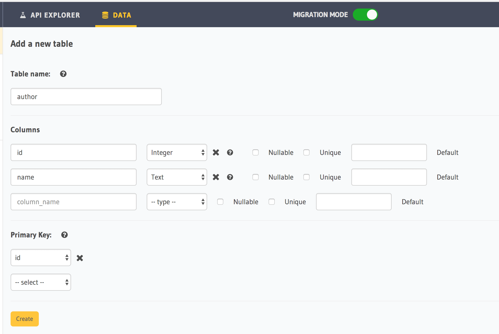
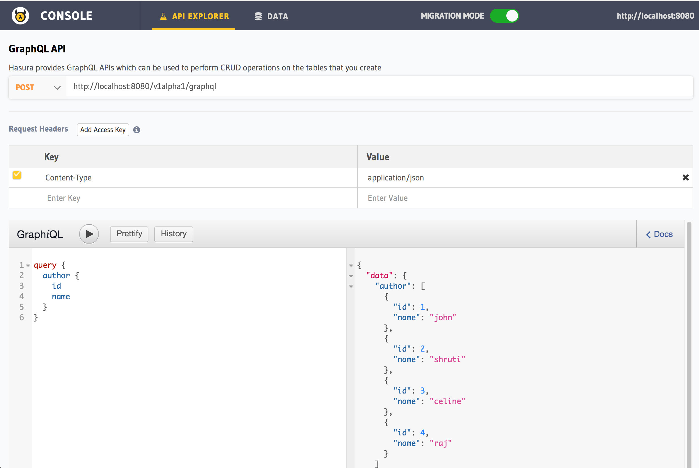
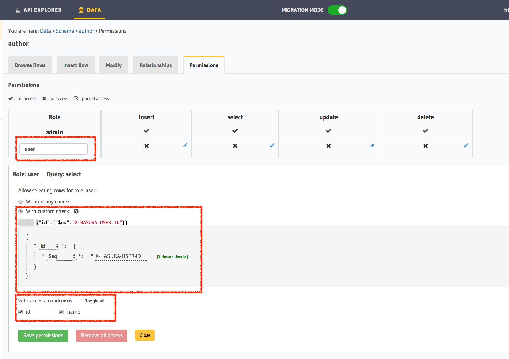
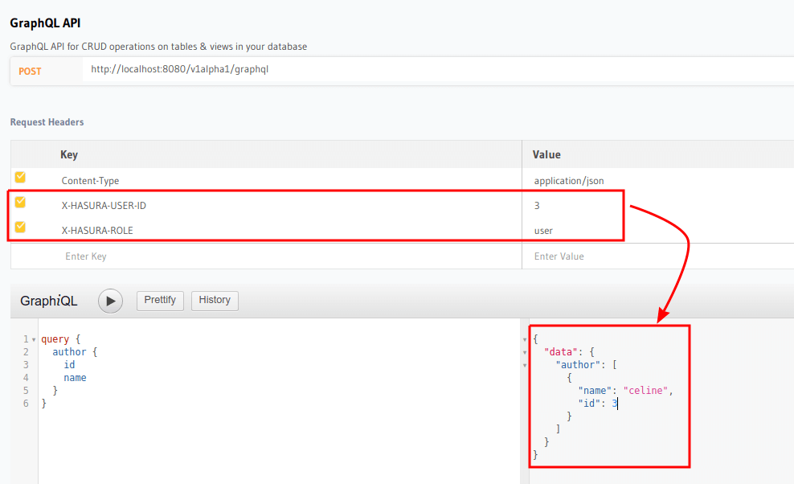
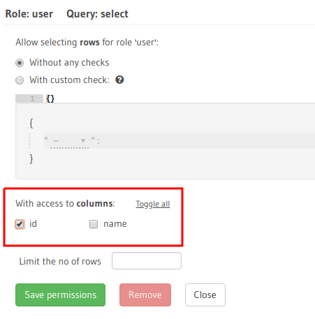
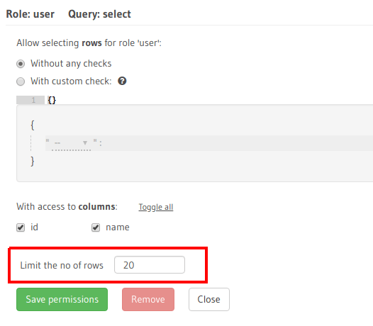

Access control basics
=====================

.. contents:: Table of contents
  :backlinks: none
  :depth: 1
  :local:

In this section, we're going to set up a simple access control rule for restricting querying on a table.
We're working with a simple ``author`` table where users have some information stored about themselves.

Create an author table
----------------------

Head to your console and create an ``author`` table with the following columns:

+----------+--------+
|      id  | integer|
+----------+--------+
| name     | text   |
+----------+--------+

Insert some sample data into the table:

+-------------+----------+
|      **id** | **name** |
+-------------+----------+
| 1           |  john    |
+-------------+----------+
| 2           |  shruti  |
+-------------+----------+
| 3           |  celine  |
+-------------+----------+
| 4           |  raj     |
+-------------+----------+

Try out a query
---------------

.. code-block:: graphql

  query {
    author {
      id
      name
    }
  }

You'll see that this results in a response that contains all the authors because by default the GraphQL query is
accepted with admin permissions.

Add a simple access control rule for a logged in user
-----------------------------------------------------

Let's say that for our app, logged in users are only allowed to fetch their own data.

Let's add a **select** permission for the **user** role on the ``author`` table:

.. list-table::
   :header-rows: 1
   :widths: 15 20 25 40

   * - Table
     - Definition
     - Condition
     - Representation

   * - author
     - user's own row
     - ``id`` in the row is equal to ``user-id`` from the request session
     -
       .. code-block:: json

          {
            "id": {
              "_eq": "X-Hasura-User-Id"
            }
          }

Now, let's make the same query as above but also include two dynamic authorization variables via request headers.
``X-Hasura-Role`` and ``X-Hasura-User-Id`` will automatically get used according to the permission rule we set up.

You can notice above how the same query now only includes the right slice of data.

.. _restrict_columns:

Restrict access to certain columns
----------------------------------

We can restrict the columns of a table that a particular role has access to.

Head to the ``Permissions`` tab of the table and edit the ``Select`` permissions for the role:

.. _limit_rows:

Limit number of rows returned in a single request
-------------------------------------------------

We can set a hard limit on the maximum number of rows that will be returned in a single request for a table for a particular role.

Head to the ``Permissions`` tab of the table and edit the ``Select`` permissions for the role:

More about permissions
----------------------

Next: :doc:`Roles and dynamic variables <roles-variables>`

