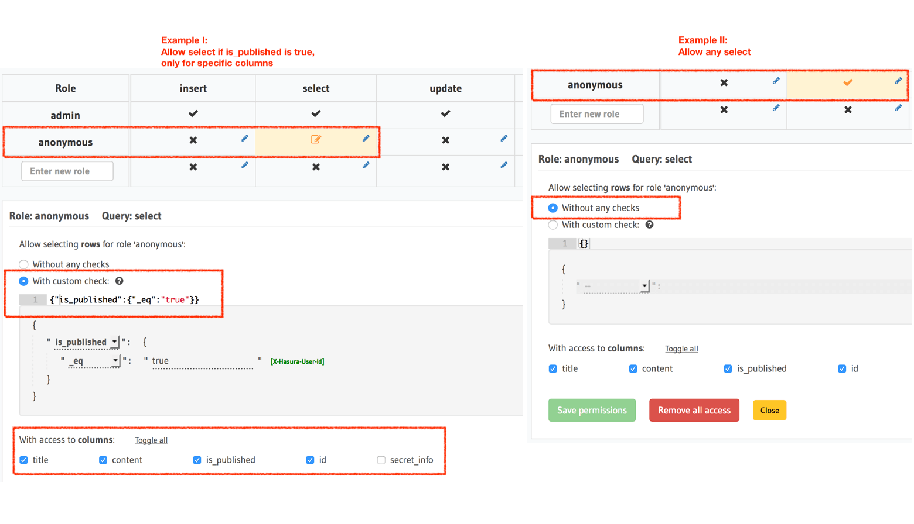
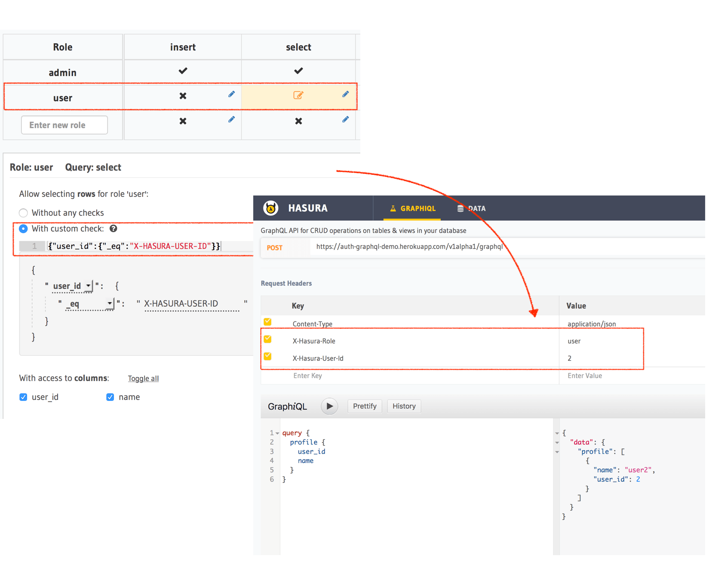
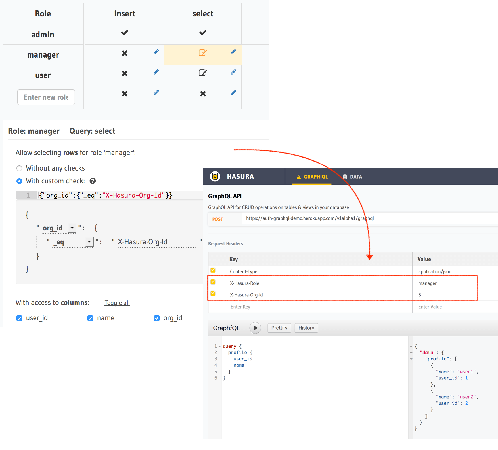
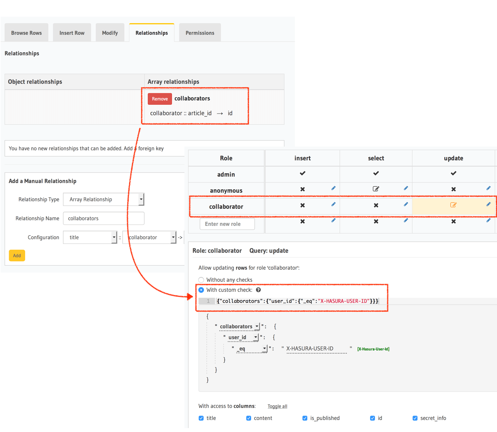

Access control examples
=======================

.. contents:: Table of contents
  :backlinks: none
  :depth: 1
  :local:

This is a guide to help you set up a basic authorization architecture for your GraphQL fields.

Here are some examples of common use-cases.

Anonymous (not logged in) users
-------------------------------

- Create a role called ``anonymous`` (this value is up to you, you could even name the role ``public``).
- Generally, you wouldn't add insert, update, or delete permissions.
- For the select permission condition, create a valid condition depending on your data model. For example, ``is_published: {_eq: true}``.
- If you don't have a condition, then just set the permission to ``Without any checks``, represented by a ``{}``.
- Choose the right set of columns that will get exposed in the GraphQL schema as fields. Ensure that sensitive information will not be exposed.

Logged-in users
---------------

- Create a role called ``user``.
- Access control rules in this case are usually dependent on a ``user_id`` or a ``owner_id`` column in your data model.
- Set up a permission for insert/select/update/delete that uses said column. E.g.: ``author_id: {_eq: "X-Hasura-User-Id"}`` for an article table.
- Note that the ``X-Hasura-User-Id`` is a :doc:`dynamic session variable<./roles-variables>` that comes in from your :doc:`auth webhook's<./webhook>` response, or as a request as a header if you're testing.

Managers of an organisation in a multi-tenant app
-------------------------------------------------

Suppose you have a multi-tenant application where managers of a particular organisation can see all of the data that belongs to the organisation. In this case, your data models will probably have an ``org_id`` column that denotes the organisation either in the same table or via a related table.

- Create a role called ``manager``.
- Create a permission for select, which has the condition: ``org_id: {_eq: "X-Hasura-Org-Id"}``.
- ``X-Hasura-Org-Id`` is a :doc:`dynamic variable<./roles-variables>` that is returned by your :doc:`auth webhook <./webhook>` for an incoming GraphQL request.

Collaborators of an article
---------------------------

Let's say the "ownership" or "visibility" information for a data model (table) is not present as a column in the table, but in a different related table. In this case, let's say there is an ``article`` table and a ``collaborator`` table that has ``article_id, collaborator_id`` columns.

- Create a relationship called ``collaborators`` from the article table.

  - Array relationship (article has array of collaborators): ``article :: id → collaborator :: article_id``.

- Create a role called ``collaborator``.
- Create a select permission on the ``article`` table, which has the condition: ``collaborators: {collaborator_id: {_eq: "X-Hasura-User_id"}}``.

  - This reads as: Allow the role collaborator to select if ``article.collaborators`` has a ``collaborator_id`` equal to that of ``X-Hasura-User-Id``.

Role-based schemas
------------------

For every role that you create, Hasura automatically publishes a different GraphQL schema that represents the right queries, fields, and mutations that are available to that role.

Case 1: Logged-in users and anonymous users can access the same GraphQL fields
^^^^^^^^^^^^^^^^^^^^^^^^^^^^^^^^^^^^^^^^^^^^^^^^^^^^^^^^^^^^^^^^^^^^^^^^^^^^^^

In simple use-cases, logged-in users and anonymous users might be able to fetch different rows (let's say because of a ``is_public`` flag), but have access to the same fields.

- ``anonymous`` role has a ``{is_public: {_eq: true}}`` select condition.

  - This reads: Allow anyone to access rows that are marked public.

- ``user`` role has a ``_or: [{is_public: {_eq: true}}, {owner_id: {_eq: "X-Hasura-User-Id"}}]``.

  - This reads: Allow users to access any rows that are public, or that are owned by them.

Case 2: Logged-in users and anonymous users have access to different fields
^^^^^^^^^^^^^^^^^^^^^^^^^^^^^^^^^^^^^^^^^^^^^^^^^^^^^^^^^^^^^^^^^^^^^^^^^^^

In this case, anonymous users might have access only to a subset of fields while logged-in users can access all the fields for data that they own.

- ``anonymous`` role has a ``{is_public: {_eq: true}}`` select condition, and only the right columns are allowed to be selected.

  - This reads: Allow anyone to access rows that are marked public.

- ``user`` role has a ``{owner_id: {_eq: "X-Hasura-User-Id"}}`` and all the columns are marked as selected.

  - This reads: Allow users to that are owned by them.
