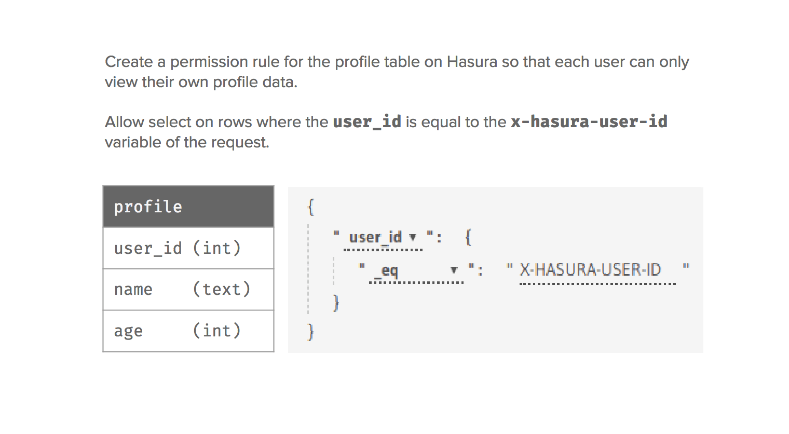

Authentication / Access control
===============================

.. contents:: Table of contents
  :backlinks: none
  :depth: 1
  :local:

Hasura helps you define granular access control rules for every field in your GraphQL schema. These access control
rules use dynamic session variables that are passed with every request to define both row and column level permissions
on your data.

**For example:**

**While developing**, you can send the session variables as request headers directly.

However, **in production** when your application is deployed, your app can't send these authorization variables
directly! Your app will likely only send an authorization token or cookie provided by your app's authentication
system to Hasura. In this case, Hasura will make a request to a webhook set up by you with the request headers your
app has sent (authorization tokens, cookies, etc). The webhook should then return the variables required as context for
the access control rules. Alternatively, your app can send to Hasura JWT tokens, which can then be decoded by Hasura to
get the variables required for the access control rules.

See :doc:`webhook` or :doc:`jwt` for more details on passing dynamic session variables.

Next, let's setup some :doc:`basic access control rules <basics>`.

**See:**

.. toctree::
   :maxdepth: 1

   basics
   roles-variables
   common-roles-auth-examples
   webhook
   webhook-examples
   jwt
   jwt-examples
