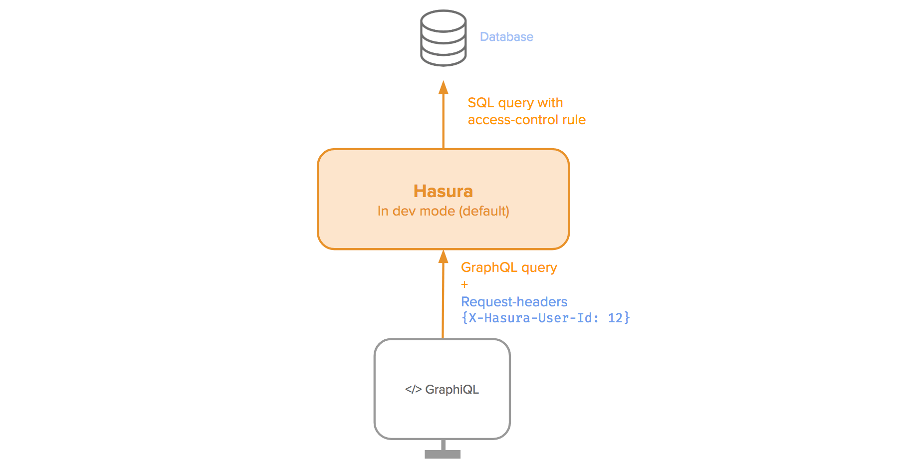

Authentication / Access control
===============================

.. contents:: Table of contents
  :backlinks: none
  :depth: 1
  :local:

Hasura helps you define granular access controls for every field in your GraphQL schema (i.e. every table or
view in your Postgres schema). These access control rules can use dynamic variables that come in with every request.

.. image:: ../../../img/graphql/manual/auth/hasura-perms.png

**While developing**, you can send variables as request headers directly.

However, **in production**, when your application is deployed, your app can't send these authorization variables
directly!

Your app will likely only send an authorization token or cookie provided by your app's authentication
system to Hasura. In this case, Hasura will make a request to a webhook set up by you with the request headers your
app has sent (authorization tokens, cookies, etc). The webhook should then return the variables required as context for
the access control rules. Alternatively, your app can send to Hasura JWT tokens, which can then be decoded by Hasura to
get the variables required for the access control rules.
See :doc:`webhook` or :doc:`jwt` for more details.

Next, let's setup some :doc:`basic access control rules <basics>`.

**See:**

.. toctree::
   :maxdepth: 1

   basics
   roles-variables
   Permissions examples <common-roles-auth-examples>
   webhook
   webhook-examples
   jwt
