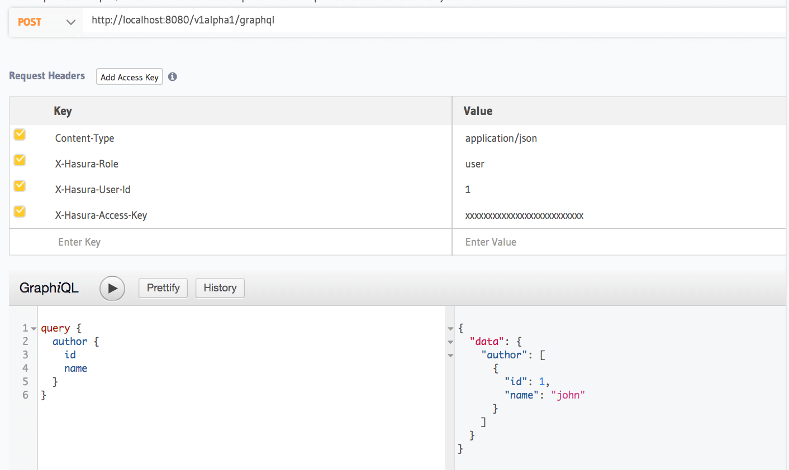

Roles & Session variables
=========================

.. contents:: Table of contents
  :backlinks: none
  :depth: 1
  :local:

The permissions system offered by Hasura GraphQL engine is extremely flexible and is built to capture complex
use-cases conveniently.

Roles
-----
Every table/view can have permission rules that are grouped together by multiple roles.
By default, there is an ``admin`` role that can perform any operation on any table.

You can create your own roles that make it easy for you to group permissions together.

Examples:

+-----------+-----------------------------------+
| user      | A logged-in user                  |
+-----------+-----------------------------------+
| anonymous | A not logged-in user              |
+-----------+-----------------------------------+
| manager   | A user that  has access to other  |
|           | user's data                       |
+-----------+-----------------------------------+

You can then create permissions for each of these roles:

Examples:

+-----------+-----------------------------------+
| user      | CRUD on data that belongs to them |
+-----------+-----------------------------------+
| anonymous | Only read from some tables/views  |
+-----------+-----------------------------------+

Dynamic session variables
-------------------------

When you create a permission, or an access control rule, the permission rule itself needs access to some variables
that are derived from the request itself. Let's refer to these as *session variables*.

For example: If a user makes a request, the session token maps to a ``user-id``. This ``user-id`` can be used in
a permission to show that inserts into a table are only allowed if the ``user_id`` column has a value equal to that
of ``user-id``, the session variable.

When you are constructing permission rules, however, there might be several variables that represent the business logic
of having access to data. For example, if you have a SaaS application, you might restrict access based on a ``client_id``
variable. If you want to provide different levels of access on different devices you might restrict access based on a
``device_type`` variable.

Hasura allows you to create permission rules that can use any dynamic variable that is a property of the request.
All your dynamic variables must follow the naming convention ``X-Hasura-*``.

Examples:

.. list-table::
   :header-rows: 1
   :widths: 20 10 20 50

   * - Example
     - Role
     - Condition
     - Permission expression

   * - Allow access to user's own row
     - ``user``
     - ``user_id`` column is equal to ``session-user-id`` from a request
     -
       .. code-block:: json

          {
            "user_id": {
              "_eq": "X-Hasura-User-Id"
            }
          }

   * - Allow project admins access to anything that belongs to the project
     - ``project-admin``
     - ``project_id`` column is equal to ``project-id`` of the "session user"
     -
       .. code-block:: json

          {
            "project_id": {
              "_eq": "X-Hasura-Project-Id"
            }
          }

Indicating roles and session-variables in a GraphQL request
-----------------------------------------------------------

Now that we have these roles and permission rules that use session variables set up, how do we actually use them
when we make GraphQL requests from an app or from a different service?

Option 1: Development & Testing
^^^^^^^^^^^^^^^^^^^^^^^^^^^^^^^

While you're developing or testing, just indicate your role and your session variables by passing headers along with
the request:

.. note::

  If you've enabled Hasura GraphQL engine with an access key, make sure you add the ACCESS_KEY header as well.

Option 2: In production, from apps
^^^^^^^^^^^^^^^^^^^^^^^^^^^^^^^^^^

If you're making GraphQL queries from your apps, you will probably not (and should not) be sending session variables directly
from your app because anyone can spoof the role and values of the variables and get access to whatever data they want.

In this case, you should configure a webhook that will return an object containing the role and session variables
given the session token (authorization token, JWT, cookie etc.) that your app normally uses.

See :doc:`webhook` or :doc:`jwt` for more details on passing dynamic session variables in production.

