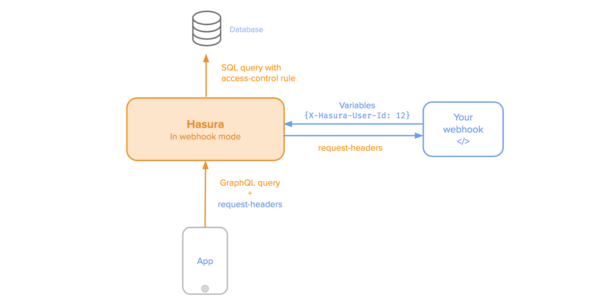

Authorization using webhooks
============================

You can configure a webhook (see :doc:`GraphQL server options <../deployment/graphql-engine-flags/reference>`) to
authenticate all incoming requests to the Hasura GraphQL engine server.

.. note::
   Configuring webhook requires Hasura to run with an access key (``--access-key``).
..   :doc:`Read more<config>`.

- The configured webhook is  **called** when ``X-Hasura-Access-Key`` header is not found in the request.
- The configured webhook is **ignored** when ``X-Hasura-Access-Key`` header is found in the request.

Spec for the webhook
--------------------

Request
^^^^^^^
Hasura will send a ``GET`` request to your webhook with headers it received from client **except**
``Content-Length``, ``Content-MD5``, ``User-Agent``, ``Host`` , ``Origin``, ``Referer`` , ``Accept``, ``Accept-Encoding``
``Accept-Language``, ``Accept-Datetime`` , ``Cache-Control``, ``Connection`` and ``DNT``:

.. code-block:: http

   GET https://<your-custom-webhook>/ HTTP/1.1
   <Header-Key>: <Header-Value>

If you configure your webhook to use with ``POST``, then Hasura will send **all client headers in payload:**

.. code-block:: http

   POST https://<your-custom-webhook>/ HTTP/1.1
   Content-Type: application/json

   {
    "headers": {
        "header-key1": "header-value1",
        "header-key2": "header-value2"
      }
   }

Response
^^^^^^^^

Success
+++++++
To allow the GraphQL request to go through, your webhook must return a ``200`` status code.
You should send the ``X-Hasura-*`` "session variables" to your permission rules in Hasura.

.. code-block:: http

   HTTP/1.1 200 OK
   Content-Type: application/json

   {
       "X-Hasura-User-Id": "25",
       "X-Hasura-Role": "user",
       "X-Hasura-Is-Owner": "true",
       "X-Hasura-Custom": "custom value"
   }

.. note::
   All values should be ``String``. They will be converted to the right type automatically.

Failure
+++++++
If you want to deny the GraphQL request return a ``401 Unauthorized`` exception.

.. code-block:: http

   HTTP/1.1 401 Unauthorized

.. note::
   Anything other than a ``200`` or ``401`` response from webhook makes server raise a ``500 Internal Server Error``
   exception.

See:
----

- :doc:`Auth webhook samples <webhook-examples>`
