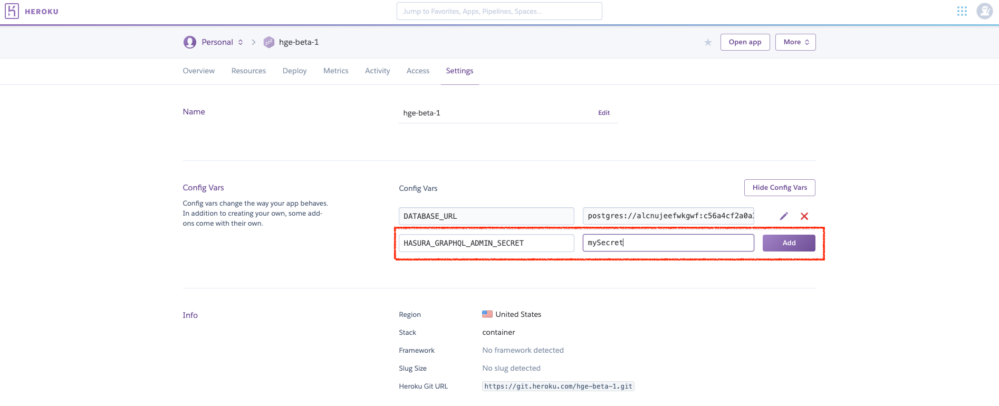
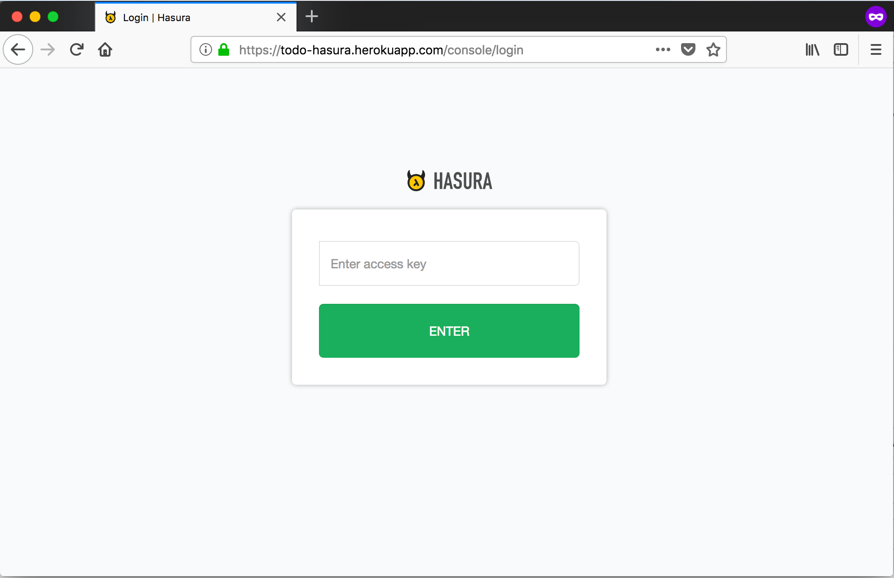

Securing the GraphQL endpoint (Heroku)
======================================

.. contents:: Table of contents
  :backlinks: none
  :depth: 1
  :local:

To make sure that your GraphQL endpoint and the Hasura console are not publicly accessible, you need to
configure an access key.

Add the HASURA_GRAPHQL_ACCESS_KEY env var
-----------------------------------------

Head to the config-vars URL on your Heroku dashboard and set the ``HASURA_GRAPHQL_ACCESS_KEY`` environment variable.

Setting this environment variable will automatically restart the dyno. Now when you access your console, you'll be
prompted for the access key.

(optional) Use the access key with the CLI
------------------------------------------

In case you're using the CLI to open the Hasura console, use the ``access-key`` flag when you open the console:

.. code-block:: bash

   hasura console --access-key=mysecretkey

.. note::

  If you're looking at adding authentication and access control to your GraphQL API then head
  to :doc:`Authentication / access control <../../auth/index>`.