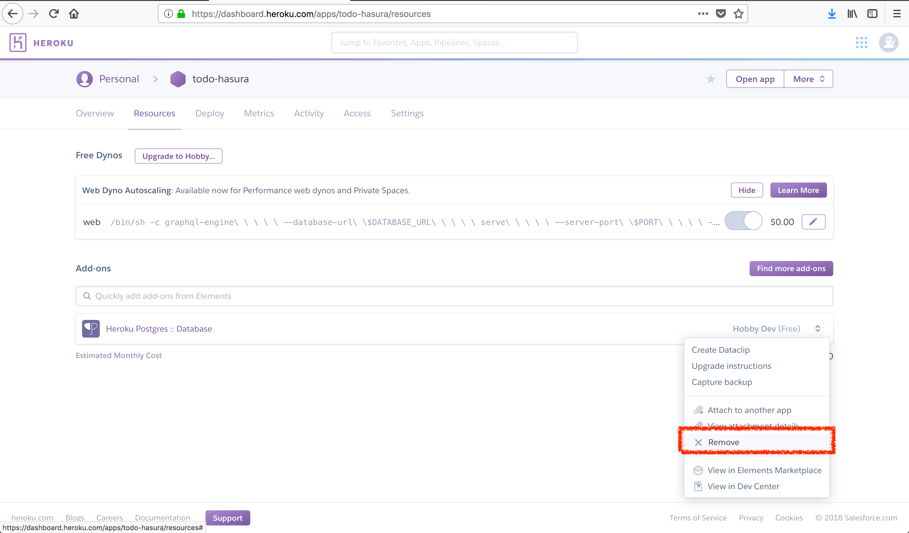
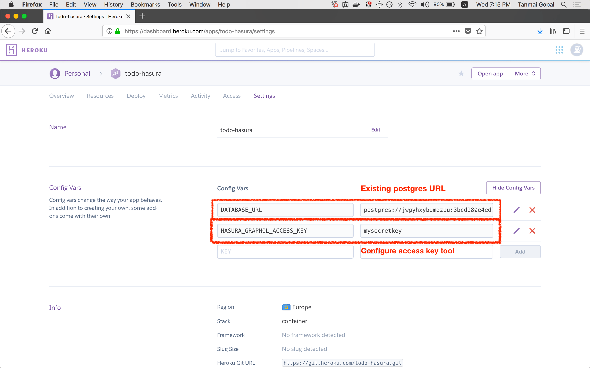
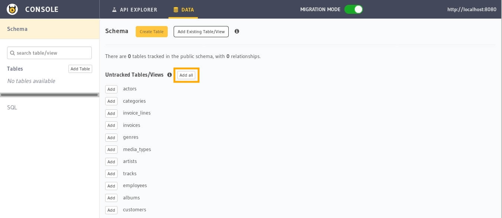

Using an existing Heroku database
=================================

.. contents:: Table of contents
  :backlinks: none
  :depth: 1
  :local:

Let's say you have an existing `Heroku Postgres <https://www.heroku.com/postgres>`__ database with data in it, and you'd
like add GraphQL on it.

.. note::

   In case you're exposing an existing database (esp. if it is production), please configure an access key
   for the console and the GraphQL endpoint.

Step 0: Deploy Hasura on Heroku
-------------------------------

Deploy Hasura on Heroku by clicking on this button:

.. image:: https://camo.githubusercontent.com/83b0e95b38892b49184e07ad572c94c8038323fb/68747470733a2f2f7777772e6865726f6b7563646e2e636f6d2f6465706c6f792f627574746f6e2e737667
  :width: 200px
  :alt: heroku_deploy_button
  :class: no-shadow
  :target: https://heroku.com/deploy?template=https://github.com/hasura/graphql-engine-heroku

Follow the Heroku instructions to deploy, check if the Hasura console loads up when you **View app** and then head
to the **Manage App** screen on your Heroku dashboard.

Step 1: Remove the existing Postgres addon in the app
-----------------------------------------------------

Head to your Heroku dashboard and delete the Postgres addon:

Step 2: Configure environment variables
---------------------------------------

Now configure the ``DATABASE_URL`` with your existing Heroku Postgres database URL and a ``HASURA_GRAPHQL_ACCESS_KEY``
if you want to secure your endpoint.

Step 3: Track tables and relationships
--------------------------------------

Wait for the GraphQL engine to restart and you'll see your existing tables as "untracked tables" in the console.

