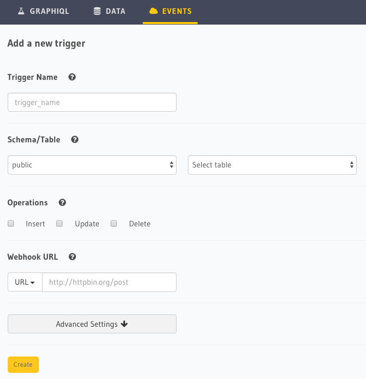
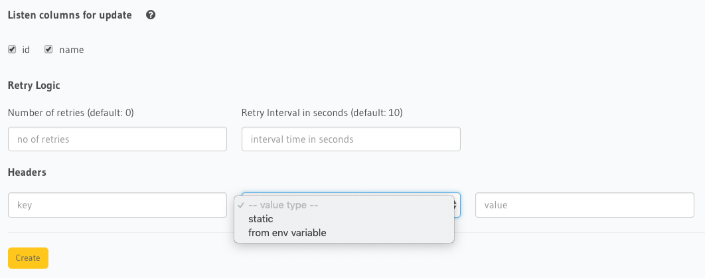

Creating an event trigger
=========================

.. contents:: Table of contents
  :backlinks: none
  :depth: 1
  :local:

Event triggers can be created using the Hasura console.

Open the Hasura console, head to the ``Events`` tab and click on the ``Create trigger`` button to open up the
interface below to create an event trigger:

Parameters
----------

**Trigger Name**

Unique name for event trigger.

**Schema/Table**

The postgres schema and table name on which event trigger needs to be created.

**Operations**

The operation on which event trigger needs to be invoked. Can be ``INSERT``, ``UPDATE`` and/or ``DELETE``.

**Webhook URL**

The HTTP(s) URL which will be called with event payload on configured operation. Must be a ``POST`` handler. This URL
can be entered manually or can be picked up from an environment variable (*the environment variable needs to be set
before using it for this configuration*).

Advanced Settings
-----------------

Listen columns for update
^^^^^^^^^^^^^^^^^^^^^^^^^

Update operations are special because you may want to trigger webhook only if specific columns have changed in a row.
Choose the columns here which you want the update operation to listen on.

If a column is not selected here, then an update to that column will not trigger webhook.

Retry Logic
^^^^^^^^^^^

Retry configuration is available in the "Advanced settings" when you create a trigger.

1. ``num_retries``: This is the number of times a failed invocation is retried. The default value is **0**.
2. ``interval_sec``: The number of seconds after which a failed invocation for an event, is retried. The default value
   is **10**.

Headers
^^^^^^^

Custom headers can be added to an event trigger. Each webhook request will have these headers added.

Each header has 3 parameters:

1. ``Key``: Name of the header e.g. Authorization or X-My-Header.
2. ``Type``: One of ``static`` or ``from env variable``. ``static`` means the value provided in the ``Value`` field is
   the raw value of the header. ``from env variable`` means the value provided in the ``Value`` field is the name of
   the environment variable in the GraphQL Engine which will be resolved before sending the header.
3. ``Value``: The value of the header. Either static value or name of an environment variable.
