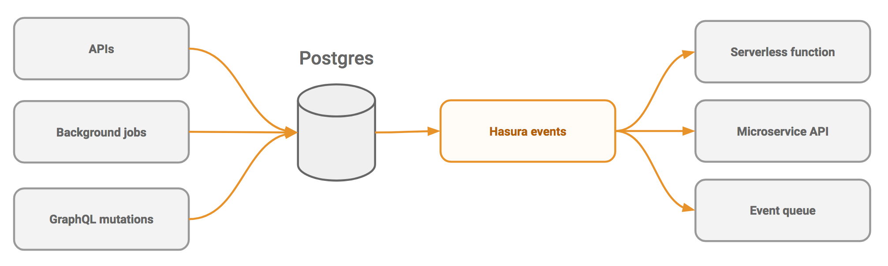

Event triggers
==============

Hasura can be used to create event triggers on tables in the Postgres database. Event triggers reliably capture
events happening on the specified tables and then call configured webhooks to carry out some business logic.

See:
^^^^

.. toctree::
   :maxdepth: 2
   :titlesonly:

   create-trigger
   payload
   serverless
   samples
