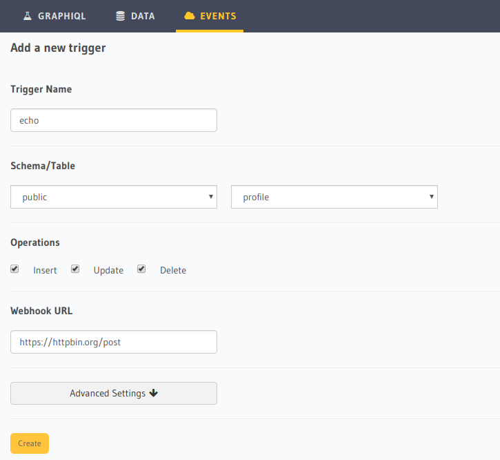
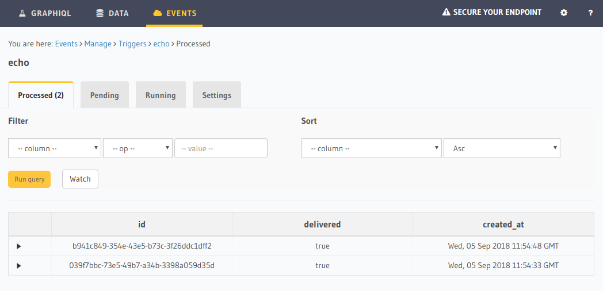

Setting up your first event trigger
===================================

.. contents:: Table of contents
  :backlinks: none
  :depth: 1
  :local:

You can use Hasura to setup event triggers which call configured webhooks whenever specific database events occur.

Let's create a sample event trigger with https://httpbin.org as our simple webhook.

Create a table
--------------
Head to the Hasura console, navigate to ``Data -> Create table`` and create a sample table called ``profile`` with
the following columns:

+----------+----------+
|   **profile**       |
+----------+----------+
| id       | integer  |
+----------+----------+
| name     | text     |
+----------+----------+

.. image:: ../../../img/graphql/manual/getting-started/create-profile-table.png

Setup an event trigger
----------------------
In the Hasura console, navigate to ``Events -> Create trigger`` and:

1. Enter trigger name as ``echo``.
2. Select table ``profile`` from the table dropdown.
3. Select operations: ``insert``, ``update`` and ``delete``.
4. Enter webhook URL as: ``https://httpbin.org/post``.

This sets up our webhook ``https://httpbin.org/post`` to receive database changes on insert, update and delete on
``profile`` table.

Watch the trigger in action
---------------------------

1. Insert some sample data into the ``profile`` table.
2. Now navigate to the ``Events`` tab and click on the ``echo`` trigger in the left sidebar.
3. Expand the details of an event to see the response from the webhook.

Next steps
----------

Read more about:

- :doc:`Event triggers <../event-triggers/index>`
