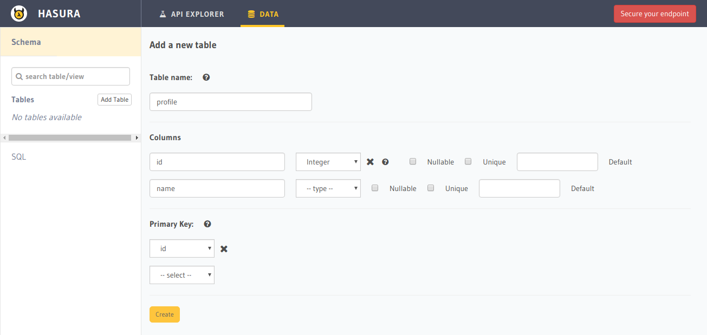
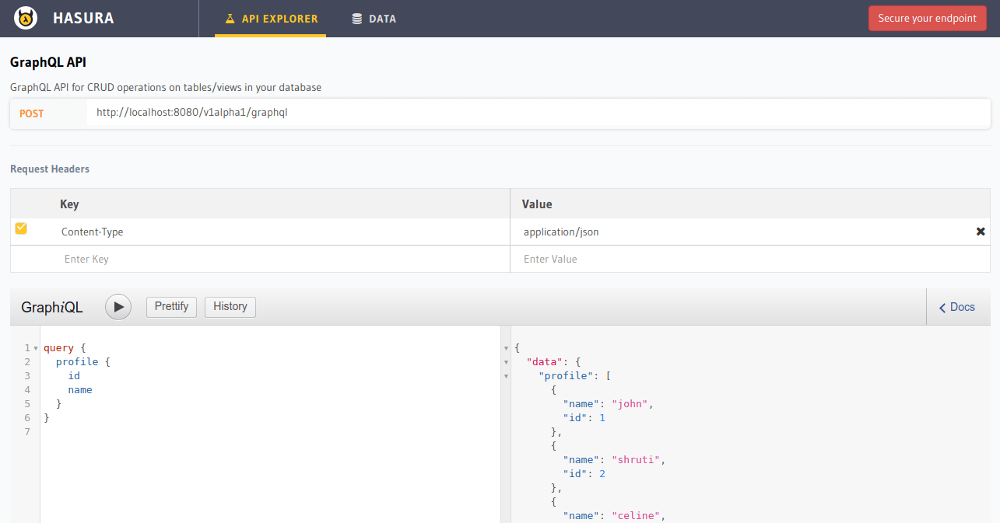

.. _first_graphql_query:

Making your first GraphQL query
===============================

.. contents:: Table of contents
  :backlinks: none
  :depth: 1
  :local:

Let's create a sample table and query from it using the Hasura console, a UI tool meant for doing exactly this:

Create a table
--------------

Head to the Hasura console, navigate to ``Data -> Create table`` and create a sample table called ``profile`` with
the following columns:

+----------+----------+
|   **profile**       |
+----------+----------+
| id       | integer  |
+----------+----------+
| name     | text     |
+----------+----------+

Insert some sample data into the table:

+-----------+------------+
| **id**    | **name**   |
+-----------+------------+
| 1         |  john      |
+-----------+------------+
| 2         |  shruti    |
+-----------+------------+
| 3         |  celine    |
+-----------+------------+
| 4         |  raj       |
+-----------+------------+

Try out a query
---------------

Head to the ``GraphiQL`` tab in the console and try running the following query:

.. code-block:: graphql

    query {
      profile {
        id
        name
      }
    }

You'll see that you get all the inserted data!

Next steps
----------

Read more about:

- :doc:`Building your schema <../schema/index>`
- :doc:`Queries <../queries/index>`

