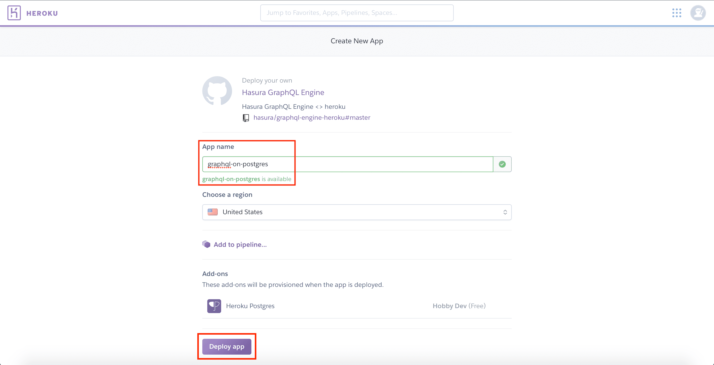
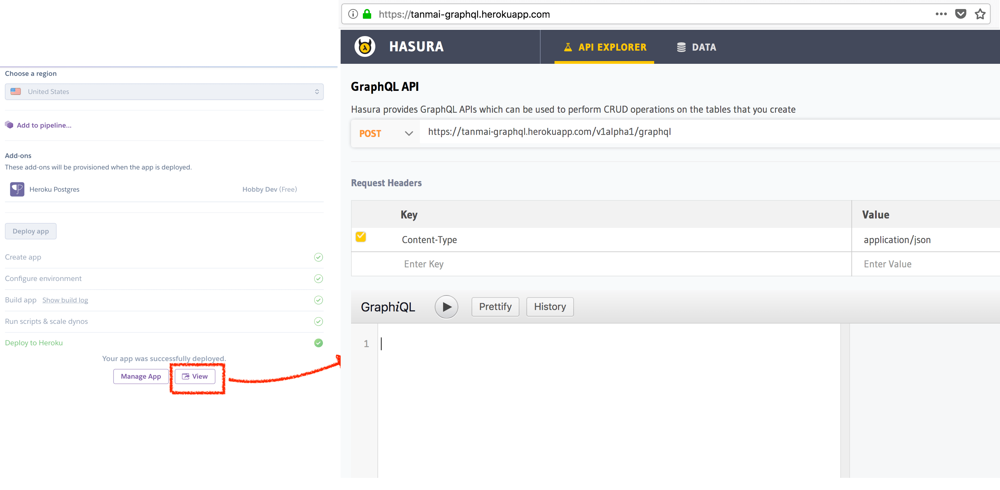

Quickstart with Heroku
======================

This guide will help you get Hasura GraphQL engine and Postgres running on `Heroku's free tier <https://www.heroku.com/free>`_.
It is the easiest and fastest way of trying Hasura out.

If you'd like to link this to an existing database, please head to this guide instead:
`Using an existing database on Heroku <https://docs.hasura.io/1.0/graphql/manual/deployment/heroku/using-existing-heroku-database.html>`_.

Deploy to Heroku
----------------

Click the button below to deploy to Heroku:

.. image:: https://camo.githubusercontent.com/83b0e95b38892b49184e07ad572c94c8038323fb/68747470733a2f2f7777772e6865726f6b7563646e2e636f6d2f6465706c6f792f627574746f6e2e737667
  :width: 200px
  :alt: heroku_deploy_button
  :class: no-shadow
  :target: https://heroku.com/deploy?template=https://github.com/hasura/graphql-engine-heroku

.. note::
   If you don't have an account on Heroku, you need to sign up on Heroku. You won't need a credit card, and once you
   sign up you'll be redirected to your Heroku app creation page automatically.

Note that **Heroku's free Postgres add-on** is also automatically provisioned!

Open the Hasura console
-----------------------

That's it!  Head to ``https://<YOUR_HEROKU_APP>.herokuapp.com`` and open your app.
You should see the Hasura console.

Next: Try Hasura out!
---------------------

Make your `first graphql query <https://docs.hasura.io/1.0/graphql/manual/getting-started/first-graphql-query.html>`_.

OR

Set up your `first event trigger <https://docs.hasura.io/1.0/graphql/manual/getting-started/first-event-trigger.html>`_.

Advanced:
---------

This was a quickstart guide to get the Hasura GraphQL engine up and running quickly. For more detailed instructions
on deploying using Heroku, `check out <https://docs.hasura.io/1.0/graphql/manual/deployment/heroku/index.html>`_.
