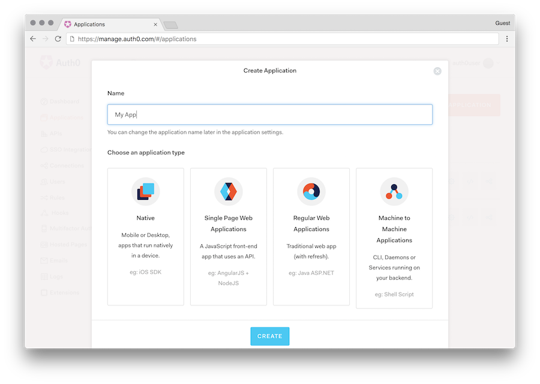
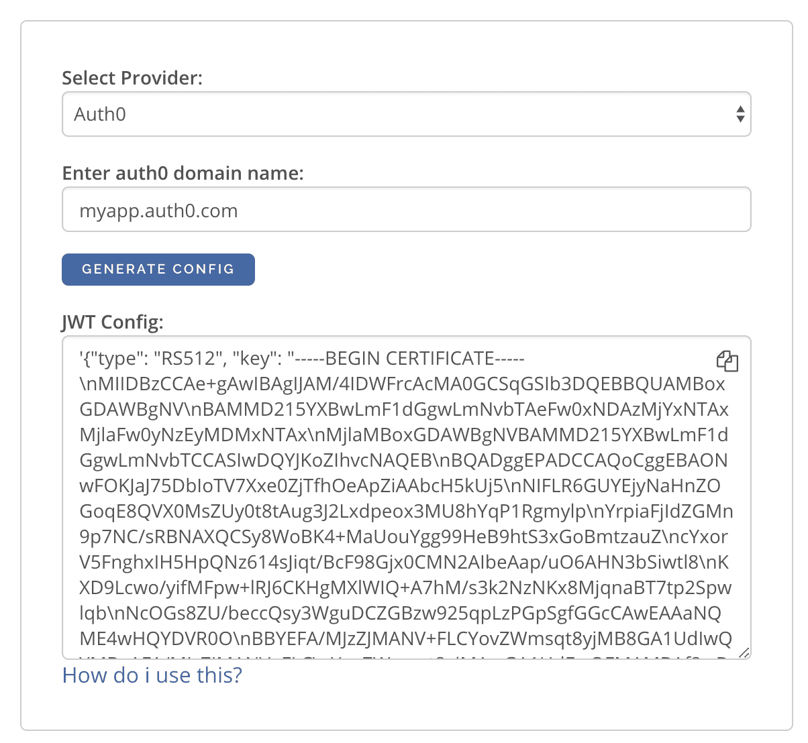

.. _auth0_jwt:

Auth0 JWT Integration with Hasura GraphQL engine
================================================

.. contents:: Table of contents
  :backlinks: none
  :depth: 1
  :local:

In this guide, we will walk-through on how to set up Auth0 to work with Hasura GraphQL engine.

Create an Auth0 Application
^^^^^^^^^^^^^^^^^^^^^^^^^^^

- Navigate to the `Auth0 dashboard <https://manage.auth0.com>`__
- Click on the ``Applications`` menu option on the left and then click the ``+ Create Application`` button.
- In the ``Create Application`` window, set a name for your application and select ``Single Page Web Applications``.
  (Assuming your application is React/Angular/Vue etc).

Configure Auth0 Rules & Callback URLs
^^^^^^^^^^^^^^^^^^^^^^^^^^^^^^^^^^^^^

In the settings of the application, add appropriate (e.g: http://localhost:3000/callback) URLs as ``Allowed Callback
URLs`` and ``Allowed Web Origins``. Add domain specific URLs as well for production apps. (e.g: https://myapp.com/callback)

In the dashboard, navigate to ``Rules``. Add the following rules to add our custom JWT claims:

.. code-block:: javascript

    function (user, context, callback) {
      const namespace = "https://hasura.io/jwt/claims";
      context.idToken[namespace] = 
        { 
          'x-hasura-default-role': 'user',
          // do some custom logic to decide allowed roles
          'x-hasura-allowed-roles': ['user'],
          'x-hasura-user-id': user.user_id
        };
      callback(null, user, context);
    }

Configure Hasura to use Auth0 Keys
^^^^^^^^^^^^^^^^^^^^^^^^^^^^^^^^^^

Auth0 publishes their JWK under:

``https://<your-auth0-domain>.auth0.com/.well-known/jwks.json``

But they have a `bug where the certificate thumbprint does not match
<https://community.auth0.com/t/certificate-thumbprint-is-longer-than-20-bytes/7794/3>`__.
Hence, currently this URL does not work with Hasura.

Current workaround is to download the X590 certificate from:

``https://<your-auth0-domain>.auth0.com/pem``

And use it in the ``key`` field:

.. code-block:: json

        {
          "type":"RS512",
          "key": "-----BEGIN CERTIFICATE-----
    MIIDDTCAfWgAwIBAgIJhNlZ11IDrxbMA0GCSqSIb3DQEBCwUAMCQxIjAgBgNV
    BAMTGXlc3QtaGdlLWp3C5ldS5hdXRoMC5jb20HhcNMTgwNzMwMTM1MjM1WhcN
    MzIwND3MTM1MjM1WjAkSIwIAYDVQQDExl0ZXNLWhnZS1qd3QuZXUuYXV0aDAu
    Y29tMIBIjANBgkqhkiGw0BAQEFAAOCAQ8AMIICgKCAQEA13CivdSkNzRnOnR5
    ZNiReD+AgbL7BWjRiw3RwjxRp5PYzvAGuj94yR6LRh3QybYtsMFbSg5J7fNq6
    Ld6yMpMrUu8CBOnYY456b/2jlf+Vp8vEQuKvPOOw8Ev6x7X3blcuXCELSwyL3
    AGHq9OP2RV6V6CIE863zzuYH5HDLzU35oMZqogJVRJM0+6besH6TnSTNiA7xi
    BAqFaiRNQRVi1CAUa0bkN1XRp4AFy7d63VldOsM+8QnCNHySdDr1XevVuq6DK
    LQyGexFy4niALgHV0Q7A+xP1c2G6rJomZmn4j1avnlBpU87E58JMrRHOCj+5m
    Xj22/QDAQABo0IwQDAPgNVHRMBAf8EBTADAQHMB0GA1UdDgQWBBT6FvNkuUgu
    tk3OYQi4lo5aOgwazAOgNVHQ8BAf8EBAMCAoQDQYJKoZIhvcNAQELBQADggEB
    ADCLj+L22pEKyqaIUlhUJh7DAiDSLafy0fw56CntzPhqiZVVRlhxeAKidkCLV
    r9IEbRuxUoXiQSezPqM//9xHegMp0f2VauVCFg7EpUanYwvqFqjy9LWgH+SBz
    4uroLSZ5g1EPsHtlArLChA90caTX4e7Z7Xlu8G2kHRJB5nC7ycdbMUvEWBMeI
    tn/pcbmZ3/vlgj4UTEnURe2UPmSJpxmPwXqBcvwdKHRMgFXhZxojWCi0z4ftf
    f8t8UJIcbEblnkYe7wzYy8tOXoMMHqGSisCdkp/866029rJsKbwd8rVIyKNC5
    frGYaw+0cxO6/WvSir0eA=
    -----END CERTIFICATE-----
    "
        }

An easier way to generate the above config is to use the following UI:

https://hasura.io/jwt-config.

The generated config can be used in env ``HASURA_GRAPHQL_JWT_SECRET`` or ``--jwt-secret`` flag.
The config generated from this page can be directly pasted in yaml files and command line arguments as it takes care of
escaping new lines.

Add Access Control Rules via Hasura Console
^^^^^^^^^^^^^^^^^^^^^^^^^^^^^^^^^^^^^^^^^^^

With the above steps, Auth0 is configured and ready to be used in the application. But to further restrict querying on
a table, you can setup access control rules.

Refer :doc:`../../auth/basics` for more information.
