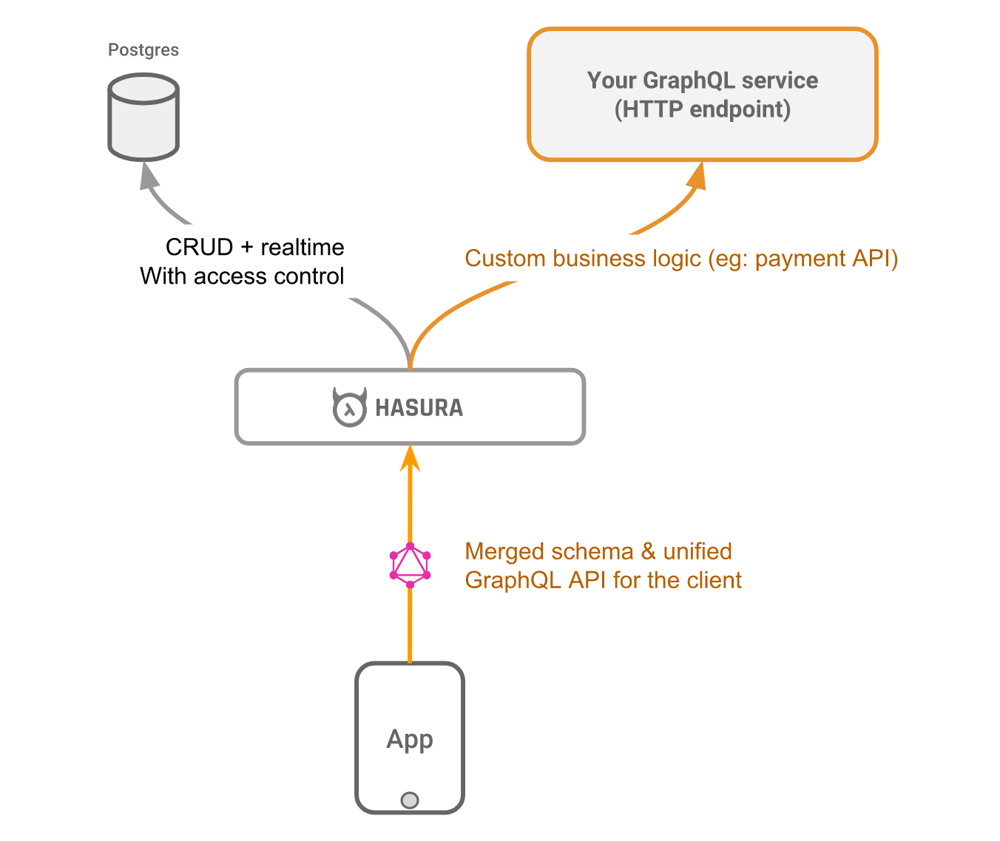
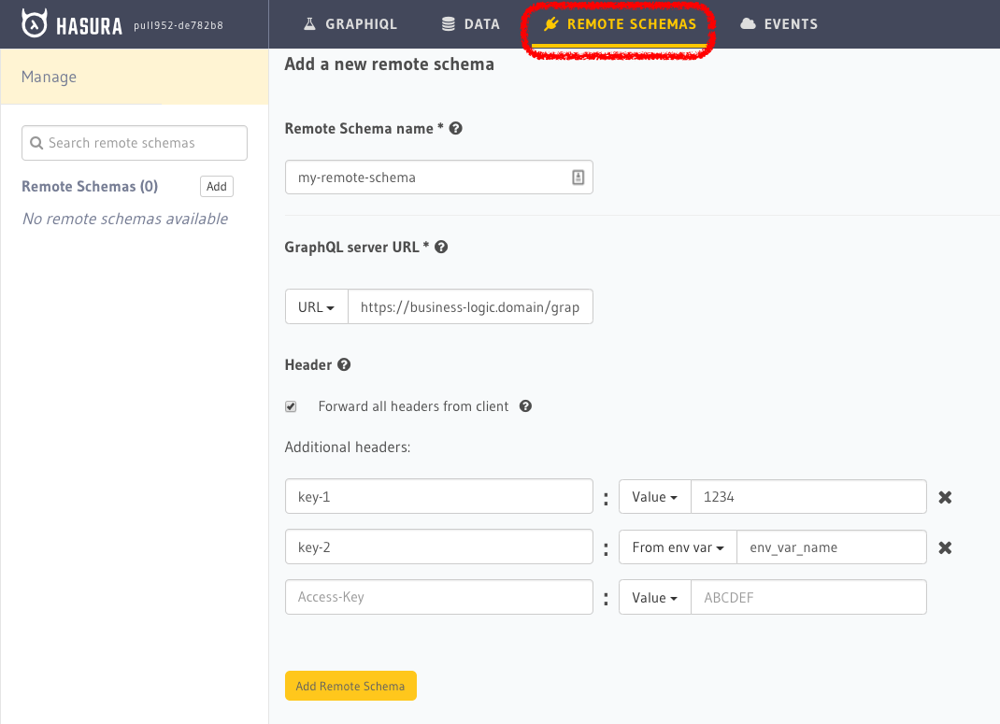

Remote schemas
==============

.. contents:: Table of contents
  :backlinks: none
  :depth: 2
  :local:

Hasura gives you CRUD + realtime GraphQL APIs with authorization & access control. However, in many cases, you will need to write APIs (queries, mutations) that contain custom logic. For example, implementing a payment API, or querying data that is not in your database.

Hasura has the ability to merge remote GraphQL schemas and provide a unified GraphQL API. Think of it
like automated schema stitching. All you need to do is build your own GraphQL service and then provide the HTTP endpoint to Hasura. Your GraphQL service can be written in any language or framework.

This is what Hasura running with "Remote schemas" looks like:

.. note::

  This is a new feature in active development. Please do give us feedback, bug-reports and ask us questions on
  our `discord <https://discord.gg/vBPpJkS>`__ or on `github <https://github.com/hasura/graphql-engine>`__.

Use-cases
---------

- Custom business logic, like a payment API
- Querying data that is not available in your database

You can handle these use-cases by writing resolvers in a custom GraphQL server
and making Hasura merge this ``remote schema`` with the existing autogenerated
schema. You can also add multiple remote schemas. Think of the merged schema as
a union of top-level nodes from each of the sub-schemas.

Note that if you are looking for adding authorization & access control for your
app users to the GraphQL APIs that are auto-generated via Hasura, head to
:doc:`Authorization / Access control <../auth/index>`

.. admonition:: Nomenclature

   Top-level node names need to be unique across all merged schemas (*case-sensitive match*).
    Types with the *exact same name and structure* will be merged. But types with the *same name but different structure* will result in type conflicts.

.. admonition:: Current limitations

  - Nodes from different GraphQL servers cannot be used in the same query/mutation. All top-level nodes have to be from the same GraphQL server.
  - Subscriptions on remote GraphQL server are not supported.
  - Interfaces_ and Unions_ are not supported - if a remote schema has interfaces/unions, an error will be thrown if you try to merge it.

  These limitations will be addressed in upcoming versions.

How to add a remote schema
--------------------------

Follow the steps below to add your "remote schema" to hasura.

Step 1: Write a custom GraphQL server
^^^^^^^^^^^^^^^^^^^^^^^^^^^^^^^^^^^^^

You need to create a custom GraphQL server with a schema and corresponding resolvers that solve your use case
(*if you already have a functional GraphQL server that meets your requirements, you can skip this step*). You can
use any language/framework of your choice to author this server or deploy it anywhere. A great way to get started
is to use one of our boilerplates:

- `Boilerplates <https://github.com/hasura/graphql-engine/tree/master/community/boilerplates/graphql-servers>`__
- `Serverless boilerplates <https://github.com/hasura/graphql-serverless>`__

Step 2: Merge remote schema
^^^^^^^^^^^^^^^^^^^^^^^^^^^

Head to the console to merge your remote schema with GraphQL Engine's auto-generated schema. In a top level tab,
named ``Remote Schemas``, click on the ``Add`` button.

You need to enter the following information:

- **Remote Schema name**: an alias for the remote schema that must be unique on an instance of GraphQL Engine.
- **GraphQL server URL**: the endpoint at which your remote GraphQL server is available. This value can be entered
  manually or by specifying an environment variable that contains this information. If you want to specify an
  environment variable, please note that currently there is no validation that the environment variable is
  actually available at the time of this configuration, so any errors in this configuration will result in a
  runtime error.
- **Headers**: configure the headers to be sent to your custom GraphQL server.

  - Toggle forwarding all headers sent by the client (when making a GraphQL query) to your remote GraphQL server.
  - Send additional headers to your remote server - These can be static header name-value pairs; and/or pairs of "header name-environment variable name".
    You can specify the value of the header to picked up from the enviroment variable.

    **Example**: Let's say your remote GraphQL server needs a ``X-Api-Key`` as a header. As this value contains sensitive data (like API key in this
    example), you can configure name of an environment variable which will hold the value. This environment variable needs to be present when you start
    GraphQL Engine. When Hasura sends requests to your remote server, it will pick up the value from this environment variable.

.. note::

   If the remote schema configuration contains environment variables - either
   for URL or headers - **environment variables need to be present** (GraphQL
   engine should be started with these env variables) with valid values, when
   adding the remote schema.

Click on the ``Add Remote Schema`` button to merge the remote schema.

Step 3: Make queries to the remote server from Hasura
^^^^^^^^^^^^^^^^^^^^^^^^^^^^^^^^^^^^^^^^^^^^^^^^^^^^^
Now you can head to *GraphiQL* and make queries to your remote server from Hasura.

Query your remote server by making requests to the Hasura graphql endpoint (``/v1alpha1/graphql``).

.. note::

  For some use cases, you may need to extend the GraphQL schema fields exposed by Hasura GraphQL engine
  (*and not merely augment as we have done above*) with a custom schema/server. To support them, you can use
  community tooling to write your own client-facing GraphQL gateway that interacts with GraphQL Engine.

  But adding an additional layer on top of Hasura GraphQL engine significantly impacts the performance provided by it
  out of the box (*by as much as 4x*). If you need any help with remodeling these kind of use cases to use the
  built-in remote schemas feature, please get in touch with us on `Discord <https://discord.gg/vBPpJkS>`__.

.. _Interfaces: https://graphql.github.io/learn/schema/#interfaces
.. _Unions: https://graphql.github.io/learn/schema/#union-types

Bypassing Hasura's authorization system for remote schema queries
-----------------------------------------------------------------

It might be necessary sometimes to bypass Hasura's authorization system (calling
the configured webhook, or validating the JWT), for queries that are for a
remote GraphQL server.

**For example**, you have a remote GraphQL server which does authentication,
i.e. signup and login, and you have added it as a remote schema. In this case,
you would not want to perform Hasura's authorization when the user is making a
login/signup request.

There is no first-class option to currently do this via any configuration in
Hasura. However a similar solution can achieved by the following workarounds:

Bypassing webhook authorization
^^^^^^^^^^^^^^^^^^^^^^^^^^^^^^^
If you have a :doc:`webhook authorization setup <../auth/webhook>`, in the
normal scenario, your authorization webhook should return ``200`` on success and
``401`` if it is unable to authorize the current request or authorization
information is absent (like cookie, authorization header etc.)

In the workaround, the webhook should respond with ``200`` and ``x-hasura-role:
anonymous`` instead of a ``401`` when the authorization information is absent or
it fails to resolve it. And, when adding the remote schema, the ``Forward all
headers from client`` option is checked. So the remote server will get the
relevant cookie/header (from the client) and the role anonymous.

Bypassing JWT authorization
^^^^^^^^^^^^^^^^^^^^^^^^^^^

Your authentication server should generate a static JWT token for
anonymous/unauthenticated users. And, when adding the remote schema, the
``Forward all headers from client`` option is checked.

For example, it can generate:

.. code-block:: json

  {
    "sub": "0000000000",
    "iat": 1516239022,
    "role": "anonymous",
    "https://hasura.io/jwt/claims": {
      "x-hasura-allowed-roles": ["anonymous"],
      "x-hasura-default-role": "anonymous"
    }
  }

Hasura will get this JWT and successfully validate it. When your remote server
receives this JWT, it should specifically validate JWT and, for example, check
for ``role`` key in the JWT. If it's set to ``anonymous`` then it should
consider the request as unauthenticated.
