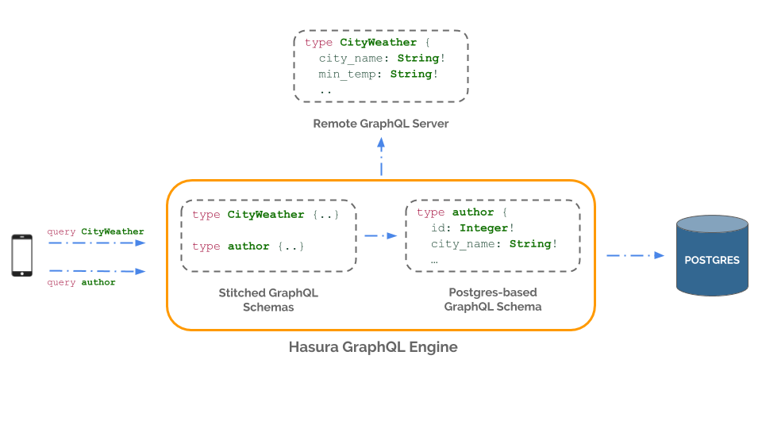

Remote schemas
==============

Hasura GraphQL engine provides instant GraphQL APIs over the tables and views of any Postgres database by
auto-generating the CRUD resolvers. However, sometimes you may need additional resolvers to support some use cases.

Here are a couple of common use cases:

- Customizing mutations (e.g. running validations before inserts)
- Supporting features like payments, etc. and providing a consistent interface to access them i.e. behind the GraphQL
  Engine's API
- Fetching disparate data from other sources (e.g. from a weather API or another database)

These use cases can be handled by writing resolvers in a custom GraphQL server and stitching its schema
(``remote schema``) with GraphQL Engine's schema (think of the merged schema as a union of top-level nodes from
each of the sub-schemas).

The combined schema will let a frontend app query top-level nodes from any of the merged schemas from the
same GraphQL endpoint:

.. code-block:: graphql
      
  # query a new top level node from another GraphQL schema
  query {
    city_weather {
      city_name
      min_temp
    }
  }

  # invoke business logic (e.g. payment) in a remote schema's resolver
  mutation {
    insert_payment {
      order_id
      total_amount
      ...
    }
  }

Here's how you can add a remote schema to GraphQL Engine:

Step-1: Write a custom GraphQL server
-------------------------------------

You need to create a custom GraphQL server with a schema and corresponding resolvers that solve your use case
(*if you already have a functional GraphQL server that meets your requirements, you can skip this step*). You can
use any language/framework of your choice to author this server or deploy it anywhere. A great way to get started
is to use one of our boilerplates:

- `Boilerplates <https://github.com/hasura/graphql-engine/tree/master/community/boilerplates/graphql-servers>`__
- `Serverless boilerplates <https://github.com/hasura/graphql-serverless>`__

.. note::

  GraphQL Engine does not currently support conflicting top level nodes, so please be careful with your custom schema's nomenclature and ensure that the top-level node names in it do not clash with the top-level nodes in GraphQL Engine's schema. Also, having remote GraphQL nodes and Hasura nodes in a single query/mutation will throw an error. These limitations will be addressed in upcoming iterations.

Step-2: Merge remote schema
---------------------------
Head to the console to merge your remote schema with GraphQL Engine's auto-generated schema. In a top level tab,
named ``Remote Schemas``, click on the ``Add`` button.

.. image:: ../../../img/graphql/manual/business-logic/add-remote-schemas-interface.png

You need to enter the following information:

- **Remote Schema name**: an alias for the remote schema that must be unique on an instance of GraphQL Engine.
- **GraphQL server URL**: the endpoint at which your remote GraphQL server is available. This value can be entered
  manually or by specifying an environment variable that contains this information. If you want to specify an
  environment variable, please note that currently there is no validation that the environment variable is
  actually available at the time of this configuration, so any errors in this configuration will result in a
  runtime error.
- **Headers**: configure the headers to be sent to your custom GraphQL server.

  - Toggle forwarding headers sent by the client app in the request to your remote GraphQL server.   
  - Additional headers, constant key-value pairs and/or key-value pairs whose values are picked up
    from an environment variable.

Click on the ``Add Remote Schema`` button to merge the remote schema.

.. note::

  For some use cases, you may need to extend the GraphQL schema fields exposed by Hasura GraphQL engine
  (*and not merely augment as we have done above*) with a custom schema/server. To support them, you can use
  community tooling to write your own client-facing GraphQL gateway that interacts with GraphQL Engine.

  But adding an additional layer on top of Hasura GraphQL engine significantly impacts the performance provided by it
  out of the box (*by as much as 4x*). If you need any help with remodeling these kind of use cases to use the
  built-in remote schemas feature, please get in touch with us on `Discord <https://discord.gg/vBPpJkS>`__.

