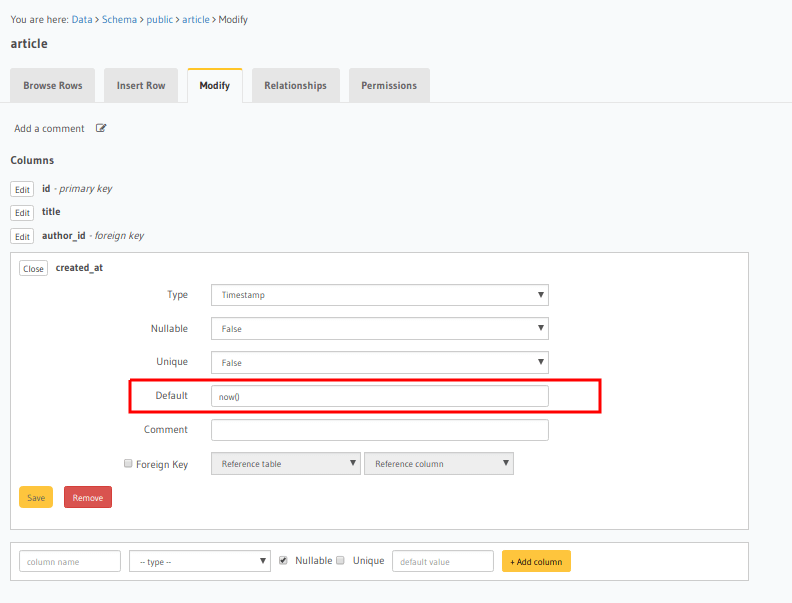
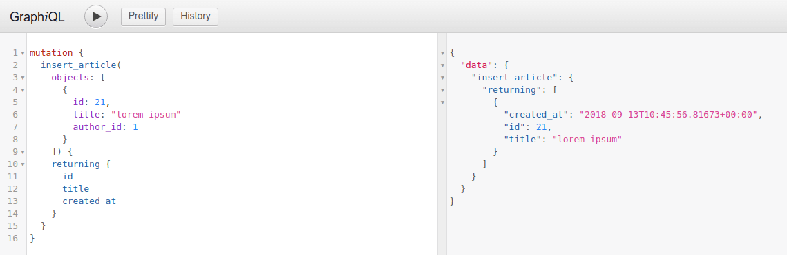

Setting default values for fields
=================================

Let's say you want certain fields to have their values set automatically by Postgres if
not explicitly passed. For example, an auto-incrementing id, a created_at timestamp, etc.

We can achieve this by setting a default value for the field which could either be a fixed value or a simple SQL
function.

**Example:** Say we have a field ``created_at`` in a table ``article``  which we would want to be set to the current
timestamp whenever a new row is added to the table.

1) Modify the table
-------------------

Edit the ``created_at`` field and set its Default value as the SQL function ``now()``.

Open the console and head to ``Data -> article -> Modify``:

.. admonition:: To set an auto-incrementing default value

  To set a default value as an auto-incrementing integer you first need to set up a ``sequence`` which will be the
  source of our default value.

  Let's say we have a field called ``roll_number`` which we would like to be set by default as an auto-incremented
  integer.

  Head to ``Data -> SQL`` and run the following SQL command to create a new sequence.

  .. code-block:: SQL

    CREATE SEQUENCE roll_number_seq;

  Now set the default value of the ``roll_number`` field as ``nextval('roll_number_seq')``.

2) Run an insert mutation
-------------------------

Now if you do not pass the ``created_at`` field value while running an insert mutation on the ``article`` table, its
value will be set automatically by Postgres.

.. note::

  The default value is ignored when a value is explicitly set to the field. To enforce the value set in a field is the
  result of the defined SQL function, see: :doc:`sql-functions`.
