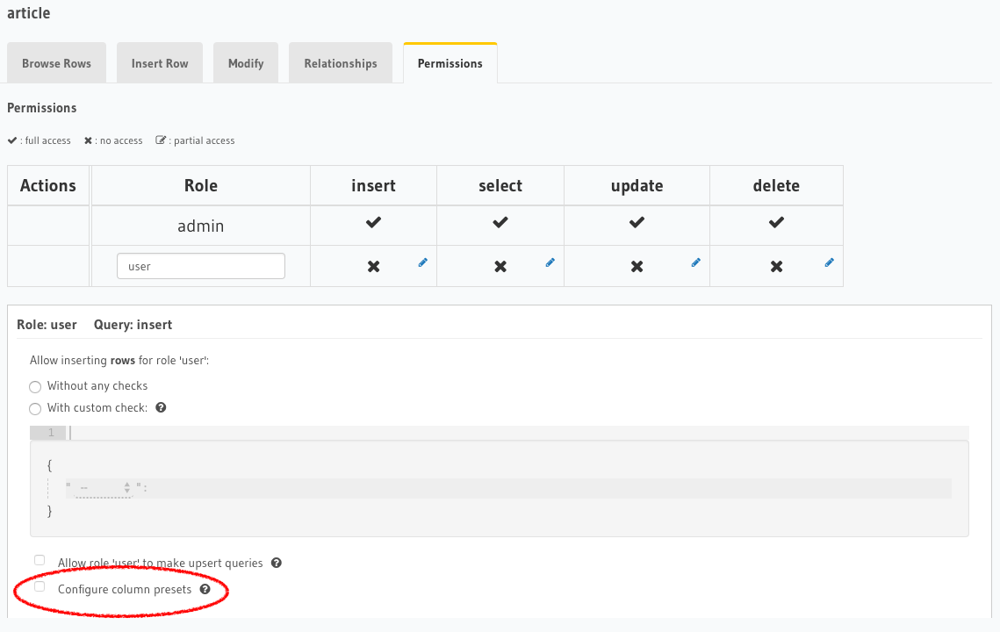
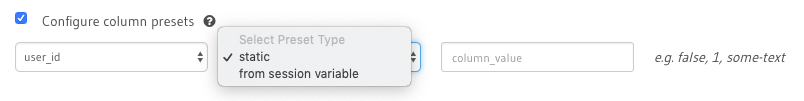
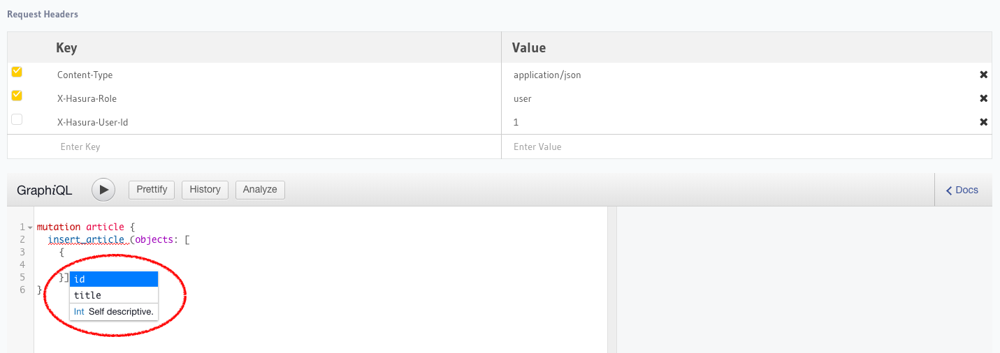
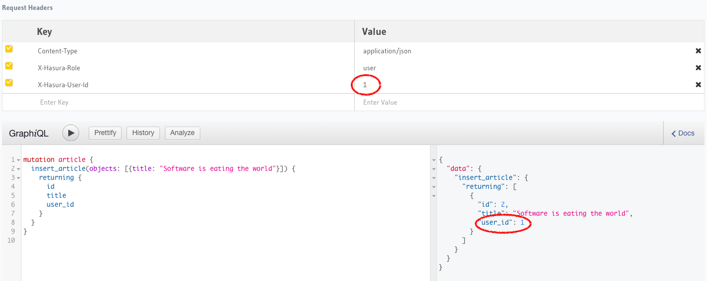

Setting default values for fields
=================================

Let's say you want certain fields to have their values set automatically when not explcitly passed. You can do this in two ways:

- **Postgres defaults**: configure default values, using fixed values or a simple SQL function, for fields/columns in the table definition. E.g. an auto-incrementing id, a created_at timestamp, etc.

- **Column presets**: set up presets, using session variables or fixed values, that are applied when a new row is created. E.g. setting a ``user_id`` field automatically from a session variable/Authorization header.

Postgres defaults
-----------------

**Example:** Say we have a field ``created_at`` in a table ``article`` which we want to be set to the current timestamp whenever a new row is added to the table.

1) Modify the table
^^^^^^^^^^^^^^^^^^^

Edit the ``created_at`` field and set its Default value as the SQL function ``now()``.

Open the console and head to ``Data -> article -> Modify``:

.. image:: ../../../img/graphql/manual/schema/add-default-value.png

.. admonition:: To set an auto-incrementing default value

  To set a default value as an auto-incrementing integer you first need to set up a ``sequence`` which will be the source of our default value.

  Let's say we have a field called ``roll_number`` which we would like to be set by default as an auto-incremented integer.

  Head to ``Data -> SQL`` and run the following SQL command to create a new sequence.

  .. code-block:: SQL

    CREATE SEQUENCE roll_number_seq;

  Now set the default value of the ``roll_number`` field as ``nextval('roll_number_seq')``.

2) Run an insert mutation
^^^^^^^^^^^^^^^^^^^^^^^^^

Now if you do not pass the ``created_at`` field value while running an insert mutation on the ``article`` table, its value will be set automatically by Postgres.

.. image:: ../../../img/graphql/manual/schema/default-value-response.png

.. note::

  The default value is ignored when a value is explicitly set to the field. To enforce the value set in a field is the result of the defined SQL function, see: :doc:`sql-functions`.

Columns presets
---------------

GraphQL Engine's column presets let you define role-based default values for any field/column. These values can either be an Authorization header's value or a static value.

.. admonition:: Column preset restricts mutation access for configured role

  If a column has a preset defined for a given role, access to the column for mutations will be restricted for users with said role.

**Example:** Say we have a field ``user_id`` in a table ``article`` which is to be set to the id of the user, from the value of the user's Authorization header whenever a new row is added to the ``article`` table.

1) Configure column preset
^^^^^^^^^^^^^^^^^^^^^^^^^^
The column preset option is available under the ``Permissions`` tab of a table. Open the console and head to ``Data -> article -> Permissions``:

Enable the column preset option to define presets for one or more columns. For each column, you can pick between setting the preset using a static value or from a session variable. 

For our chosen example, we'll use the ``from session variable`` option and configure the ``user_id`` column to be automatically populated based on the value of the Authorization header ``X-Hasura-User-Id``.

2) Run an insert mutation
^^^^^^^^^^^^^^^^^^^^^^^^^

Head to the GraphiQL interface in the console and try making an insert mutation on the ``article`` table with the following headers (*to run through this example, don't forget to also grant the* ``user`` *role sufficient permissions to select from the* ``article`` *table*):

- ``X-Hasura-role`` --> ``user`` (*to test the behaviour for the configured role*)
- ``X-Hasura-User-Id`` --> ``1`` (*this is the value we should expect in the* ``user_id`` *field*)

As mentioned earlier, you'll notice when you add the ``X-Hasura-role`` header that the field, ``user_id``, is no longer available as the mutation type's field:

Now, if we run the following insert mutation, we'll see that the ``user_id`` field is indeed being set with the value passed in the ``X-Hasura-User-Id`` header:

.. note::

  Not passing the configured header will result in a run-time error:
  
  .. code-block:: JSON

    {
        "errors": [
          {
            "path": "$",
            "error": "\"x-hasura-user-id\" header is expected but not found",
            "code": "not-found"
          }
        ]
    }