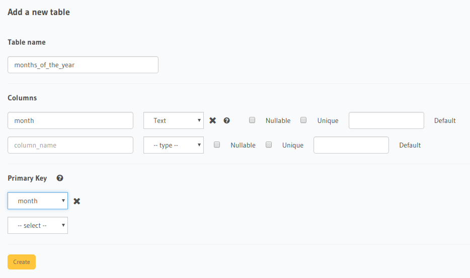
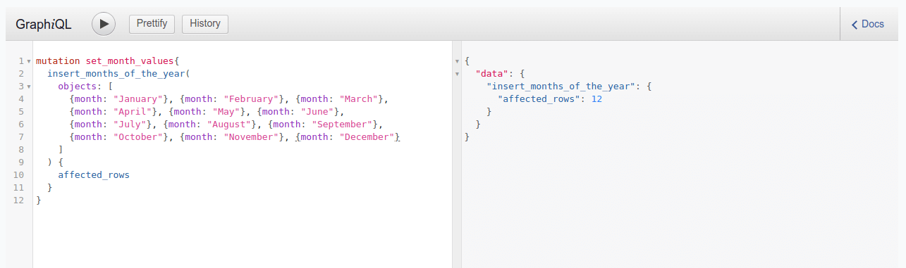
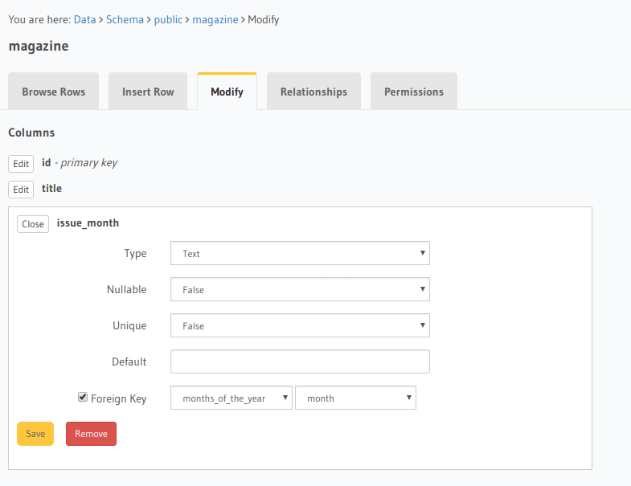

Enum type fields
================

.. contents:: Table of contents
  :backlinks: none
  :depth: 1
  :local:

Enum type fields can only take a value from a fixed set of allowed values.

In a relational database such as Postgres, an enum type field in a table can be defined by setting a foreign-key
to another table which contains the reference list of allowed values. This ensures a value can be set into the field
only if it exists in the reference table.

**For example**, let's say we have a table ``magazine`` with fields ``(id, title, issue_month, issue_year)``
and we would like to restrict the values of the ``issue_month`` field to just the months of the year (i.e. January,
February, and so on).

Create a reference table for the enum
-------------------------------------

Open the Hasura console and head to the ``Data -> Create table`` interface.

Create a table ``months_of_the_year`` with just one column ``month``, which is the primary key:

Add the allowed enum values to the reference table
--------------------------------------------------

Head to the ``GraphiQL`` tab of the console and run an insert mutation to insert the allowed enum values:

Add a foreign-key constraint to the reference table
---------------------------------------------------

Head to the ``Data -> magazine -> Modify`` tab of the console and set a foreign-key to the ``months_of_the_year`` table
using the fields: ``issue_month -> months_of_the_year :: month``:

Now the ``issue_month`` field can only take values from the months of the year.

.. note::
  This will not provide auto-complete or query validation on the client side using the GraphQL schema as of now
  but will ensure consistency in the database.