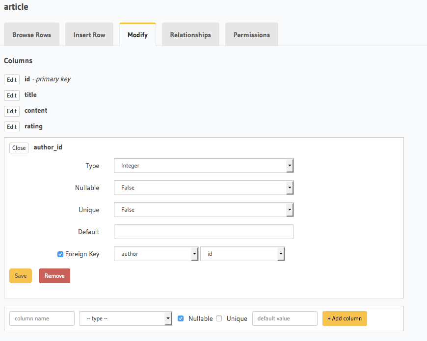
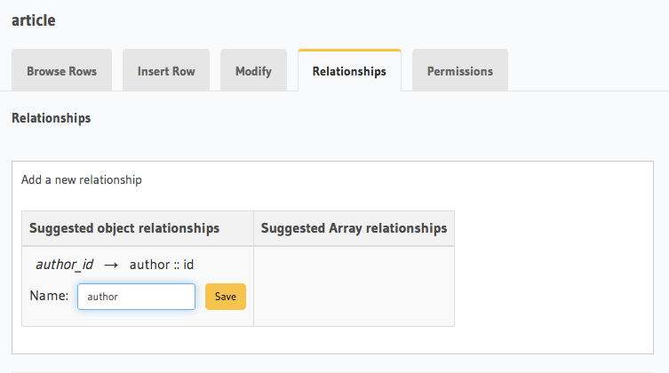
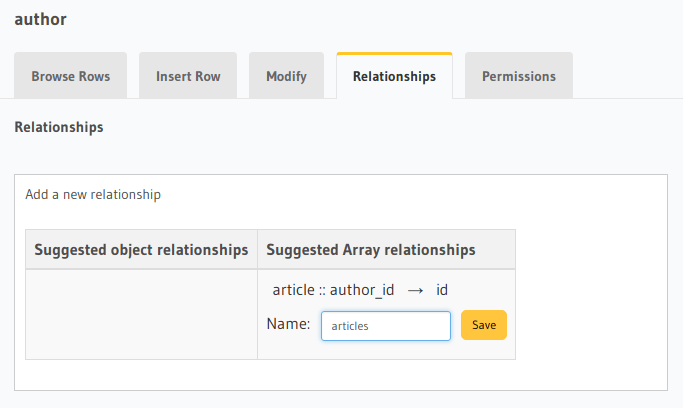
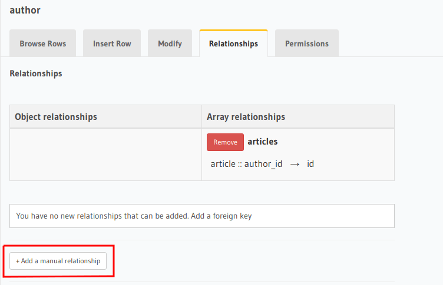
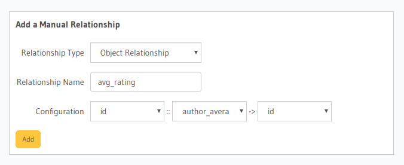

Creating relationships
======================

.. contents:: Table of contents
  :backlinks: none
  :depth: 1
  :local:

A relationship from one table/view to another can be created by defining a link between a column of the table/view to a
column of the other table/view.

Typically, relationships are defined using foreign-key constraints. But in some cases, it might not be possible to
use foreign-key constraints to create the relation. For example, while trying to create a relationship involving a view
as foreign-keys can't be created on views.

.. _relationships-using-fkey:

Using Foreign Keys
------------------

Say we created two tables, ``author(id, name)`` and ``article(id, title, content, rating, author_id)``. Let us now
connect these tables to enable nested queries using a foreign-key:

1) Add foreign-key constraint
^^^^^^^^^^^^^^^^^^^^^^^^^^^^^

In the console, navigate to the ``Modify`` tab of the ``article`` table. Edit the ``author_id`` column and configure
it as a foreign-key for the ``id`` column in the ``author`` table:

2) Create an object relationship
^^^^^^^^^^^^^^^^^^^^^^^^^^^^^^^^

Each article has one author. This is an ``object relationship``. The console
infers this using the foreign-key and recommends the potential relationship in the ``Relationships`` tab
of the ``article`` table.

Add an ``object relationship`` named ``author`` as shown here:

We can now run a nested object query that is based on this ``object relationship``

Fetch a list of articles and each article's author:

.. graphiql::
  :view_only:
  :query:
    query {
      article {
        id
        title
        author {
          id
          name
        }
      }
    }
  :response:
    {
      "data": {
        "article": [
          {
            "id": 1,
            "title": "sit amet",
            "author": {
              "name": "Anjela",
              "id": 4
            }
          },
          {
            "id": 2,
            "title": "a nibh",
            "author": {
              "name": "Beltran",
              "id": 2
            }
          },
          {
            "id": 3,
            "title": "amet justo morbi",
            "author": {
              "name": "Anjela",
              "id": 4
            }
          }
        ]
      }
    }

3) Create an array relationship
^^^^^^^^^^^^^^^^^^^^^^^^^^^^^^^

An author can write multiple articles. This is an ``array relationship``.

You can add an ``array relationship`` exactly how you added an ``object relationship`` as shown above:

We can now run a nested object query that is based on this ``array relationship``.

Fetch a list of authors and a nested list of each author's articles:

.. graphiql::
  :view_only:
  :query:
    query {
      author {
        id
        name
        articles {
          id
          title
        }
      }
    }
  :response:
    {
      "data": {
        "author": [
          {
            "id": 1,
            "name": "Justin",
            "articles": [
              {
                "id": 15,
                "title": "vel dapibus at"
              },
              {
                "id": 16,
                "title": "sem duis aliquam"
              }
            ]
          },
          {
            "id": 2,
            "name": "Beltran",
            "articles": [
              {
                "id": 2,
                "title": "a nibh"
              },
              {
                "id": 9,
                "title": "sit amet"
              }
            ]
          },
          {
            "id": 3,
            "name": "Sidney",
            "articles": [
              {
                "id": 6,
                "title": "sapien ut"
              },
              {
                "id": 11,
                "title": "turpis eget"
              },
              {
                "id": 14,
                "title": "congue etiam justo"
              }
            ]
          }
        ]
      }
    }

.. _relationships-without-fkey:

Using Manual Relationships
--------------------------

Let's say you have a table ``author(id, name)`` and a view ``author_avg_rating(id, avg)`` which has the
average rating of articles for each author.

To create an ``object relationship`` called ``avg_rating`` from the ``author`` table to the ``author_avg_rating`` view,
navigate to the ``Relationships`` tab of the ``author`` table in the console and click on the ``+ Add a manual
relationship`` button:

This will open up a section as shown below:

For our case:

- Relationship Type will be: ``Object Relationship``
- Relationship Name can be: ``avg_rating``
- Configuration: ``id :: author_avg_rating -> id``

Now click on the ``Add`` button to create the relationship.

We can now run a nested object query that is based on this ``object relationship``.

Fetch a list of authors with the average rating of their articles:

.. graphiql::
  :view_only:
  :query:
    query {
      author {
        id
        name
        avg_rating {
          avg
        }
      }
    }
  :response:
    {
      "data": {
        "author": [
          {
            "id": 1,
            "name": "Justin",
            "avg_rating": {
              "avg": 2.5
            }
          },
          {
            "id": 2,
            "name": "Beltran",
            "avg_rating": {
              "avg": 3
            }
          },
          {
            "id": 3,
            "name": "Sidney",
            "avg_rating": {
              "avg": 2.6666666666666665
            }
          }
        ]
      }
    }