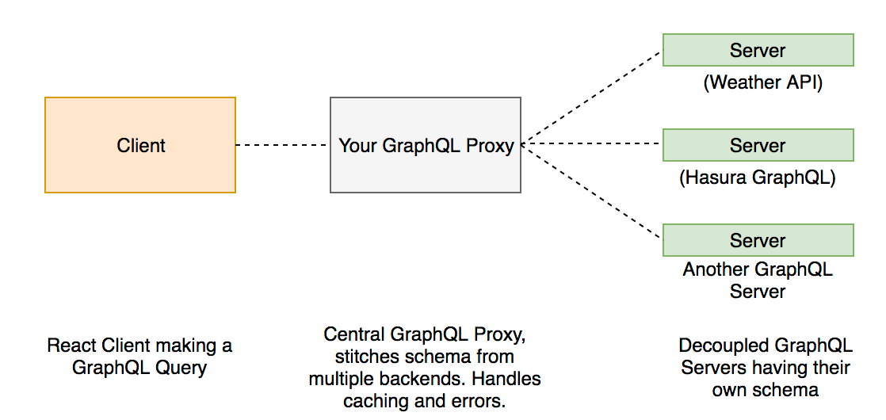

========================
GraphQL Schema Stitching
========================

Schema stitching is the process of creating a single GraphQL schema from multiple underlying GraphQL APIs.

If you need to add custom business logic or customize your GraphQL schema then we recommend using schema stitching.

Here are 2 common use cases:

- Fetch data from sources that are not in the database (eg: a weather API)
- Customize mutations (eg: running validations before inserts)

.. note::

  If you are looking for ``graphql-bindings``, please check out `this git repository
  <https://github.com/hasura/generate-graphql-bindings>`_.

Schema stitching allows you to have one unified API that allows the client to query multiple GraphQL Schemas at the
same time, including relations between the schemas.

In the above architecture, we see that there are multiple decoupled graphql services running somewhere and a central
server acts as a GraphQL Proxy server and it combines the different schemas into a unified API that the client can
query on.

Let's go through a simple example to understand why schema stitching might be required in certain use cases and how
it can be leveraged to unify all your APIs to a single GraphQL API.

Assume the following database schema in PostgreSQL:

+----------------------------------------+----------------------------------------+
|Table                                   |Columns                                 |
+========================================+========================================+
|person                                  |id, name, city                          |
+----------------------------------------+----------------------------------------+

We have a simple ``person`` table with columns ``id``, ``name`` and ``city``. For this example, the above table has
anonymous select permission.

The GraphQL query in Hasura Data API for the above table would look like:

.. code-block:: graphql

    query fetch_person {
      person {
        id
        name
        city
      }
    }

This is a simple select on table person.

On the other hand, we have a GraphQL server for fetching weather information that connects to ``Meta Weather API``.

The GraphQL schema for this weather API looks like:

.. code-block:: graphql

    type CityWeather {
      temp: String
      min_temp: String
      max_temp: String
      city_name: String!
      applicable_date: String!
    }

.. code-block:: graphql

    type Query {
      cityWeather(city_name: String! applicable_date: String): CityWeather
    }

The GraphQL query to fetch this weather information would look like:

.. code-block:: graphql

    query {
      cityWeather (city_name: "Bangalore") {
        city_name
        temp
        min_temp
        max_temp
        applicable_date
      }
    }

Explore this API on `Apollo LaunchPad <https://launchpad.graphql.com/nxw8w0z9q7>`_.

Note the usage of ``city_name`` as an argument for the ``cityWeather`` query. Using this we can extend our original
Postgres's ``person`` schema to include weather information based on the ``city`` column of the person table.

.. code-block:: graphql

    extend type person {
      city_weather: CityWeather,
    }

We have extended the type person to have one more field called ``city_weather``. This will resolve to the weather
schema defined above and the respective resolver will return appropriate data.

The source code for the custom resolver can be found on GitHub - `graphql-schema-stitching-demo
<https://github.com/hasura/graphql-schema-stitching-demo>`_. Note the usage of ``mergeSchemas``, a
``graphql-tools`` utility that enables schema stitching.

Now the merged schema can be queried as:

.. code-block:: graphql

    query {
      person {
        id
        name
        city
        city_weather {
          city_name
          temp
          min_temp
          max_temp
          applicable_date
        }
      }
    }

This is a neat abstraction for the client making the GraphQL API, as all the merging of different schemas are
done by the server and exposed as a single API.

Read the official docs on `schema stitching <https://www.apollographql.com/docs/graphql-tools/schema-stitching.html>`_
by Apollo for detailed guides.
