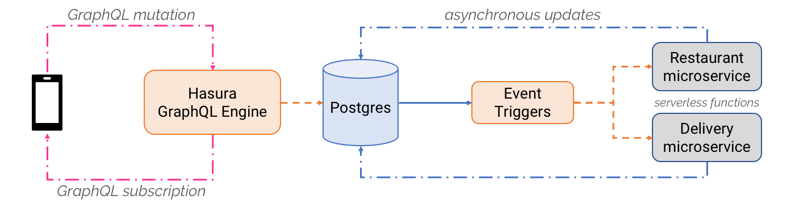

# Event triggers on Postgres

Trigger webhooks on database events using Hasura GraphQL Engine's event triggers.

## Highlights

* **Build reactive & async apps/features**: Trigger asynchronous serverless or cloud functions to reduce infrastructure costs and simplify DevOps for developers.

* **Atomic & Reliable**: Using native Postgres triggers, every relevant action on the database is captured as an event. Even if Hasura is down or being updated, events will be captured and delivered as soon as possible with an *atleast-once* guarantee. You can even configure delivery policies like `max_retries` and `retry_interval`.

* **Scalable**: The event-triggers system is horizontally scalable - if you need to handle more events, just throw more resources at it!

* **Works with existing, live databases**: Point it to an existing Postgres database to instantly listen to changes in your data and invoke webhooks.

* **Ready for observability & monitoring]**: Generated events are automatically instrumented with an event-id and structured logs emitted by Hasura make it easy for you to use your favourite tools to run an event-driven backend in production ([watch](https://youtu.be/WOPA52r3bzU) an overview using [Honeycomb](https://honeycomb.io/)).

## Quickstart: 

### One-click deployment on Heroku

The fastest way to try event triggers out is via Heroku.

1. Click on the following button to deploy GraphQL Engine on Heroku with the free Postgres add-on:

    

2. Open the Hasura console

   Visit `https://<app-name>.herokuapp.com` (*replace \<app-name\> with your app name*) to open the admin console.

3. Configure your first event trigger and webhook

   Create a table, configure the database update you want to use as a trigger and instantly invoke a webhook by adding a new row in your table. Follow this [simple guide](https://docs.hasura.io/1.0/graphql/manual/getting-started/first-event-trigger.html).

### Other deployment methods

For Docker-based deployment and advanced configuration options, see [deployment guides](https://docs.hasura.io/1.0/graphql/manual/getting-started/index.html).

### Demo (*30 seconds*)

[Create an event-trigger and webhook in 60 seconds](https://youtu.be/EaTUVWnDCvA)

### Serverless boilerplates

Use one of the [serverless trigger
boilerplates](community/boilerplates/serverless-triggers) to deploy a webhook
that can capture database events.  
Serverless/cloud-function platforms covered by boilerplates: 

* [AWS Lambda](community/boilerplates/serverless-triggers/aws-lambda)
* [Google Cloud Functions](community/boilerplates/serverless-triggers/google-cloud-functions)
* [Azure Functions](community/boilerplates/serverless-triggers/azure-functions)
* [Zeit Now](community/boilerplates/serverless-triggers/zeit-now)

## Architecture

## Demos & Tutorials: Building reactive & async apps/features

### Notifications

Trigger push notifications and emails based on database events. Try the demo and tutorial below to see how browser push notifications are triggered when the user inserts some data:

* [Watch demo](https://www.youtube.com/watch?v=nuSHkzE2-zo)
* [Try it out](https://serverless-push.demo.hasura.app/)
* [Tutorial](community/examples/serverless-push)

<!--
### Async business logic

Convert complex, long-running business logic to be event-driven, asynchronous and resilient to failure. Try this demo and tutorial below to see how an image processing job is run asynchronously to convert an image to a black-and-white version:

* [Watch demo](https://some-youtube-demo.com) (*10:00 mins*)
* [Try it out](https://some-link/)
* [Tutorial](https://some-other-link)

-->

### Data transformation (ETL)

Transform and load data into external data-stores. Check out this demo and tutorial below to see how Postgres data is transformed to build and populate an Algolia index:

* [Watch demo](https://youtu.be/kWVEBWdEVAA)
* [Try it out](https://serverless-etl.demo.hasura.app/)
* [Tutorial](community/examples/serverless-etl)

### Building reactive UX for your async backend with realtime GraphQL

Propagate event-driven and asynchronous information to UI clients easily with GraphQL subscriptions & live-queries.

**Watch**: [Building a reactive app with an async backend](https://youtu.be/kTSOxRrtCeI) (*04:15 mins*)

## Translations

This document is available in the following translations:

- [French :fr:](translations/event-triggers.french.md)
